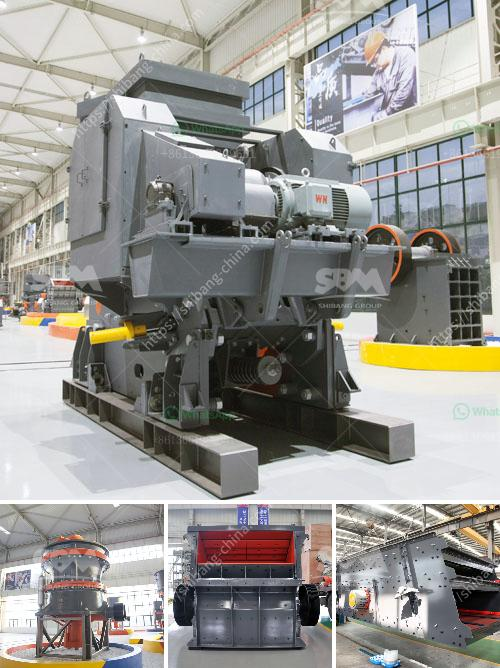

<h3>What is a cement grinding unit and what processes are involved ?</h3>
A cement grinding unit, also known as a cement mill, is an extremely important process in cement production and involves many steps and processes. The main function of a cement grinding unit is to grind cement clinker (and gelling agent, performance adjusting materials, etc.) into a suitable particle size (expressed by fineness, specific surface area, etc.), form a certain particle gradation, increase its hydration area, accelerate hydration speed, and satisfies the requirements of setting and hardening cement paste.

The cement grinding unit differs from the raw material mill or cement mill because the clinker material needs to be ground to a certain degree of fineness before it can be put into production, so that the process of its noting, mixing, and storage can be more condensed, in order to reduce the transportation and storage costs.

1. Crushing: The limestone obtained from mines is crushed to a particle size that can be used in the production line.

2. Blending: The crushed limestone is mixed with other raw materials like clay, sand, iron ore, and bauxite in the desired proportion. This mixture is then fed into a cement grinding mill where they are ground into an extremely fine powder.

3. Grinding: The grinding process is done in a ball mill. The cement mill consists of cylindrical shell rotating on a horizontal axis mounted on a sturdy structure. The confined spaces within the shell are divided into compartments, typically known as first and second chambers, where grinding takes place. The clinker and other raw materials are fed into the mill through a hopper, and the mill grinds them into a fine powder.

4. Storage and packaging: After grinding, the cement is stored in silos or storage tanks. This helps in maintaining the correct moisture content and temperature for the cement. The cement is then packed in bags or transported in bulk to the distribution centers.

5. Quality control: Throughout the entire process, quality control measures are implemented to ensure that the final cement meets the desired specifications. This includes monitoring the fineness of the cement, chemical composition, strength, and adherence to specific standards.

Overall, the cement grinding unit is a crucial step in the cement production process as it accounts for the highest consumption of energy and resources in the whole production line. Therefore, it is essential to ensure the efficient and sustainable operation of the cement grinding unit to minimize costs and maximize productivity.
<h3>Contact us</h3><ul><li><strong>Whatsapp:&nbsp;<a href="https://wa.me/8613661969651">+8613661969651</a></strong></li><li><a href="https://swt.shibang-china.com/?git&amp;zhl&amp;What is a cement grinding unit and what processes are involved "><strong>Online Service(chat now)</strong></a></li></ul><h3>Related</h3><ul><li><a href='What equipment is used in antimony mining .md'>What equipment is used in antimony mining ?</a></li><li><a href='what are the applications of small portable crusher.md'>what are the applications of small portable crusher?</a></li><li><a href='What is quarrying in relation to cement production.md'>What is quarrying in relation to cement production?</a></li><li><a href='What is the process of mining iron ore.md'>What is the process of mining iron ore?</a></li><li><a href='what jaw crushers speed rpm should do.md'>what jaw crushers speed rpm should do</a></li></ul>