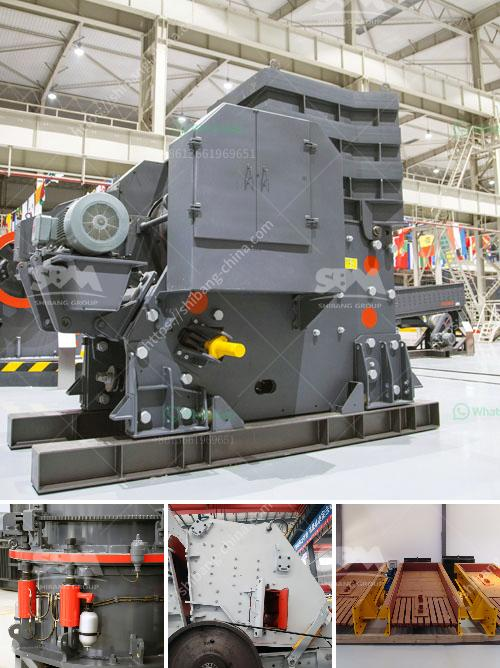

<h3>What is a cone crusher and what stones are it mainly used to crush?</h3>
A cone crusher is a powerful machine that is commonly used for crushing hard and highly abrasive materials, such as rocks and ores. This type of crushing equipment is preferred in mining, construction, and many other industries because it provides an efficient crushing process and reduces the size of materials so they can be further processed. Let's take a closer look at what a cone crusher is and the stones it is mainly used to crush.

A cone crusher is a compression type of machine that reduces material by squeezing or compressing the feed material between a moving piece of steel called the mantle and a stationary piece called the concave. Crushing occurs when the mantle moves away from the concave, causing the stones to be squeezed and crushed between the mantle and concave.

The stones that a cone crusher is mainly used to crush are generally of hard and high abrasive nature, such as granite, basalt, and quartzite. These stones have a higher compressive strength and are more difficult to crush. Cone crushers are designed to crush hard and abrasive materials effectively and efficiently.

Granite, a common type of intrusive, felsic, igneous rock, is one of the stones most frequently crushed by cone crushers. Its high compressive strength and high abrasive nature make it an ideal material for road construction, building aggregates, and railroad ballast.

Basalt is another commonly crushed stone by cone crushers. It is a dark-colored, fine-grained volcanic rock formed from the rapid cooling of lava. Basalt is known for its excellent durability and high resistance to wear, making it an ideal material for concrete aggregates, airport runways, and highway pavements.

Quartzite, a metamorphic rock formed from sandstone under intense heat and pressure, is also widely crushed by cone crushers. Quartzite possesses high abrasion resistance and good chemical resistance, making it suitable for high-quality construction materials, including railway ballast, surface texture for paving stones, and aggregate for concrete and asphalt mixes.

These are just a few examples of the stones that cone crushers are commonly used to crush. However, cone crushers can also crush a wide range of other materials such as limestone, gravel, and even ore minerals like gold and silver.

In conclusion, a cone crusher is a powerful machine that is used to crush a variety of stones, with granite, basalt, and quartzite being among the most common. These stones have a high compressive strength and are difficult to crush, making cone crushers an essential tool in the mining and construction industries. Cone crushers efficiently reduce the size of materials and enable further processing, ensuring that valuable stones can be utilized effectively.
<h3>Contact us</h3><ul><li><strong>Whatsapp:&nbsp;<a href="https://wa.me/8613661969651">+8613661969651</a></strong></li><li><a href="https://swt.shibang-china.com/?git&amp;zhl&amp;What is a cone crusher and what stones are it mainly used to crush"><strong>Online Service(chat now)</strong></a></li></ul><h3>Related</h3><ul><li><a href='What are the characteristics of bauxite ore and how to crush it.md'>What are the characteristics of bauxite ore and how to crush it?</a></li><li><a href='What is the cost of a quarry crusher for 500 tons.md'>What is the cost of a quarry crusher for 500 tons?</a></li><li><a href='What is the mining process for fluorite.md'>What is the mining process for fluorite?</a></li><li><a href='what are the applications of small portable crusher.md'>what are the applications of small portable crusher?</a></li><li><a href='when pulverizing coal what is a crusher use for？.md'>when pulverizing coal what is a crusher use for？</a></li></ul>