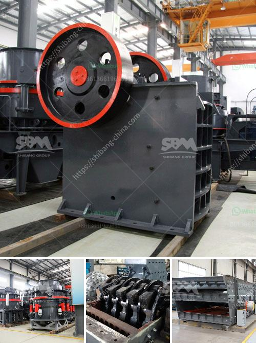

<h3>What is a grinding ball mill aid?</h3>
In the world of milling and grinding, there are a multitude of tools and equipment available to assist with the process. One such equipment is the grinding ball mill aid, a grinding aid is a chemical agent that increases the efficiency of the grinding process by reducing the surface energy forces between the particles.

Grinding aids have been used for decades in the cement industry and are commonly used in mining and ore beneficiation as well. Various types of grinding aids are available in the market that can be used in ball mills to increase grinding efficiency. Some of the most common types include alkanolamines, glycols, and phenol-based chemicals.

The primary function of a grinding aid is to improve the grinding efficiency of the mill, thereby increasing the throughput and reducing specific energy consumption. By reducing the surface energy forces between the particles, grinding aids enable finer particle size distribution, leading to improved grinding performance and product quality.

Grinding aids work by either physically interacting with the particles or chemically reacting with them. Physical interaction involves reducing the friction between particles, preventing agglomeration and maximizing the impact forces during grinding. Chemical reactions, on the other hand, can alter the surface properties of the particles, leading to improved flowability and reducing the risk of clogging or choking within the mill.

The effectiveness of a grinding aid depends on various factors, such as the type and dosage of the aid used, the characteristics of the raw materials being ground, and the operating conditions of the mill. Therefore, it is crucial to carefully select the appropriate grinding aid for the specific application.

Grinding aids are typically added in small quantities to the mill feed. Fewer amounts are used for the initial grinding stages, while higher dosages may be required for fine grinding or grinding of difficult-to-grind materials. Excessive use of grinding aids can have adverse effects on the mill, leading to increased power consumption and reduced product quality.

It is important to note that grinding aids are not a substitute for good mill design and operation. While they can significantly enhance grinding efficiency, their effectiveness relies on a well-designed mill with appropriate equipment and operating conditions. A poorly designed mill or incorrect grinding practices can negate the benefits of using grinding aids.

In conclusion, a grinding ball mill aid is a chemical agent used to improve the efficiency of the grinding process in ball mills. They aid in increasing the throughput of the mill and reducing specific energy consumption. However, their effectiveness depends on several factors, including the type and dosage of the aid, raw material characteristics, and mill operating conditions. Careful selection and proper use of grinding aids can lead to improved grinding performance and product quality.
<h3>Contact us</h3><ul><li><strong>Whatsapp:&nbsp;<a href="https://wa.me/8613661969651">+8613661969651</a></strong></li><li><a href="https://swt.shibang-china.com/?git&amp;zhl&amp;What is a grinding ball mill aid"><strong>Online Service(chat now)</strong></a></li></ul><h3>Related</h3><ul><li><a href='What kind of crushing machinery is needed for gypsum mine mining.md'>What kind of crushing machinery is needed for gypsum mine mining?</a></li><li><a href='What guidelines are needed to set up a mobile stone crusher in Orissa.md'>What guidelines are needed to set up a mobile stone crusher in Orissa?</a></li><li><a href='What equipment is used when sand mining.md'>What equipment is used when sand mining?</a></li><li><a href='what type of crusher is best for concrete crushing.md'>what type of crusher is best for concrete crushing?</a></li><li><a href='Which industries depend on coal.md'>Which industries depend on coal?</a></li></ul>