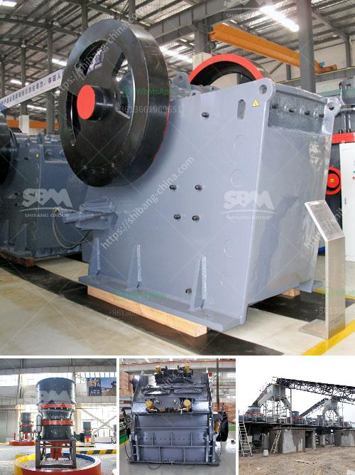

<h3>What is a magnetic iron separator</h3>
A magnetic iron separator, also known as a magnetic separator or magnetic drum separator, is a type of equipment that utilizes magnetic fields to separate ferrous materials from non-ferrous ones. This device is widely used in various industries, such as mining, ore beneficiation, metallurgy, iron and steel, ceramics, and cement, to name a few.

The primary purpose of a magnetic iron separator is to extract and recover magnetic materials from a mixture. These materials may include iron ores, magnetite, ilmenite, hematite, manganese ore, and other minerals with magnetic properties. The separator works by attracting and removing these ferrous materials from non-magnetic materials through the use of magnetic force.

The basic principle behind a magnetic iron separator is the generation of a magnetic field. The separator consists of a rotating drum made of magnetic material that is placed in a tank or trough. The drum is magnetized and is connected to an electrical conductor. As the drum rotates, the magnetic field generated by the conductor attracts and holds onto the magnetic materials, separating them from the rest of the mixture.

There are various designs and configurations of magnetic iron separators available, depending on the specific application requirements. The most common types include the wet drum separator, dry drum separator, and the magnetic pulley separator. Wet drum separators are typically used in heavy media applications, while dry drum separators are used for dry, free-flowing materials. Magnetic pulley separators are used for the continuous extraction of tramp iron from conveyor belts, chutes, and other transport systems.

One of the key advantages of a magnetic iron separator is its efficiency in separating magnetic materials from non-magnetic ones. This ensures a high-quality product and helps improve overall operational efficiency. Additionally, the separator can be designed to handle large volumes of material, making it suitable for industrial-scale applications.

Another benefit of using a magnetic iron separator is the protection it provides for downstream equipment. By removing ferrous materials, the separator prevents damage to crushers, grinders, and other processing equipment that may be sensitive to magnetic contaminants. This leads to reduced maintenance costs and increased equipment lifespan.

In conclusion, a magnetic iron separator is a valuable piece of equipment used in various industries for the separation of magnetic materials from non-magnetic ones. By utilizing magnetic force, the separator extracts and recovers ferrous materials from mixtures, ensuring a high-quality product and protecting downstream equipment. Its efficiency and versatility make it an essential tool in many industrial processes.
<h3>Contact us</h3><ul><li><strong>Whatsapp:&nbsp;<a href="https://wa.me/8613661969651">+8613661969651</a></strong></li><li><a href="https://swt.shibang-china.com/?git&amp;zhl&amp;What is a magnetic iron separator"><strong>Online Service(chat now)</strong></a></li></ul><h3>Related</h3><ul><li><a href='What is hematite magnetic limonite and rhodochrosite.md'>What is hematite, magnetic limonite and rhodochrosite?</a></li><li><a href='What is the percentage saved in labor costs for the operation of mobile mining crushers.md'>What is the percentage saved in labor costs for the operation of mobile mining crushers?</a></li><li><a href='What type of crusher is used to crush copper ore.md'>What type of crusher is used to crush copper ore?</a></li><li><a href='What is the most popular rock crusher on market.md'>What is the most popular rock crusher on market?</a></li><li><a href='What is a recycle feed hopper sand mine.md'>What is a recycle feed hopper sand mine?</a></li></ul>