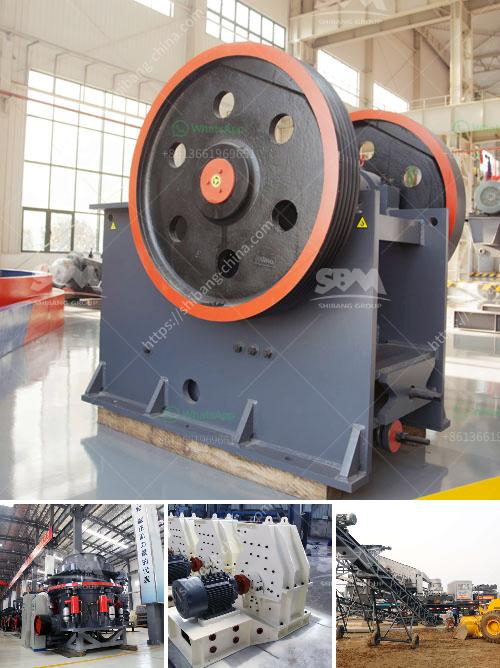

<h3>What is a rare earth beneficiation plant?</h3>
A rare earth beneficiation plant is a facility designed to process rare earth-bearing ore to produce rare earth concentrates, which are used in various applications. These plants typically take a few years to build and can cost hundreds of millions to billions of dollars. Due to the complexity of rare earth processing and the scarcity of these elements, beneficiation plants are crucial in ensuring a reliable supply of rare earths for various industries.

Rare earth elements (REEs) are a group of seventeen chemical elements with unique magnetic, luminescent, and catalytic properties. They are used in a wide range of applications, including electronics, renewable energy technologies, defense systems, and medical devices. Examples of rare earth elements include neodymium, used in magnets for electric vehicles, and dysprosium, used in lasers and nuclear reactors.

The extraction and processing of rare earth elements present numerous challenges. Unlike other metals, rare earths are typically found in low concentrations and often occur as complex minerals that are difficult to separate from other elements. This complex nature requires specialized techniques to extract and concentrate rare earth elements into usable products.

1. Mining: Rare earth-bearing ore is extracted from the ground using conventional mining methods. This can involve open-pit or underground mining, depending on the ore deposit's depth and size.

2. Milling: The mined ore is then crushed and ground into fine particles. This step enhances the surface area of the ore, facilitating the subsequent chemical and physical processes. Additionally, impurities are sometimes removed during this stage.

3. Processing: In this crucial step, various beneficiation techniques are employed to separate rare earth minerals from the ore. These techniques include froth flotation, magnetic separation, and gravity separation. Froth flotation, for instance, utilizes the differences in surface properties of minerals to selectively separate them. The resulting concentrate contains high concentrations of rare earth elements.

After the beneficiation process, the concentrate is often further refined to remove impurities and increase the rare earth content. This can involve additional processing steps like leaching, roasting, or precipitation.

Once the rare earth concentrate is obtained, it is transported to a rare earth separation facility, where the individual elements are separated further. Separation is a highly technical and energy-intensive process, involving various chemical reactions and multiple purification steps. These facilities use advanced techniques such as solvent extraction and ion exchange to purify and extract individual rare earth elements.

In conclusion, a rare earth beneficiation plant is a crucial component of the rare earth supply chain. These facilities enable the extraction and concentration of rare earth minerals, ensuring a reliable supply for industries dependent on these elements. Given their complexity and cost, the development of rare earth beneficiation plants is a significant investment that contributes to the advancement of technology, green energy, and numerous other industries.
<h3>Contact us</h3><ul><li><strong>Whatsapp:&nbsp;<a href="https://wa.me/8613661969651">+8613661969651</a></strong></li><li><a href="https://swt.shibang-china.com/?git&amp;zhl&amp;What is a rare earth beneficiation plant"><strong>Online Service(chat now)</strong></a></li></ul><h3>Related</h3><ul><li><a href='What is the price of the mobile crusher that has a capacity of 350 tons per hour.md'>What is the price of the mobile crusher that has a capacity of 350 tons per hour?</a></li><li><a href='What mechanical equipment is used in limestone mining.md'>What mechanical equipment is used in limestone mining</a></li><li><a href='What equipment is used in the bauxite mining process in Jamaica.md'>What equipment is used in the bauxite mining process in Jamaica?</a></li><li><a href='Which industries depend on coal.md'>Which industries depend on coal?</a></li><li><a href='What is the use of crushing magnetite rock before milling.md'>What is the use of crushing magnetite rock before milling?</a></li></ul>