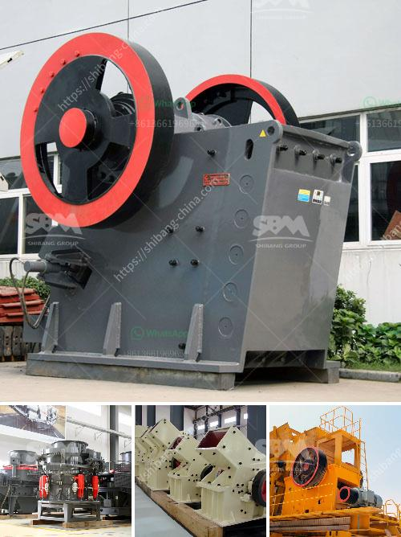

<h3>What is a recycle feed hopper sand mine?</h3>
In the realm of mining operations, sand mines play a vital role in extracting and processing sand for various industries around the world. One important component of a successful sand mining operation is a recycle feed hopper. This crucial piece of equipment helps optimize the efficiency and effectiveness of the mining process while reducing environmental impact.

At its core, a recycle feed hopper is a large container designed to hold and regulate the flow of sand within the mining operation. It acts as a reservoir where sand, water, and other materials are collected and then redistributed throughout the operation. The ultimate goal is to enhance the efficiency of the mining operation and minimize waste.

In a sand mine setting, the recycle feed hopper is primarily responsible for recirculating water and aggregate material. It is designed to collect sand and water from one end of the mining operation, separate any impurities, and then reroute the cleaned material back into the processing system. This process allows for continuous extraction and processing of sand without interrupting the flow.

The recycle feed hopper serves as a key element in sustainability and environmental conservation efforts within the sand mining industry. By collecting and reusing water and sand, it reduces the overall water consumption of the mining operation. Additionally, it minimizes the release of sediments and pollutants into nearby water bodies, ensuring compliance with environmental regulations.

The design of a recycle feed hopper may vary depending on the specifics of the sand mine operation. However, the basic components typically include a large container, water jets or sprays, separation mechanisms, and an outlet for recirculated material. These elements work together to separate and clean the sand, ensuring that only the desired aggregate material is reintroduced into the mining process.

To function optimally, a recycle feed hopper requires appropriate maintenance and oversight. Regular inspections and cleaning are essential to prevent blockages or malfunctioning of the separation mechanisms. This proactive approach can help avoid costly downtime and ensure the continuous flow of sand within the mining operation.

Moreover, operators must carefully monitor the input and output of the recycle feed hopper to maintain the desired sand-to-water ratio. By accurately managing this ratio, operators can adjust the processing system and optimize the sand quality while minimizing waste and extracting the highest possible yield.

In conclusion, a recycle feed hopper is a critical component of sand mining operations. Its primary function is to collect, separate, and redistribute sand and water within the mining process. This equipment helps maximize efficiency, reduce waste, and adhere to environmental regulations for sustainable sand extraction. Proper maintenance and monitoring are crucial to ensure the smooth functioning of the recycle feed hopper, ultimately contributing to the success of the overall sand mining operation.
<h3>Contact us</h3><ul><li><strong>Whatsapp:&nbsp;<a href="https://wa.me/8613661969651">+8613661969651</a></strong></li><li><a href="https://swt.shibang-china.com/?git&amp;zhl&amp;What is a recycle feed hopper sand mine"><strong>Online Service(chat now)</strong></a></li></ul><h3>Related</h3><ul><li><a href='What are the mining processes of copper.md'>What are the mining processes of copper?</a></li><li><a href='What is primary crushing and secondary crushing.md'>What is primary crushing and secondary crushing?</a></li><li><a href='What is the mining process of gypsum.md'>What is the mining process of gypsum?</a></li><li><a href='What is iron ore mining in Pakistan.md'>What is iron ore mining in Pakistan?</a></li><li><a href='What are the wearing parts of grinding mill .md'>What are the wearing parts of grinding mill ?</a></li></ul>