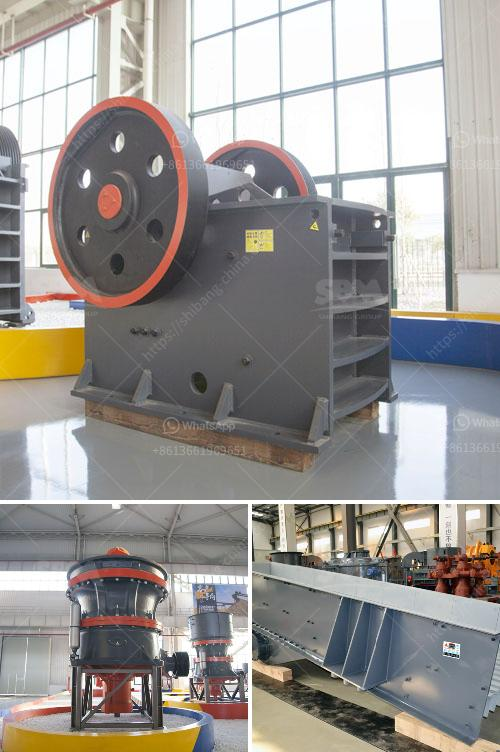

<h3>What is a suitable crusher for coal?</h3>
Coal is an essential component for many industries worldwide. The extraction, processing, and utilization of coal all require suitable equipment. Choosing the right crusher is essential for every operation. Understanding the stages of crushing process and the types of crushers can be a hurdle for many industries. In this article, we will focus on the two primary crushers used for coal crushing. 

Coal crushers are usually categorized into two types - primary and secondary crushers. Primary crushers are used in the first stage of crushing process. Secondary crushers are used in the second stage of crushing process. In addition to these, there are tertiary and quaternary crushers. Generally, jaw crushers are used as primary crushers, gyratory crushers are used as secondary crushers, and cone crushers are used as tertiary crushers. 

1. Primary crushing: The raw coal is crushed into smaller pieces in a crusher called a jaw crusher. The jaw crusher takes the coal feed and breaks it into smaller sizes, typically 6 to 10 inches. The main objective of primary crushing is to reduce the coal size to a size that can be transported to the next crushing stage.

2. Secondary crushing: The smaller sized coal particles are further crushed by a secondary crusher. This stage is used to reduce the size of the coal even further to a size suitable for pulverization. The crushers used in this stage include impact crushers, hammer crushers, double roll crushers, and vertical shaft impact crushers.

3. Tertiary crushing: Tertiary crushers are used to produce finely crushed coal particles. They operate by using compression, impact, or shear forces to break the coal into smaller sizes. Cone crushers, roll crushers, and impact crushers are commonly used for tertiary crushing.

1. Feed size: The size of the coal feed is an important factor in the selection of a primary crusher. It should be large enough to feed the secondary or tertiary crushers, but not too large to cause damage to the crusher.

2. Material properties: The material properties of the coal, including hardness, moisture content, and abrasiveness, should also be considered when selecting a crusher. Different crushers are designed to handle different types of coal and may not be suitable for all materials.

3. Capacity requirements: The capacity requirements of the crusher depend on the desired product size and the size distribution of the coal feed. It is essential to choose a crusher that can handle the required capacity and produce the desired product size.

4. Operating costs: The operating costs of a crusher, including power consumption and maintenance costs, should also be considered. Energy-efficient crushers can help reduce operating costs over the life of the crusher.

In conclusion, choosing a suitable crusher for coal depends on the properties of the coal and the desired product size. Different types of crushers are available to meet the specific requirements of various industries. It is important to choose the right crusher to maximize productivity, reduce operating costs, and ensure the desired product quality.
<h3>Contact us</h3><ul><li><strong>Whatsapp:&nbsp;<a href="https://wa.me/8613661969651">+8613661969651</a></strong></li><li><a href="https://swt.shibang-china.com/?git&amp;zhl&amp;What is a suitable crusher for coal"><strong>Online Service(chat now)</strong></a></li></ul><h3>Related</h3><ul><li><a href='What does the crushing of copper ore have to do with ball mills.md'>What does the crushing of copper ore have to do with ball mills?</a></li><li><a href='What is the cost of the equipment used in mining lead ore.md'>What is the cost of the equipment used in mining lead ore?</a></li><li><a href='What size equpment is used in big rock crushing crews.md'>What size equpment is used in big rock crushing crews?</a></li><li><a href='What is belt conveyor in gold mining.md'>What is belt conveyor in gold mining?</a></li><li><a href='what equipment needed for mining iron ore.md'>what equipment needed for mining iron ore</a></li></ul>