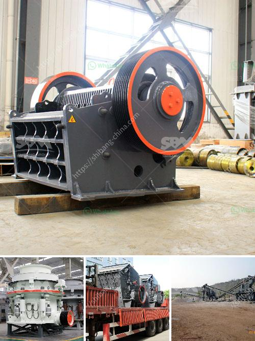

<h3>What is aluminium ore benefication process?</h3>
Aluminium is a versatile and widely used metal, known for its lightweight, corrosion resistance, and high thermal conductivity. To meet the increasing demand for aluminium, the extraction and benefication of aluminium ore are critical.

Aluminium ore, also known as bauxite, is the primary source of aluminium. Bauxite typically contains about 40-60% aluminum oxide (Al2O3). It is formed through weathering of rocks in tropical climates, where the most significant deposits are found.

The benefication process of aluminium ore involves several steps to extract valuable aluminum minerals and remove impurities. These steps include mining, crushing, grinding, gravity separation, and flotation.

The first step in aluminium ore benefication is mining. Large open-pit mines are commonly used, where the bauxite deposit is exposed near the surface. The topsoil and vegetation are removed before the extraction of the ore begins.

Once the bauxite ore is mined, it goes through crushing and grinding processes. The ore is broken down into smaller pieces, reducing its size for easier handling and extraction. Crushing and grinding are typically done using jaw crushers and ball mills.

Gravity separation is an essential step in the benefication process. In this step, the crushed ore is mixed with water and subjected to gravity separation techniques. The density difference between the valuable aluminium minerals and the impurities allows for their separation. The lighter impurities are removed, while the denser aluminium minerals settle at the bottom.

Flotation is another important step in aluminium ore benefication. It is typically used to separate fine-grained aluminium minerals from the remaining impurities. In this process, chemicals called collectors are added to the ore mixture, and air bubbles are introduced. The collectors selectively bind to the aluminium minerals, making them float to the surface. The impurities, on the other hand, remain in the water.

After flotation, the froth containing the aluminium minerals is collected and dried. This concentrate is further processed to obtain alumina, which is the refined form of aluminium oxide. The alumina is then used to produce aluminium metal through a process called electrolysis.

The entire aluminium ore benefication process aims to increase the aluminium content in bauxite and remove impurities that could affect the final product's quality. Through these steps, the extraction and benefication process ensures the production of high-grade aluminium that meets the industry's standards.

In conclusion, the aluminium ore benefication process is a crucial step in the production of high-quality aluminium. By combining mining, crushing, grinding, gravity separation, and flotation, valuable aluminium minerals are extracted from bauxite ore, ensuring the production of pure aluminium for various applications. As the demand for aluminium continues to grow, advancements in the benefication process will play a significant role in meeting this demand efficiently and sustainably.
<h3>Contact us</h3><ul><li><strong>Whatsapp:&nbsp;<a href="https://wa.me/8613661969651">+8613661969651</a></strong></li><li><a href="https://swt.shibang-china.com/?git&amp;zhl&amp;What is aluminium ore benefication process"><strong>Online Service(chat now)</strong></a></li></ul><h3>Related</h3><ul><li><a href='what type of crusher is best for concrete crushing.md'>what type of crusher is best for concrete crushing?</a></li><li><a href='What kind of crusher crushes basalt best.md'>What kind of crusher crushes basalt best?</a></li><li><a href='What equipment is needed for kaolin ore mines.md'>What equipment is needed for kaolin ore mines?</a></li><li><a href='what aspects influence stone crusher efficiency.md'>what aspects influence stone crusher efficiency</a></li><li><a href='What is the aggregate crusher.md'>What is the aggregate crusher?</a></li></ul>