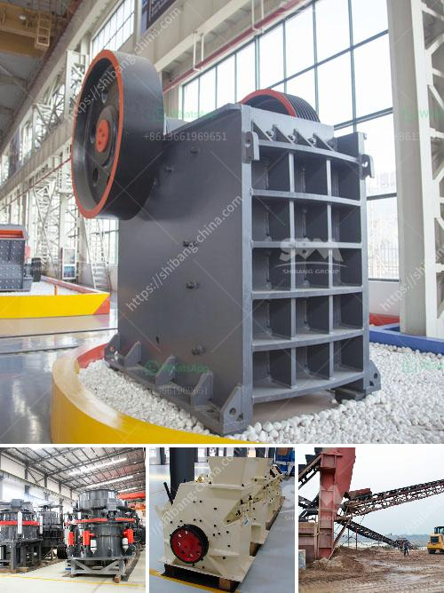

<h3>What is an ore vibrating screen? What is it for?</h3>
An ore vibrating screen is a piece of equipment that uses vibration to separate different-sized particles from each other. Unlike ordinary screens, an ore vibrating screen is equipped with multiple screens, each with different mesh sizes, allowing for the separation of particles of varying sizes.

The primary purpose of an ore vibrating screen is to separate ore particles into different sizes for further processing. This separation is achieved by utilizing the vibrations and movement of the screen, which causes smaller particles to fall through the screen mesh and larger particles to move towards the screen's edges.

One of the key benefits of using an ore vibrating screen is its ability to increase productivity and efficiency in the ore processing industry. By separating ore particles into different sizes, the vibrating screen allows for more streamlined and targeted processing. Smaller particles can be removed from the stream early on, preventing them from impeding the processing of larger particles. This results in a more efficient overall process and higher quality end products.

In addition to its main purpose of particle separation, an ore vibrating screen also offers other significant advantages. For instance, it aids in the removal of water or moisture from the ore. By vibrating the screen, excess water is expelled from the material, making it easier to handle and process. This is especially beneficial in industries where the moisture content of the ore needs to be controlled.

Furthermore, an ore vibrating screen helps in improving the quality of the final products. The separation of particles ensures that only the desired size range is processed further. This is particularly important in industries such as mining and mineral processing, where the ore needs to meet certain specifications or requirements. By removing unwanted particles, the vibrating screen helps ensure that the final products meet quality standards.

Another advantage of using an ore vibrating screen is its versatility. The screen's mesh sizes can be easily adjusted to accommodate different types of ore and desired particle sizes. This flexibility allows the vibrating screen to be used in various industries and applications, making it a highly adaptable piece of equipment.

In conclusion, an ore vibrating screen plays a crucial role in the ore processing industry. By separating ore particles into different sizes, it increases productivity, improves efficiency, and enhances the quality of the final products. Its ability to remove excess moisture also aids in handling and processing. Additionally, its versatility allows for use in a wide range of industries and applications. Overall, an ore vibrating screen is a valuable tool in the ore processing industry, helping to optimize and improve various aspects of the production process.
<h3>Contact us</h3><ul><li><strong>Whatsapp:&nbsp;<a href="https://wa.me/8613661969651">+8613661969651</a></strong></li><li><a href="https://swt.shibang-china.com/?git&amp;zhl&amp;What is an ore vibrating screen What is it for"><strong>Online Service(chat now)</strong></a></li></ul><h3>Related</h3><ul><li><a href='What is the process of mining hematite ore.md'>What is the process of mining hematite ore?</a></li><li><a href='What is a belt conveyor control system.md'>What is a belt conveyor control system?</a></li><li><a href='What is the cost of the equipment used in mining lead ore.md'>What is the cost of the equipment used in mining lead ore?</a></li><li><a href='What are factors that will affect the output of a cement mill.md'>What are factors that will affect the output of a cement mill?</a></li><li><a href='What beneficiation method is used for iron ore.md'>What beneficiation method is used for iron ore?</a></li></ul>