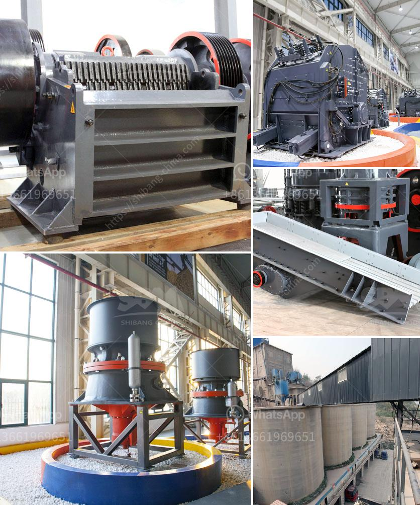

<h3>What is approximate cost of a jaw crusher?</h3>
A jaw crusher is one of the most commonly used primary crushers in the mining, quarrying, and demolition industries. Jaw crusher plays a vital role in crushing various kinds of ores and rocks with a compressive strength of less than 320MPa, such as granite, quartz, basalt, limestone, river pebble, iron ore, etc.

The function of the jaw crusher is based on the force pressing stone, the jaw moving in respect of an eccentric shaft moves back and forth regarding the fixed jaw (fixed on the frame), opening and closing dynamically. This force is generated by the eccentric shaft which is powered by a motor installed on the top of the crusher. As the material enters the crushing chamber, it gets squeezed between the fixed and movable jaws until it reaches the desired size, and it then exits through the discharge opening.

When considering purchasing a jaw crusher, one of the most important factors is the approximate cost of the equipment. Price plays a vital role in the selection process of a crusher, as it determines the investment and operating costs of the machine.

The cost of a jaw crusher varies depending on the size and capacity of the machine as well as the hardness of the ore and rock. Generally, jaw crushers are categorized into various classes - primary jaw crusher, medium jaw crusher, and fine jaw crusher.

The primary jaw crusher, also known as a laboratory crusher, is designed to reduce hard and brittle materials, such as ores, minerals, coal, coke, chemicals, and other similar materials. It is typically used as a primary crusher in a small-scale production plant, where reduction ratios are relatively low.

Medium jaw crushers are often used as primary crushers in large-scale mining and quarrying operations. These crushers are capable of handling larger feed sizes and higher capacities than primary jaw crushers. They are usually utilized in the primary crushing stage of a crushing circuit.

Fine jaw crushers are used to crush secondary and tertiary materials, such as granites, basalt, limestone, and river gravels. With their high reduction ratios, these crushers are suitable for reducing the size of a variety of materials to a smaller, more uniform size.

The approximate cost of a jaw crusher can range from tens of thousands to hundreds of thousands of dollars, depending on the model you choose, the machine's specifications, and its application. It is recommended to consult with a professional manufacturer and let them recommend the most suitable jaw crusher for your specific needs.

Additionally, the cost of installing, operating, and maintaining a jaw crusher should also be taken into consideration. Apart from the initial purchase cost, factors like power consumption, fuel expenses, spare parts availability, and maintenance requirements also contribute to the overall cost.

In conclusion, when considering the cost of purchasing a jaw crusher, it is essential to take into account the size, capacity, and type of crusher required for your specific application. By consulting with a reputable manufacturer, you can ensure that you choose the most suitable jaw crusher that meets all your requirements without exceeding your budget.
<h3>Contact us</h3><ul><li><strong>Whatsapp:&nbsp;<a href="https://wa.me/8613661969651">+8613661969651</a></strong></li><li><a href="https://swt.shibang-china.com/?git&amp;zhl&amp;What is approximate cost of a jaw crusher"><strong>Online Service(chat now)</strong></a></li></ul><h3>Related</h3><ul><li><a href='What is the separation process in a vertical raw mill.md'>What is the separation process in a vertical raw mill?</a></li><li><a href='What about the crusher made in Ethiopia.md'>What about the crusher made in Ethiopia?</a></li><li><a href='What does the crushing of copper ore have to do with ball mills.md'>What does the crushing of copper ore have to do with ball mills?</a></li><li><a href='what are steps to wash iron sand？.md'>what are steps to wash iron sand？</a></li><li><a href='What are the parts of ball mill internal structure.md'>What are the parts of ball mill internal structure?</a></li></ul>