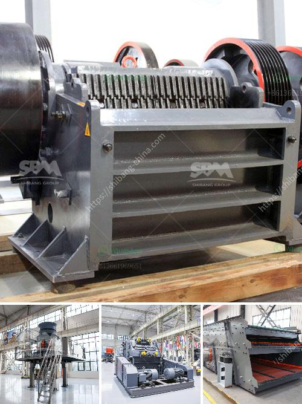

<h3>What is barite and how is it mined?</h3>
Barite is a mineral composed of barium sulfate (BaSO4), which is naturally occurring in a variety of colors and formations. It has a high specific gravity of 4.5, making it one of the heaviest non-metallic minerals. Barite is widely used in the oil and gas industry as a drilling fluid additive due to its ability to control high-pressure zones and prevent blowouts during drilling operations. It is also utilized in various other industries such as construction, paints, ceramics, and medical applications.

The process of mining barite involves removing the overburden, drilling the mineral deposit, and transporting it to the surface for further processing. Once the barite deposit is located, the first step is to remove the soil and rock covering it, referred to as the overburden. This is typically done using heavy machinery such as bulldozers and excavators to create an open pit mine or by blasting the overburden with explosives.

After the overburden is removed, drilling is carried out to access the barite deposit. This involves using rotary drilling rigs equipped with diamond or tungsten carbide bits to create holes in the ground. The drilling process involves injecting drilling mud, a mixture of water and additives, into the hole to lubricate the bit, cool the drill string, and remove the rock cuttings.

Once the drilling is completed, the samples are analyzed to determine the quality and quantity of barite present in the deposit. If the analysis indicates a viable concentration of barite, the extraction process begins. The barite is transported to the surface through the drill pipe using compressed air or a combination of air and water. This process is called air-lifting and allows the barite to flow to the surface without any blockage.

After reaching the surface, the barite is separated from the drilling mud by either gravity separation or flotation techniques. Gravity separation relies on the difference in specific gravity between barite and the drilling mud to separate them. This process involves passing the mixture through various equipment such as shale shakers, centrifuges, and hydrocyclones that separate the heavier barite from the lighter drilling mud.

Flotation, on the other hand, is a process that utilizes chemical reagents to selectively attach to the barite particles, allowing them to rise to the surface. The flotation process involves mixing the ground barite ore with water and reagents in flotation cells. Air bubbles are then introduced, causing the barite particles to attach to the bubbles and rise to the surface, where they are collected and further processed.

Once separated from the drilling mud, the barite undergoes further processing to meet the specific requirements of its end-use. This can include grinding the barite into a fine powder, screening for desired particle size, and removing impurities through techniques such as magnetic separation or froth flotation.

In summary, barite is a valuable mineral used in a range of industries, especially in the oil and gas sector. Its mining process involves removing overburden, drilling the deposit, and separating the barite from the drilling mud through gravity separation or flotation techniques. This ensures that the high-quality barite is extracted and refined for various industrial applications.
<h3>Contact us</h3><ul><li><strong>Whatsapp:&nbsp;<a href="https://wa.me/8613661969651">+8613661969651</a></strong></li><li><a href="https://swt.shibang-china.com/?git&amp;zhl&amp;What is barite and how is it mined"><strong>Online Service(chat now)</strong></a></li></ul><h3>Related</h3><ul><li><a href='What is a grinding ball mill aid.md'>What is a grinding ball mill aid?</a></li><li><a href='What is the optimum frequency for a vibrating screen.md'>What is the optimum frequency for a vibrating screen?</a></li><li><a href='Which industries depend on coal.md'>Which industries depend on coal?</a></li><li><a href='What is the process of mining copper ore.md'>What is the process of mining copper ore?</a></li><li><a href='What kind of crushing machinery is used to mine marble ore.md'>What kind of crushing machinery is used to mine marble ore</a></li></ul>