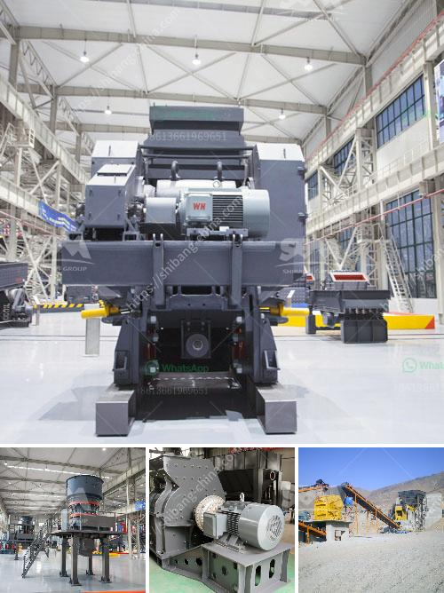

<h3>What is belt conveyor in gold mining?</h3>
Belt conveyors are widely used in mining, metallurgy, coal, and other industries to transport bulk materials, often in large volumes over long distances. They are the most economical method of conveying bulk materials over both short and long distances.

Belt conveyors are ideal for conveying bulk materials of various types. They can be used to transport materials like iron ore, copper ore, gold ore, coal, gravel, aggregates, and other materials in bulk quantities, thereby reducing the need for haul trucks or other large vehicles to transport materials from one place to another.

In the case of gold mining, belt conveyors are an essential part of the operation. They are used to transport the ore from the underground mine to the processing plant. Overland conveyors and portable conveyors are commonly employed in this process.

The overland conveyor constantly moves the ore and transfers it to the processing plant along its route. This conveyor can span over long distances, sometimes even up to several kilometers. This makes it an efficient and cost-effective method of transporting ore from the mine to the processing plant.

Portable conveyors, on the other hand, are often used to transfer material between different stages of the gold mining process. For example, a portable conveyor can be used to unload ore from a primary crusher to a stockpile, then transported later to the processing plant for further treatment.

Belt conveyors are designed to handle bulk materials of varying weights and sizes. Depending on the specific requirements of the gold mining operation, some conveyors may need to be designed to withstand harsh environmental conditions, such as high temperatures or moisture. Special conveyor belts, coatings, and components can be utilized to ensure durability and reliability under these conditions.

In addition to transporting materials, belt conveyors can also be used to load and unload trucks, ships, and trains. This versatility makes them an essential tool in the gold mining industry, as it allows for efficient transportation of materials both within the mine site and to external locations, such as ports or smelters.

Overall, belt conveyors play a crucial role in gold mining operations, making them an integral part of the industry. They help reduce the reliance on heavy machinery, such as haul trucks, and provide a more efficient and cost-effective method of transporting bulk materials.

As the demand for gold continues to rise, the need for efficient transportation methods will also increase. Belt conveyors will continue to be a key tool in the gold mining industry, helping to streamline operations and maximize productivity. With ongoing advancements in technology, conveyor systems will likely become even more efficient and reliable in the future, further enhancing the gold mining process.
<h3>Contact us</h3><ul><li><strong>Whatsapp:&nbsp;<a href="https://wa.me/8613661969651">+8613661969651</a></strong></li><li><a href="https://swt.shibang-china.com/?git&amp;zhl&amp;What is belt conveyor in gold mining"><strong>Online Service(chat now)</strong></a></li></ul><h3>Related</h3><ul><li><a href='What is dry screening iron ore.md'>What is dry screening iron ore?</a></li><li><a href='What temperature should the Raymond roller mill operate at.md'>What temperature should the Raymond roller mill operate at?</a></li><li><a href='What is concrete crushing.md'>What is concrete crushing?</a></li><li><a href='What are factors that will affect the output of a cement mill.md'>What are factors that will affect the output of a cement mill?</a></li><li><a href='What is the process for mining line.md'>What is the process for mining line?</a></li></ul>