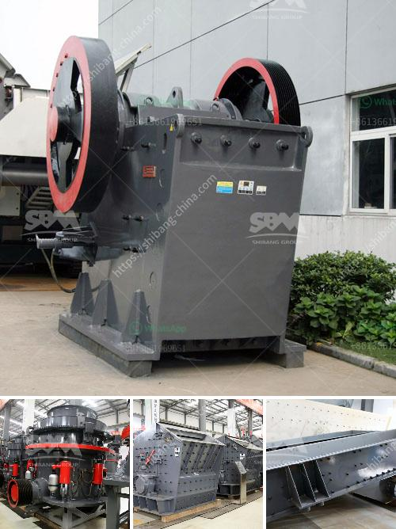

<h3>What is chrome ore grades?</h3>
Chrome ore is a crucial mineral that plays a significant role in various industries. Understanding its grades is essential for those involved in the mining, production, and trading of this valuable material. Chrome ore grades refer to the different varieties and qualities of chrome ore available in the market. These grades are determined based on various factors such as chemical composition, geological properties, and intended use.

The classification of chrome ore grades is primarily based on the percentage of chromium (Cr) present in the mineral. Chromium is a versatile element used in the production of stainless steel, alloy steel, and other alloy materials. Therefore, the grade of chrome ore directly affects its applications and market demand.

1. High-grade chromite: This type of chrome ore contains a high percentage of chromium, usually ranging from 48% to 56%. High-grade chromite is considered the most valuable due to its superior quality and purity. It is primarily used in the production of stainless steel, which requires a high chromium content for its corrosion resistance properties. This grade is in high demand and fetches a premium price in the market.

2. Medium-grade chromite: This grade contains a lower percentage of chromium, usually ranging from 36% to 47%. Medium-grade chromite is commonly used in the production of alloy steels, castings, and refractories. While it is not as pure as high-grade chromite, it still possesses sufficient chromium content to provide essential properties to the end products. The demand for medium-grade chromite remains stable due to its affordability and versatility.

3. Low-grade chromite: This grade contains the lowest percentage of chromium, usually below 35%. Low-grade chromite is typically used in various industrial applications such as cement additives, chemical catalysts, and pigments. Although it lacks the desirable properties of high and medium-grade chromite, it is still valuable due to its availability and cost-effectiveness.

The mining and extraction process play a crucial role in determining the grade of chrome ore. Higher mining standards and advanced extraction techniques result in higher-quality ore, whereas inefficient mining practices may lead to lower grades. Additionally, several geological factors, such as the presence of impurities and contaminants, can impact the overall grade of chrome ore.

To streamline the trading and commercialization of chrome ore, internationally recognized standards have been established. These standards specify the acceptable quality and composition of chrome ore grades for different applications. The most widely recognized standard for chrome ore grades is the International Organization for Standardization (ISO) 9001 certification.

In conclusion, chrome ore grades refer to the different varieties and qualities of chrome ore available in the market. These grades are determined based on the chromium content and are classified as high-grade, medium-grade, and low-grade chromite. Understanding these grades is crucial for miners, manufacturers, and traders involved in the chrome ore industry to ensure they meet the specific requirements of different industries and end-users.
<h3>Contact us</h3><ul><li><strong>Whatsapp:&nbsp;<a href="https://wa.me/8613661969651">+8613661969651</a></strong></li><li><a href="https://swt.shibang-china.com/?git&amp;zhl&amp;What is chrome ore grades"><strong>Online Service(chat now)</strong></a></li></ul><h3>Related</h3><ul><li><a href='What are machines used for mining iron ore.md'>What are machines used for mining iron ore?</a></li><li><a href='what are some of the equipments used in mining industry.md'>what are some of the equipments used in mining industry?</a></li><li><a href='what are the equipment for gypsum mining.md'>what are the equipment for gypsum mining?</a></li><li><a href='Whats better for a granite mobile crusher or fixed crusher.md'>Whats better for a granite mobile crusher or fixed crusher?</a></li><li><a href='what is the running cost for a jaw crusher.md'>what is the running cost for a jaw crusher?</a></li></ul>