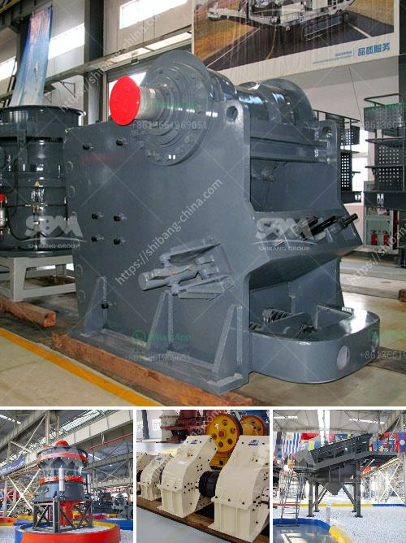

<h3>What is concrete crusher?</h3>
What is a concrete crusher? This question may be on your mind if you have ever come across construction sites or heard about the demolition industry. A concrete crusher is a heavy-duty machine that is used to crush concrete rubble or demolition waste into smaller pieces. This equipment crushes and breaks down concrete into reusable materials, making it an essential component in the construction industry.

Concrete crushers are available in various sizes and types, ranging from portable units for minor projects to large industrial machines for heavy-duty tasks. These machines come with hydraulic systems that enable easy and efficient crushing of concrete. The machine's crushing jaws or plates apply pressure to the concrete to create cracks and fractures, allowing the smaller pieces to be separated, recycled, or used for other purposes.

One of the main advantages of using a concrete crusher is the reduction in waste management costs. By crushing and recycling concrete on-site, construction companies can avoid the expensive transportation and disposal fees associated with disposing of concrete waste at landfills. Instead, the crushed concrete can be used as a base material for new construction projects, saving both money and resources.

Concrete crushers also play a crucial role in environmental sustainability. Concrete is one of the most commonly used materials in construction, but its production is resource-intensive and contributes to carbon emissions. By recycling concrete, the demand for extracting new raw materials is reduced, leading to a smaller environmental footprint. Additionally, using recycled concrete as a base material reduces the need for gravel, conserving valuable natural resources.

Furthermore, concrete crushers enhance the efficiency and productivity of construction projects. The ability to crush concrete on-site eliminates the need for hauling and loading concrete debris onto trucks and transporting it to recycling facilities or landfills. This saves time, labor, and fuel, allowing construction projects to progress smoothly and meet deadlines.

Apart from the construction industry, concrete crushers are also beneficial in the demolition sector. When buildings or structures need to be demolished, concrete crushers can efficiently break down the concrete, making it easier for the debris to be removed and disposed of. The crushed concrete can then be recycled or used as fill material, closing the loop and reducing waste.

In conclusion, a concrete crusher is a vital tool in the construction and demolition industries. With their ability to crush concrete into reusable materials, these machines contribute to waste reduction, cost savings, and environmental sustainability. Whether it is a small-scale project or a large construction site, a concrete crusher is an essential addition to any machinery fleet. By investing in a concrete crusher, individuals and organizations can not only save money but also contribute to a greener and more sustainable environment.
<h3>Contact us</h3><ul><li><strong>Whatsapp:&nbsp;<a href="https://wa.me/8613661969651">+8613661969651</a></strong></li><li><a href="https://swt.shibang-china.com/?git&amp;zhl&amp;What is concrete crusher"><strong>Online Service(chat now)</strong></a></li></ul><h3>Related</h3><ul><li><a href='What are the processes of iron ore beneficiation.md'>What are the processes of iron ore beneficiation?</a></li><li><a href='what is universal grinding machine？.md'>what is universal grinding machine？</a></li><li><a href='What are the mining processes of copper.md'>What are the mining processes of copper?</a></li><li><a href='What is the price of the mobile crusher that has a capacity of 350 tons per hour.md'>What is the price of the mobile crusher that has a capacity of 350 tons per hour?</a></li><li><a href='What machinery is used in copper mining .md'>What machinery is used in copper mining ?</a></li></ul>