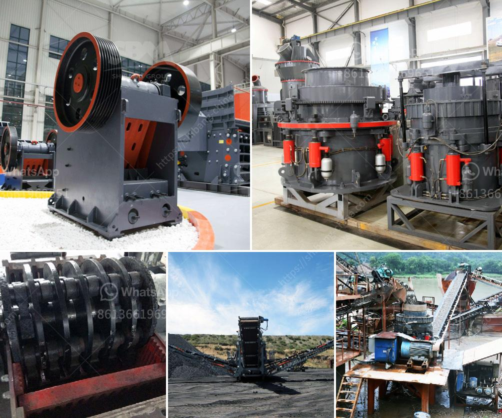

<h3>What is concrete crushing?</h3>
Concrete crushing is a popular and essential process in the construction industry. In simple terms, it involves breaking, removing, and crushing concrete into smaller and reusable materials. This process, also known as concrete recycling, has gained significant importance due to the scarcity and environmental impact of virgin resources. Concrete crushing helps reduce pollution and waste, conserve resources, and lower construction costs.

The process of concrete crushing involves several steps. First, larger chunks of concrete are broken down into smaller pieces using specialized equipment like excavators, jaw crushers, and cone crushers. This primary crushing process further reduces the size of the concrete rubble, making it easier to handle and transport. These smaller pieces are then fed into secondary crushers, such as impact crushers or gyratory crushers, to further break them down into even smaller sizes.

Once the concrete is crushed into smaller pieces, it can be used in various ways. For instance, crushed concrete can be used as a base material for roads, parking lots, or driveways. The crushed material can be mixed and used as the aggregate in new concrete mixtures, replacing the need for virgin aggregates. It can also be used as fill material in landscaping and construction projects.

Concrete crushing offers several benefits for both the construction industry and the environment. Firstly, it helps conserve natural resources. By using crushed concrete as an aggregate, the need for mining and extracting new materials is significantly reduced. This helps preserve natural resources like gravel, sand, and stone, which are often in limited supply.

Additionally, concrete recycling reduces the amount of waste generated and transported to landfills. The crushing process allows construction companies to reuse concrete materials that would otherwise end up as waste. This reduces the strain on landfills and helps reduce pollution associated with landfill practices. Moreover, it decreases the demand for landfill space, allowing for more efficient use of these areas.

Concrete crushing also contributes to the reduction of carbon emissions. The production of new concrete requires significant amounts of energy, which releases carbon dioxide (CO2), a greenhouse gas responsible for climate change. On the other hand, concrete recycling helps save energy and reduce CO2 emissions associated with the production of new concrete. By reusing crushed concrete as a substitute for virgin materials, the carbon footprint of construction projects can be significantly reduced.

Finally, concrete crushing is cost-effective. Construction companies can save on disposal fees typically associated with transporting concrete waste to landfills. Moreover, recycled concrete is often cheaper than virgin aggregates. By using crushed concrete, construction projects can achieve cost savings while still maintaining a high-quality end product.

In conclusion, concrete crushing is an essential process in the construction industry. It provides many benefits, including resource conservation, waste reduction, carbon emission reduction, and cost savings. By crushing and reusing concrete, construction companies can contribute to a more sustainable future while meeting their project needs efficiently.
<h3>Contact us</h3><ul><li><strong>Whatsapp:&nbsp;<a href="https://wa.me/8613661969651">+8613661969651</a></strong></li><li><a href="https://swt.shibang-china.com/?git&amp;zhl&amp;What is concrete crushing"><strong>Online Service(chat now)</strong></a></li></ul><h3>Related</h3><ul><li><a href='What machines are needed to crush river pebbles into small stones.md'>What machines are needed to crush river pebbles into small stones?</a></li><li><a href='What is the cost of limestone crushing process .md'>What is the cost of limestone crushing process ?</a></li><li><a href='What is the machine used in hard rock gold mining.md'>What is the machine used in hard rock gold mining?</a></li><li><a href='what are some of the equipments used in mining industry.md'>what are some of the equipments used in mining industry?</a></li><li><a href='What is the difference between an open circuit and a closed circuit ball mill.md'>What is the difference between an open circuit and a closed circuit ball mill?</a></li></ul>