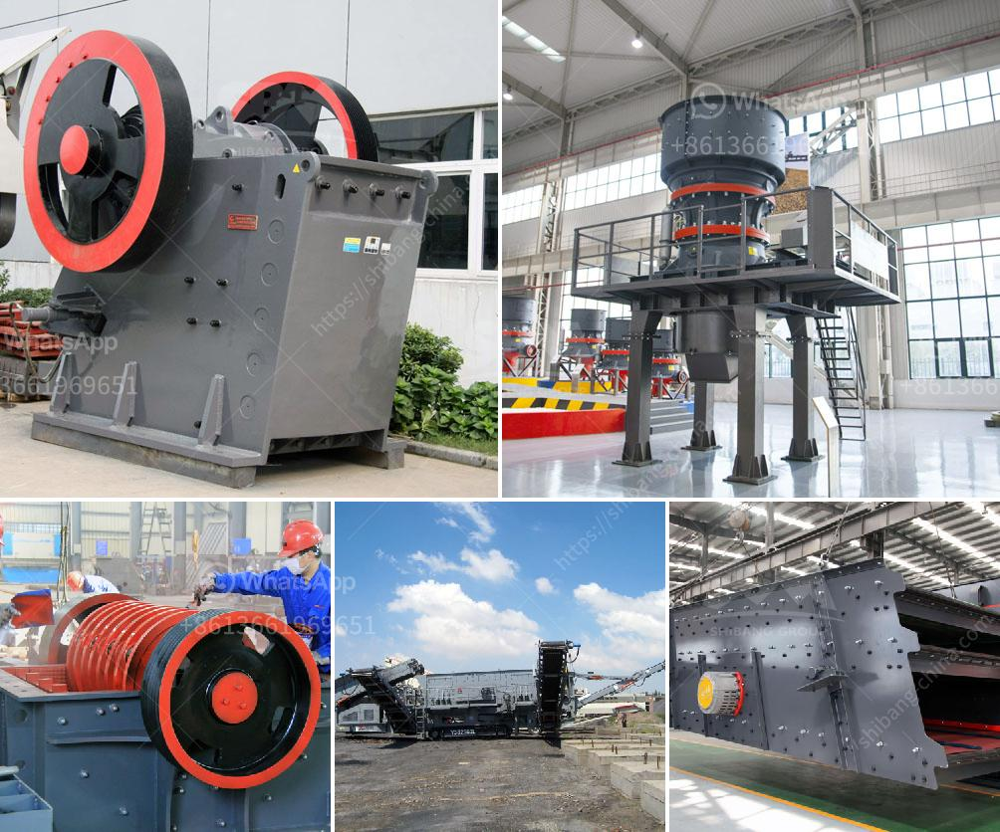

<h3>What is cost of bauxite processing per ton?</h3>
Bauxite is one of the most widely used raw materials for aluminum production globally. The production of aluminum requires various processes such as mining, crushing, grinding, and refining, which are collectively known as bauxite processing. However, the cost of bauxite processing is a crucial aspect of aluminum production.

The cost of bauxite processing per ton depends on the extraction method used to obtain the bauxite. The region and country from where the bauxite is extracted also determine the overall cost. Different extraction methods, such as open-pit mining, underground mining, or strip mining, have varying costs associated with them. 

Open-pit mining is the most commonly used method to extract bauxite, and it typically costs less than other extraction methods. In open-pit mining, the bauxite is extracted by removing the topsoil, vegetation, and layers of rock to access the bauxite ore beneath. This method requires heavy machinery, such as excavators, and incurs costs for fuel, labor, and equipment maintenance. However, open-pit mining has lower production costs per ton compared to underground mining due to its high production capacity.

Underground mining involves accessing bauxite deposits located deep underground. This method requires extensive drilling and tunneling, which increases the overall cost of bauxite processing per ton. The underground mining process is more complex and involves additional costs associated with ventilation, safety measures, and maintenance of underground infrastructure. Thus, underground mining tends to have a higher cost per ton compared to open-pit mining.

Another factor that affects the cost of bauxite processing per ton is the type of bauxite being processed. Bauxite deposits can differ in terms of quality and mineral composition. Higher-quality bauxite deposits with a higher aluminum content are generally more expensive to process. The processing of low-grade bauxite deposits requires additional refining steps, which add to the overall cost.

Additionally, the infrastructure and logistics involved in bauxite processing contribute to its cost. Bauxite processing plants require significant capital investment for construction and operation. They need to be strategically located near bauxite mines to minimize transportation costs. The cost of transporting bauxite from the mining site to the processing plant can be substantial, especially if the locations are far apart. Infrastructure development, including road networks and adequate storage facilities, also increases the cost per ton.

Overall, the cost of bauxite processing per ton can vary depending on factors such as extraction method, deposit quality, infrastructure requirements, and transportation costs. These factors contribute to the overall cost of aluminum production, making it essential for producers to evaluate and optimize their operational processes to minimize expenses. By finding cost-efficient solutions, the aluminum industry can ensure a sustainable supply of bauxite while maintaining competitive pricing in the market.
<h3>Contact us</h3><ul><li><strong>Whatsapp:&nbsp;<a href="https://wa.me/8613661969651">+8613661969651</a></strong></li><li><a href="https://swt.shibang-china.com/?git&amp;zhl&amp;What is cost of bauxite processing per ton"><strong>Online Service(chat now)</strong></a></li></ul><h3>Related</h3><ul><li><a href='What is the difference between an open circuit and a closed circuit ball mill.md'>What is the difference between an open circuit and a closed circuit ball mill?</a></li><li><a href='What is the beneficiation of iron ore.md'>What is the beneficiation of iron ore?</a></li><li><a href='What equipment is used in the mining industry .md'>What equipment is used in the mining industry ?</a></li><li><a href='What is the size of the coal after it passes through the crusher.md'>What is the size of the coal after it passes through the crusher?</a></li><li><a href='What is the process and cost of quartz extraction.md'>What is the process and cost of quartz extraction?</a></li></ul>