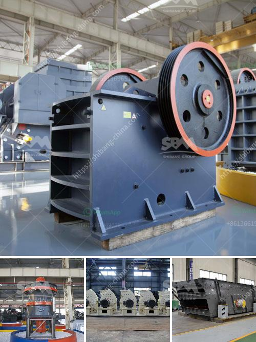

<h3>What is critical speed in rpm of ball mill 1290 mm id charged with 64mm balls</h3>
Critical speed, also known as the critical rotational speed, is the speed at which a ball mill becomes a centrifuge and is no longer effective for grinding. This speed is expressed in revolutions per minute (rpm) and is related to the size of the mill and the size of the particles being ground.

When the ball mill is rotated at its critical speed, the grinding media (steel balls) will rotate with the mill and not fall down, thus preventing the comminution of the material. It is then called a centrifuging action.

Here, Nc is the critical speed in rpm, D is the inner diameter of the mill (1290 mm in this case), and d is the diameter of the grinding balls (64 mm in this case).

It is crucial to understand that the critical speed must be exceeded to allow proper mixing, cascading, and grinding. Once the critical speed is achieved, the mill becomes a centrifuge, and the grinding media is thrown against the wall of the mill, effectively applying a force equal to their weight to the particles, causing them to break into smaller pieces.

In practical terms, the critical speed is important to understand the grinding behavior of a ball mill. It helps in determining the optimal rotational speed at which the grinding media should spin to ensure efficient grinding. If the speed is too low, the grinding media may stay at the bottom and the grinding process will not be as effective. On the other hand, if the speed is too high, the grinding media may become too energetic, leading to excessive stress and possible damage to the mill.

The critical speed also affects the residence time of the material inside the mill. As the mill rotates faster, the grinding media will spend less time near the outer edge and more time cascading and grinding the particles, resulting in finer particles.

Therefore, understanding the critical speed and operating the ball mill at an appropriate speed can greatly enhance grinding efficiency and productivity. It is recommended to experimentally determine the critical speed for every mill, considering the specific characteristics of the material being ground and the size and type of the grinding media. Only then can an optimal operation and performance be achieved, availing the advantages of a ball mill in the field of particle size reduction.
<h3>Contact us</h3><ul><li><strong>Whatsapp:&nbsp;<a href="https://wa.me/8613661969651">+8613661969651</a></strong></li><li><a href="https://swt.shibang-china.com/?git&amp;zhl&amp;What is critical speed in rpm of ball mill 1290 mm id charged with 64mm balls"><strong>Online Service(chat now)</strong></a></li></ul><h3>Related</h3><ul><li><a href='What equipment and machinery are needed to mine marble.md'>What equipment and machinery are needed to mine marble?</a></li><li><a href='what some of the equipment used in handling materials in the mining industry？.md'>what some of the equipment used in handling materials in the mining industry？</a></li><li><a href='What about the crusher made in Ethiopia.md'>What about the crusher made in Ethiopia?</a></li><li><a href='What equipment is needed for silicon ore mines.md'>What equipment is needed for silicon ore mines?</a></li><li><a href='What are the machines used to mine bauxite.md'>What are the machines used to mine bauxite?</a></li></ul>