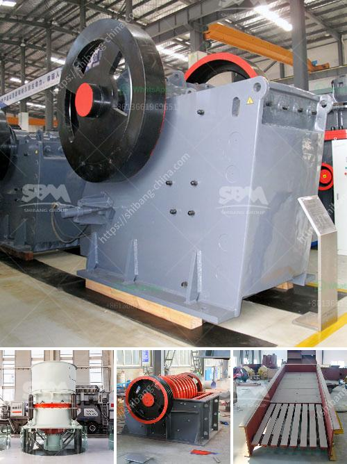

<h3>What is dry screening iron ore?</h3>
Dry screening iron ore refers to the process of removing impurities, such as clay, dust, and fine particles, from the run-of-mine (ROM) ore. It may also involve scalping the feed material to remove the oversize rocks or other impurities prior to the secondary and tertiary crushing stages.

Iron ore is an essential raw material for the steel industry. It is mined in various forms, including hematite, magnetite, limonite, siderite, and goethite. The process of mining consists of discovery of an iron ore deposit through extraction of iron ore and finally to returning the land to its natural state. Dry screening can be used to efficiently separate iron ore particles into various sizes to ensure the standard grade of the product.

One of the key aspects of dry screening iron ore is the moisture content. If the ore is too moist, it can cause the screening process to be inefficient and lead to screens plugging or blinding. Dry screening is conducted at ambient temperature, which helps to keep the moisture content of the ore low, enabling effective screening.

The dry screening process involves a vibrating screen to remove the oversize rocks and other impurities, followed by a secondary screen to remove the finer particles. This two-step screening process ensures a consistent size distribution for the final product.

Dry screening of iron ore can be done wet or dry, depending on the nature of the ore and the process requirements. Wet screening typically involves the use of water sprays to dampen the feed material, leading to less carryover fines, and therefore better separation efficiency. However, dry screening is preferred in certain cases where water availability is limited, or where the ore is non-sticky and easily breaks into smaller particles.

Dry screening also offers several advantages over wet screening. It eliminates the need for costly drying processes, reduces water consumption, and minimizes the generation of waste slurry. Additionally, dry screening can be more energy efficient, as it does not require the use of water or additional processing steps associated with wet screening.

Dry screening of iron ore is widely used in the mining industry, particularly in the extraction of hematite, magnetite, limonite, siderite, and goethite. It provides a cost-effective method for processing iron ore fines, ensuring consistent quality and optimizing the production process.

In conclusion, dry screening iron ore is an effective way to remove impurities from the ROM ore, resulting in a high-quality product for the steel industry. The process eliminates the need for costly drying and reduces water consumption, making it an attractive option for mining operations. With its versatility and cost-effectiveness, dry screening continues to play a vital role in iron ore processing worldwide.
<h3>Contact us</h3><ul><li><strong>Whatsapp:&nbsp;<a href="https://wa.me/8613661969651">+8613661969651</a></strong></li><li><a href="https://swt.shibang-china.com/?git&amp;zhl&amp;What is dry screening iron ore"><strong>Online Service(chat now)</strong></a></li></ul><h3>Related</h3><ul><li><a href='What is roller crusher.md'>What is roller crusher?</a></li><li><a href='Whats better for a granite mobile crusher or fixed crusher.md'>Whats better for a granite mobile crusher or fixed crusher?</a></li><li><a href='How to choose a cone crusher for rock crushing？.md'>How to choose a cone crusher for rock crushing？</a></li><li><a href='what is the running cost for a jaw crusher.md'>what is the running cost for a jaw crusher?</a></li><li><a href='What is concrete crusher.md'>What is concrete crusher?</a></li></ul>