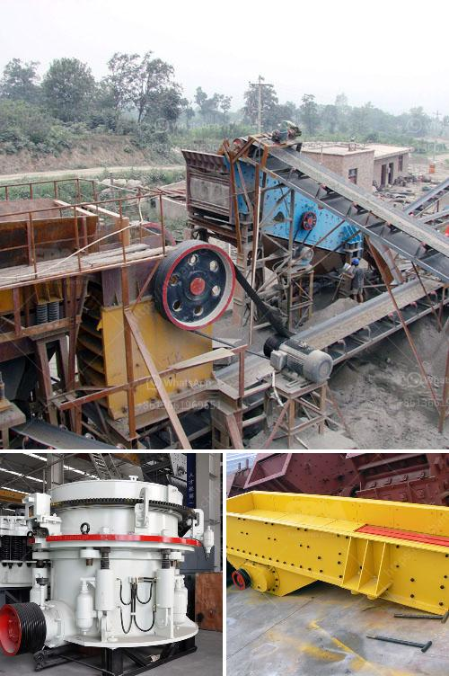

<h3>What is grindind machine?</h3>
A grinding machine is a tool or machinery designed to perform abrasive machining processes. It uses a grinding wheel as a cutting tool, which is typically composed of abrasive grains bonded together to form a solid wheel. These grains remove material from the workpiece by friction, resulting in the desired shape, dimension, and surface finish.

Grinding machines have been in use for centuries, evolving both in terms of technology and applications. Initially, they were operated manually, but with the advent of industrialization, various types of automated grinding machines were developed to enhance productivity and precision.

Grinding machines can be categorized into several types based on their design and purpose. The most common ones include surface grinders, cylindrical grinders, and bench grinders. Each type has its specialized functions and capabilities. Surface grinders are used to produce a smooth and flat surface on a workpiece, while cylindrical grinders are employed to shape cylindrical or tapered surfaces. Bench grinders, on the other hand, are primarily used for sharpening tools and grinding small workpieces.

The working principle of a grinding machine involves removing material from the workpiece by means of a rotating abrasive wheel. The wheel’s abrasive grains act as cutting tools, slicing through the material. As the wheel rotates, the workpiece is fed against it, allowing for the removal of material in the form of small chips. This process is repeated until the desired shape and finish are achieved.

In addition to the grinding wheel, grinding machines also feature a workholding device to secure the workpiece in place during the grinding process. It can be a chuck, magnetic device, or any other method that keeps the workpiece steady and prevents slippage or movement during machining.

The accuracy and precision of a grinding machine are critical factors that determine its effectiveness. Various factors, such as machine rigidity, wheel quality, and dressing technique, contribute to achieving high levels of accuracy. The stiffness of the machine structure ensures minimal vibrations and deflections, resulting in accurate and repeatable grinding operations. A high-quality grinding wheel with well-distributed abrasive grains further enhances the precision by reducing surface roughness and maintaining consistent material removal rates.

Grinding machines find extensive applications in various industries. They are used to produce highly precise components for automotive, aerospace, and medical industries. Grinders are also commonly employed in metalworking, construction, and fabrication industries to sharpen tools, remove burrs, and shape workpieces to specific requirements. Moreover, the versatility of grinding machines allows them to be applied to a wide range of materials, including metals, ceramics, glass, composites, and even wood.

In conclusion, a grinding machine is a versatile tool that is crucial for achieving precision and accuracy in various machining operations. It plays a pivotal role in manufacturing industries, offering efficient material removal, resulting in the desired shape, dimension, and surface finish of workpieces. With advancements in technology, grinding machines continue to evolve, offering improved efficiency, automation, and capabilities to meet the growing demands of modern industries.
<h3>Contact us</h3><ul><li><strong>Whatsapp:&nbsp;<a href="https://wa.me/8613661969651">+8613661969651</a></strong></li><li><a href="https://swt.shibang-china.com/?git&amp;zhl&amp;What is grindind machine"><strong>Online Service(chat now)</strong></a></li></ul><h3>Related</h3><ul><li><a href='What companies make concrete crushers .md'>What companies make concrete crushers ?</a></li><li><a href='What does the concrete batching plant contain.md'>What does the concrete batching plant contain?</a></li><li><a href='What kind of crushing machinery is used for sandstone processing ？.md'>What kind of crushing machinery is used for sandstone processing ？</a></li><li><a href='What is the mining process of gypsum.md'>What is the mining process of gypsum?</a></li><li><a href='What are the machines and equipment in mining.md'>What are the machines and equipment in mining?</a></li></ul>