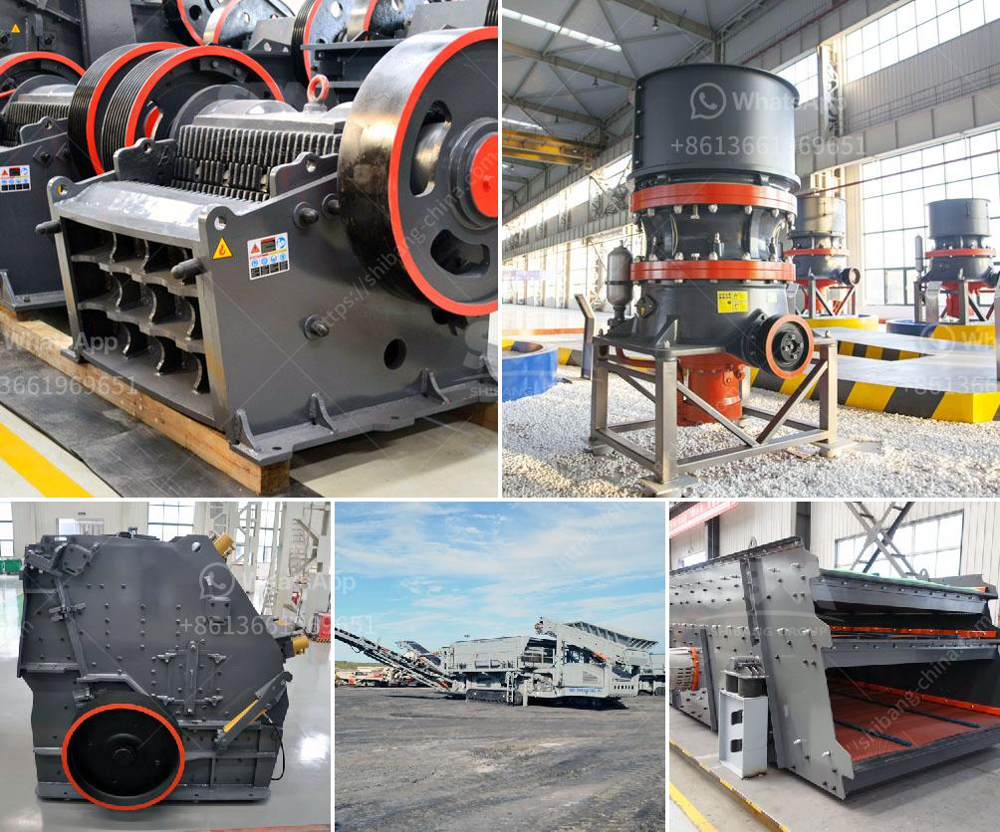

<h3>What is hematite, magnetic limonite and rhodochrosite?</h3>
The Earth is truly a treasure trove of minerals, each with its unique characteristics and properties. Some of the most fascinating minerals include hematite, magnetic limonite, and rhodochrosite, which have captivated scientists, collectors, and enthusiasts for centuries.

One of the most recognizable minerals is hematite, known for its striking red color. Hematite gets its name from the Greek word "haima," meaning blood, due to its vivid red hue when powdered or streaked. Its distinctive color is caused by iron atoms, which give it its deep red appearance.

Hematite is found in various forms, including botryoidal (resembling a cluster of grapes), massive, and crystal formations. This mineral is highly reflective and has a metallic luster, making it a popular choice for jewelry and ornamental purposes. Ancient cultures believed that hematite had protective qualities and used it as an ingredient in amulets and talismans.

Beyond its aesthetic appeal, hematite possesses significant magnetic properties. When ground into a fine powder, hematite exhibits ferromagnetism, meaning it can be magnetized by a magnetic field and retain its magnetization even after the field is removed. This property has led to its use in compasses, as it aligns itself along the Earth's magnetic field.

Another notable mineral is magnetic limonite, named after the Greek word for meadow because of its yellowish-brown color resembling dried grass. Limonite is composed of hydrated iron oxide and is often found in association with other iron minerals. It forms as a result of weathering and alteration of iron-bearing minerals, such as magnetite or hematite.

Magnetic limonite, as the name implies, is strongly magnetic and exhibits ferromagnetism. It shares this characteristic with hematite and attracts metallic objects in the presence of a magnetic field. This magnetic property has been exploited for various industrial applications, such as the production of magnetic tapes.

Limonite deposits are abundant worldwide and have been historically mined as an important source of iron ore. However, it should be noted that not all limonite is magnetic. Non-magnetic varieties of limonite, known as goethite, are also prevalent and are typically used as pigments in paints and pottery.

Lastly, rhodochrosite is a vibrant and eye-catching mineral known for its pink to red coloration. Its name is derived from the Greek words "rhodos" for rose and "khros" for color. Rhodochrosite's natural beauty and unique color make it highly sought after in the world of gemstones and jewelry.

This mineral is primarily composed of manganese carbonate, which gives its characteristic pink hue. Rhodochrosite is often found in stalactitic or globular formations, displaying concentric bands of alternating colors. Its captivating appearance, combined with its relative scarcity, has made it a favorite among collectors.

In addition to its aesthetic value, rhodochrosite is believed to possess healing properties and is associated with love and emotional healing. It is also designated as the official state mineral of Colorado, where a notable rhodochrosite deposit, known as the Sweet Home Mine, has been highly regarded for its exceptional quality and beauty.

Hematite, magnetic limonite, and rhodochrosite are just a glimpse into the diverse mineral kingdom that our planet holds. From their striking appearances to their unique magnetic properties, these minerals continue to captivate and inspire scientists, artists, and mineral enthusiasts, reminding us of the remarkable beauty and complexity of the Earth's geological wonders.
<h3>Contact us</h3><ul><li><strong>Whatsapp:&nbsp;<a href="https://wa.me/8613661969651">+8613661969651</a></strong></li><li><a href="https://swt.shibang-china.com/?git&amp;zhl&amp;What is hematite magnetic limonite and rhodochrosite"><strong>Online Service(chat now)</strong></a></li></ul><h3>Related</h3><ul><li><a href='What machines are needed to crush river pebbles into small stones.md'>What machines are needed to crush river pebbles into small stones?</a></li><li><a href='What is the optimum frequency for a vibrating screen.md'>What is the optimum frequency for a vibrating screen?</a></li><li><a href='what are steps to wash iron sand？.md'>what are steps to wash iron sand？</a></li><li><a href='What is mechanism sand.md'>What is mechanism sand?</a></li><li><a href='What type of crushing equipment should copper mine choose.md'>What type of crushing equipment should copper mine choose?</a></li></ul>