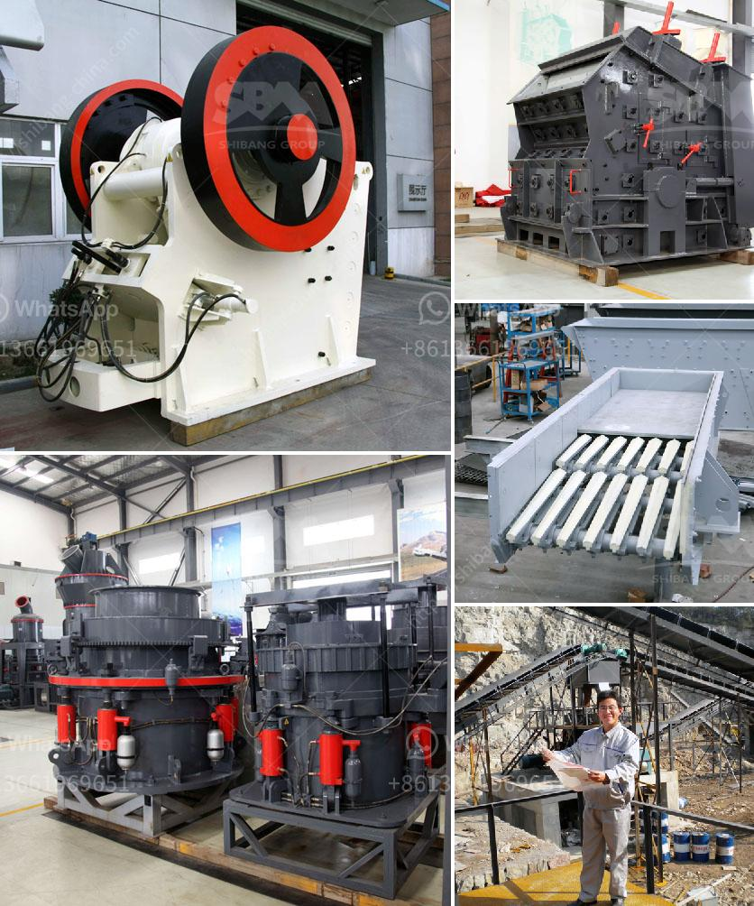

<h3>What is iron ore mining in Pakistan?</h3>
Iron mining is a crucial industry in Pakistan, which currently faces numerous challenges and hurdles in the extraction and production process. The country possesses large deposits of iron ore, but their potential remains largely untapped due to issues relating to lack of infrastructure and technology, political instability, and insufficient investment.

Pakistan is blessed with extensive iron ore deposits, estimated at over one billion tonnes. These deposits exist in various areas of the country, including Chiniot, Chagai, Kalabagh, and Nagarparkar. However, the utilization of these resources for economic development has been limited so far.

One of the primary barriers to iron ore mining in Pakistan is the lack of infrastructure, particularly in remote areas. The transportation of equipment, machinery, and workers to the mining sites is a major challenge due to the rugged terrain and inadequate road networks. This results in higher costs and delays in the development of iron ore projects.

Another significant hurdle is the lack of advanced technology and expertise in the mining sector. With outdated techniques and machinery, the extraction process becomes inefficient and costly. Pakistan needs to attract foreign investors and collaborate with international mining companies to tap into the country's vast iron ore reserves using modern technologies and practices.

Political instability also plays a role in hindering the progress of iron ore mining in Pakistan. Frequent changes in government policies and regulations create uncertainty for potential investors, discouraging them from actively participating in the industry. A stable and conducive environment is required to attract both local and foreign investment in mining projects.

Furthermore, inadequate investment in the sector limits the growth of iron mining in Pakistan. The lack of funds allocated for exploration, development, and infrastructure prevents the industry from realizing its full potential. It is crucial for the government to allocate sufficient funds and provide incentives to encourage investment in iron ore projects, thus driving economic growth and creating job opportunities.

Despite these challenges, Pakistan has taken some initiatives to promote iron ore mining. The government has announced various incentives, including tax holidays, duty exemptions, and a fair and transparent licensing process, to attract domestic and foreign investors. It has also established the Pakistan Mining Company to assist with the development of mineral resources.

In conclusion, iron ore mining has the potential to contribute significantly to Pakistan's economy, but several hurdles must be overcome to exploit this valuable resource effectively. A focus on improving infrastructure, adopting modern mining technologies, providing a stable political environment, and increasing investment are crucial to unlock the full potential of iron ore mining in Pakistan. The successful development of this sector would not only enhance the country's economic growth but also address unemployment and poverty-related issues.
<h3>Contact us</h3><ul><li><strong>Whatsapp:&nbsp;<a href="https://wa.me/8613661969651">+8613661969651</a></strong></li><li><a href="https://swt.shibang-china.com/?git&amp;zhl&amp;What is iron ore mining in Pakistan"><strong>Online Service(chat now)</strong></a></li></ul><h3>Related</h3><ul><li><a href='What equipment is needed for kaolin ore mines.md'>What equipment is needed for kaolin ore mines?</a></li><li><a href='What is the process of mining copper ore.md'>What is the process of mining copper ore?</a></li><li><a href='What can be used for basalt.md'>What can be used for basalt?</a></li><li><a href='What is dry screening iron ore.md'>What is dry screening iron ore?</a></li><li><a href='What are the production and uses of crushed rock aggregates.md'>What are the production and uses of crushed rock aggregates?</a></li></ul>