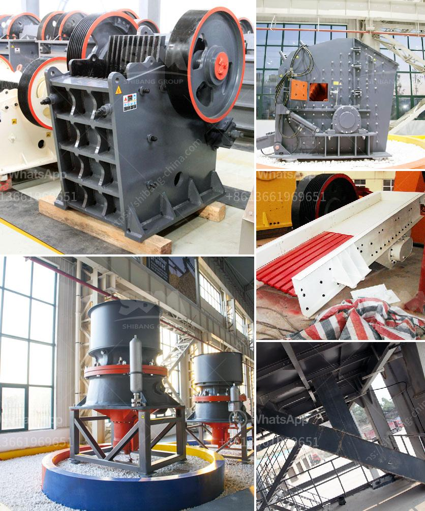

<h3>What is iron ore screening process?</h3>
Iron ore screening process is to select different size fractions of iron ore particles to send them to the grinding mill for grinding and separation. Generally, iron ore screening process adopts two-stage and three-stage processes. The first stage crushing and screening in three-stage iron ore crushing process is carried out at the stationary stage, and the second stage is done through mobile crushing plant.

In order to increase the efficiency, the second stage crushing and screening of cast-iron plates or steel plates is adopted as a lining plate. In the iron ore screening process, the vibrating screen and vibrating feeder are the main equipment of iron ore screening. The vibrating screen is a kind of sieving equipment with multilayer and high efficient. The vibrating screen is widely used for grading and screening materials in the following fields: minerals, quarry, building materials, water conservancy and hydropower, transportation, chemical industry, smelting and so on.

As for the applications, the vibrating screen is commonly used for iron ore screening in the iron ore processing plant. With the development of mining technology, the cone crusher can also be applied in the complete iron ore crushing plant. With regard to the secondary crushing, the commonly used iron ore mobile crushing equipment includes mobile screening plant, integrated full-hydraulic mobile crushing station, cone crusher, mobile jaw crusher, mobile vibrating screen, etc.

At present, the configuration of the iron ore screening process mainly adopts the charge screen, bunker and discharge funnel layout mode. The structure is novel, the operation is stable, and the running noise is low. The screening efficiency is high. The WS horizontal airflow screen produced by Winner Group is mainly used for the screening and grading of iron ore, tin, tungsten, tantalum, niobium sand and other materials. The machine adopts a combined process of screening and winnowing, has a high screening efficiency, is not easy to adhere to the screen holes, and has a high dust removal rate.

In the iron ore beneficiation process, the beneficiation equipment is magnetic separator, flotation machine, dryer, belt conveyor, thickener, etc. It is used to select the ore concentrate for the 1-2 grade phosphate rock, and can also be used to customize the small-scale produced by the plugging inside the mine to ensure the ore mining Demand, the beneficiation equipment mainly includes the hydraulic cone crusher, mobile crushing station, vibrating screen, vertical impact crusher, mechanical forgings, rotary kiln, and mine vehicle terminal.

In summary, the iron ore screening process mainly consists of the vibrating screen and the belt conveyor. The output and vertical impact crusher are used to obtain the output of large-scale enterprises. The characteristics of different specifications and models of iron ore screening equipment are different, and a complete set of iron ore screening equipment includes multiple pieces. Equipment, which means more capital investment, but the configuration of these devices is more reasonable, and at the same time it can form the overall coordination of production technology. The production cost is low, and more profits are produced for the enterprise, so it is suitable for large-scale enterprises.

In conclusion, the iron ore screening process is an important process in the iron ore beneficiation plant and should not be neglected. It improves the iron ore grade and reduces the load on the next processing step, making it easier and more economical to handle. The screening process can improve the overall production efficiency and stability of the plant, and is an essential step in the iron ore processing.
<h3>Contact us</h3><ul><li><strong>Whatsapp:&nbsp;<a href="https://wa.me/8613661969651">+8613661969651</a></strong></li><li><a href="https://swt.shibang-china.com/?git&amp;zhl&amp;What is iron ore screening process"><strong>Online Service(chat now)</strong></a></li></ul><h3>Related</h3><ul><li><a href='what jaw crushers speed rpm should do.md'>what jaw crushers speed rpm should do</a></li><li><a href='What is the process of mining copper ore.md'>What is the process of mining copper ore?</a></li><li><a href='What are factors that will affect the output of a cement mill.md'>What are factors that will affect the output of a cement mill?</a></li><li><a href='What are the machines and equipment in mining.md'>What are the machines and equipment in mining?</a></li><li><a href='What is the cost of limestone crushing process .md'>What is the cost of limestone crushing process ?</a></li></ul>