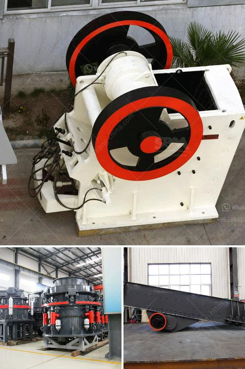

<h3>What is limestone impact crusher？</h3>
Limestone is a common rock found in nature. It has been used for centuries to create various architectural structures and buildings. With its durability and versatility, limestone is often crushed and used as an aggregate in construction projects. The process of crushing limestone includes the use of various types of crushers. Limestone impact crusher is one of the popular ore crusher machinery machines known for its high efficiency and low energy consumption.

The impact crusher is a very important crushing equipment that uses impact energy to crush materials, mainly including limestone specialized in crushing with high efficiency. It is a crushing equipment that can be used for coarse crushing, medium crushing, and fine crushing.

The limestone impact crusher is equipped with an advanced crushing cavity. It has a simple structure and is easy to operate. The unique design of the crushing cavity allows the material to be crushed more efficiently, reducing wear and tear and prolonging the service life of the equipment. The impact crusher is also equipped with a hydraulic opening device, which makes it easy to maintain and replace parts.

The limestone impact crusher works by using high-speed rotation of the rotor. The material enters the crushing cavity and is impacted by the hammer and impact plate. The rotor is driven by the motor to rotate at a high speed. When the material enters the crushing cavity, it is first crushed by the impact of the hammer, and then thrown onto the impact plate. The material is further crushed and broken by the impact of the plate.

The limestone impact crusher has the advantages of large crushing ratio, simple structure, low energy consumption, large production capacity, uniform product size, and selective crushing effect. It is a promising crushing equipment. In addition, the limestone impact crusher is equipped with a self-leveling device. When the non-crushed material enters the crushing cavity, the back plate automatically returns to its original position, ensuring the normal operation of the equipment and avoiding damage to the equipment.

Limestone impact crushers are widely used in mining, smelting, building materials, roads, railways, water conservancy and chemical industries. They have the characteristics of large crushing ratio, uniform product size, simple structure, reliable work, convenient maintenance, and low operating costs. Therefore, it is favored by users.

In conclusion, the limestone impact crusher is a crushing equipment that uses impact energy to crush materials. It has the advantages of large crushing ratio, simple structure, low energy consumption, large production capacity, uniform product size, and selective crushing effect. With its efficient crushing performance and wide range of applications, the limestone impact crusher is an essential tool for the construction industry and plays a significant role in infrastructure development.
<h3>Contact us</h3><ul><li><strong>Whatsapp:&nbsp;<a href="https://wa.me/8613661969651">+8613661969651</a></strong></li><li><a href="https://swt.shibang-china.com/?git&amp;zhl&amp;What is limestone impact crusher？"><strong>Online Service(chat now)</strong></a></li></ul><h3>Related</h3><ul><li><a href='What is iron ore mining in Pakistan.md'>What is iron ore mining in Pakistan?</a></li><li><a href='What is chrome ore grades.md'>What is chrome ore grades?</a></li><li><a href='What equipment is needed for iron ore mines .md'>What equipment is needed for iron ore mines ?</a></li><li><a href='What is iron ore screening process.md'>What is iron ore screening process?</a></li><li><a href='What is the cost of a quarry crusher for 500 tons.md'>What is the cost of a quarry crusher for 500 tons?</a></li></ul>