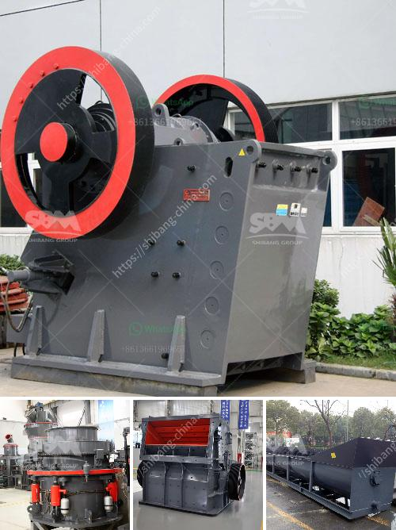

<h3>What is mechanism sand?</h3>
Sand is a ubiquitous material found in various forms across the globe. It is an essential component used in construction, manufacturing, and other industries. Over the years, the demand for sand has increased exponentially, which has led to the exploration of alternatives to natural sand, resulting in the emergence of mechanism sand.

Mechanism sand, also known as artificial sand or crushed sand, is a type of sand that is made by crushing or grinding rocks, stones, and boulders into fine particles. It is finer than natural sand and possesses certain physical and chemical properties that make it suitable for various construction applications.

One of the primary reasons for the growing popularity of mechanism sand is the depletion of natural sand resources. With the increasing demand for sand in the construction industry, the excessive extraction of river sand has led to environmental concerns such as riverbank erosion, riverbed degradation, and the loss of aquatic habitats. Mechanism sand provides a sustainable alternative that reduces the dependence on natural sand while minimizing the environmental impact.

The production process of mechanism sand involves crushing larger rocks or stones and then grading them to obtain the desired particle size. The crushed materials undergo several stages of screening and washing to remove impurities. Additionally, advanced techniques like shaping, molding, and grading can be used to further enhance the properties of the sand, making it suitable for specific applications like manufacturing concrete, asphalt, and other construction materials.

Mechanism sand possesses several advantages over natural sand. Firstly, it has a more uniform particle size, resulting in improved workability and consistency in construction projects. This uniformity ensures better compaction, reducing the risk of structural instability over time. Secondly, mechanism sand has a higher strength and durability compared to natural sand, making it desirable for applications that require robust materials. Moreover, its angular shape provides better adhesion between particles, enhancing the overall strength of the finished product.

The quality of mechanism sand is crucial in ensuring its suitability for construction purposes. Standards and specifications govern its production and use, ensuring that it meets the necessary criteria for different applications. These standards encompass factors such as particle size distribution, specific gravity, water absorption, and chemical composition, among others. Regular testing and quality control measures are implemented during the production process to maintain consistency and adherence to these standards.

In conclusion, mechanism sand is an artificial sand made from crushing rocks and stones, which provides a sustainable alternative to natural sand. With the depletion of natural sand resources and environmental concerns associated with its extraction, mechanism sand offers a solution by reducing dependence on natural sand while maintaining optimum quality and performance. Its uniform particle size, higher strength, and improved workability make it an ideal choice for various construction applications. As the demand for sand continues to rise, mechanism sand is expected to play a vital role in meeting these requirements in a sustainable and environmentally friendly manner.
<h3>Contact us</h3><ul><li><strong>Whatsapp:&nbsp;<a href="https://wa.me/8613661969651">+8613661969651</a></strong></li><li><a href="https://swt.shibang-china.com/?git&amp;zhl&amp;What is mechanism sand"><strong>Online Service(chat now)</strong></a></li></ul><h3>Related</h3><ul><li><a href='What is the process and cost of quartz extraction.md'>What is the process and cost of quartz extraction?</a></li><li><a href='what types of jaw crushers.md'>what types of jaw crushers</a></li><li><a href='what equipment is used when mining zinc ore.md'>what equipment is used when mining zinc ore?</a></li><li><a href='What type of Raymond Mill exhaust fan is used at gypsum plant.md'>What type of Raymond Mill exhaust fan is used at gypsum plant?</a></li><li><a href='What are the methods of mining mica.md'>What are the methods of mining mica?</a></li></ul>