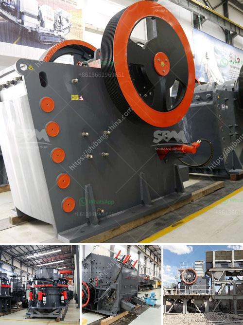

<h3>What is medium speed mills?</h3>
Medium speed mills, also known as coal pulverizers or coal mills, are machines designed to crush and grind coal into fine particles. They are commonly used in thermal power plants to finely grind coal for combustion, which ultimately generates electricity. Medium speed mills play a crucial role in the production of electricity by efficiently grinding coal and ensuring its proper combustion.

One of the significant advantages of medium speed mills is their ability to grind and pulverize coal to a specific particle size. This is important because coal particles need to be finely ground to increase their surface area, allowing for optimal combustion. By achieving a consistent particle size, medium speed mills enhance the combustion process, leading to higher efficiency and lower pollutant emissions.

Medium speed mills consist of a rotating drum or bowl that contains steel balls or rollers. The coal is fed into the mill through a central inlet pipe and falls onto the rotating grinding table. As the table rotates, the coal is crushed between the grinding elements, generating a mixture of coal particles and coal dust.

The grinding elements in medium speed mills can vary. Some mills use steel balls as the grinding media, while others use grinding rollers. The grinding elements are designed to exert force on the coal particles, crushing and grinding them into fine particles. The grinding elements also help in directing the coal towards the bottom of the mill, where it can be collected and transported to combustion chambers through coal pipes.

Medium speed mills are equipped with a range of mechanisms to control the grinding process. These include the coal feed rate control, mill air flow control, and mill temperature control. The coal feed rate control ensures a steady supply of coal into the mill, maintaining the desired particle size and preventing overloading. The mill air flow control regulates the amount of air supplied to the mill, affecting the drying and transport of coal within the mill. Lastly, the mill temperature control monitors and adjusts the temperature of the mill to optimize the combustion process.

In conclusion, medium speed mills are instrumental in the production of electricity by grinding and pulverizing coal. They ensure that coal particles are finely ground to increase their surface area, allowing for efficient combustion. The ability to control various parameters in medium speed mills enhances the grinding process and ensures optimal combustion. Implementing medium speed mills in thermal power plants leads to higher efficiency, reduced pollutant emissions, and improved overall performance.
<h3>Contact us</h3><ul><li><strong>Whatsapp:&nbsp;<a href="https://wa.me/8613661969651">+8613661969651</a></strong></li><li><a href="https://swt.shibang-china.com/?git&amp;zhl&amp;What is medium speed mills"><strong>Online Service(chat now)</strong></a></li></ul><h3>Related</h3><ul><li><a href='what are the equipment for gypsum mining.md'>what are the equipment for gypsum mining?</a></li><li><a href='What is the separation process in a vertical raw mill.md'>What is the separation process in a vertical raw mill?</a></li><li><a href='Whats the difference between a mine and quarry.md'>Whats the difference between a mine and quarry?</a></li><li><a href='What are the machines used to mine bauxite.md'>What are the machines used to mine bauxite?</a></li><li><a href='What is a cone crusher and what stones are it mainly used to crush.md'>What is a cone crusher and what stones are it mainly used to crush?</a></li></ul>