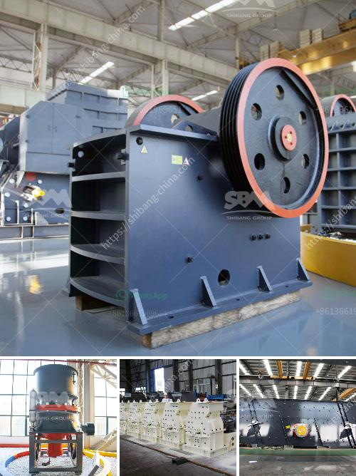

<h3>What is needed to open an aggregate mine?</h3>
Aggregate mining plays a crucial role in the construction industry, providing the necessary materials that go into building roads, bridges, homes, and other infrastructure. However, opening an aggregate mine requires careful planning, adherence to regulations, and a comprehensive understanding of the process. In this article, we will delve into what is needed to open an aggregate mine.

The first step in opening an aggregate mine is conducting thorough research. This involves identifying potential locations for the mine, considering factors such as the availability and quality of the aggregate deposits, proximity to the market, transportation infrastructure, and environmental considerations. Careful selection of the site ensures long-term viability of the operation.

Obtaining the necessary permits and complying with environmental regulations is crucial before commencing any mining operations. This may involve obtaining permits from local, state, and federal agencies, complying with various environmental laws, and addressing concerns related to water pollution, air quality, noise control, and habitat preservation.

Conducting an environmental impact assessment (EIA) is a critical requirement for opening an aggregate mine. The EIA evaluates the potential environmental impacts that the mining operation may have on the surrounding ecosystem, including flora, fauna, and water sources. Mitigation measures should be defined and implemented to minimize adverse effects and ensure sustainable mining practices.

Building positive relationships with the local community is vital for successful mine operation. Engaging with stakeholders early in the process helps address their concerns, obtain support, and mitigate any negative impacts resulting from the mine. Initiating community development projects and providing employment opportunities are important aspects of community engagement.

Opening an aggregate mine requires the development of necessary infrastructure such as access roads, processing facilities, and water management systems. These infrastructure elements are instrumental in ensuring smooth mining operations, efficient handling of aggregates, and compliance with water management regulations.

Investing in appropriate mining equipment and hiring a competent workforce are essential for efficient and safe operations. Obtaining the necessary licenses and certifications, training employees on safety protocols, and ensuring compliance with health and safety regulations are critical steps in this process. Adequate machinery and skilled personnel enable efficient extraction, processing, and transportation of aggregate materials.

Prioritizing mine reclamation and closure is a crucial aspect of responsible mining. Developing plans for reclaiming the disturbed land and restoring it to its original or suitable post-mining condition is essential. Planning for closure involves addressing issues such as long-term water management, land stabilization, and ongoing maintenance.

In conclusion, opening an aggregate mine requires careful planning, adherence to regulations, and comprehensive environmental awareness. Proper research, permitting, environmental assessment, community engagement, and infrastructure development are vital elements of the process. The investment in equipment, workforce, and the commitment to reclamation and closure plans ensures responsible and sustainable aggregate mining operations. By following these steps, companies can contribute to the construction industry while minimizing their environmental footprint and leaving a positive impact on communities.
<h3>Contact us</h3><ul><li><strong>Whatsapp:&nbsp;<a href="https://wa.me/8613661969651">+8613661969651</a></strong></li><li><a href="https://swt.shibang-china.com/?git&amp;zhl&amp;What is needed to open an aggregate mine"><strong>Online Service(chat now)</strong></a></li></ul><h3>Related</h3><ul><li><a href='what are the equipment for gypsum mining.md'>what are the equipment for gypsum mining?</a></li><li><a href='What is the cost of the cone crusher.md'>What is the cost of the cone crusher?</a></li><li><a href='what type of pumps uesd in stone crusher？.md'>what type of pumps uesd in stone crusher？</a></li><li><a href='what is concentration of ores？.md'>what is concentration of ores？</a></li><li><a href='What type of mining is used for magnetite.md'>What type of mining is used for magnetite?</a></li></ul>