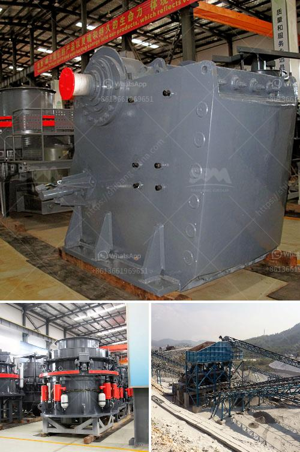

<h3>What is primary crushing and secondary crushing?</h3>
Primary crushing and secondary crushing are two basic processes in a quarry or mine. The primary crushing process is the first step in the extraction of aggregates and minerals. It is a preparatory stage that aims to reduce the size of the material before further processing and to enable easy handling and transportation. Secondary crushing, on the other hand, is the second stage of material processing and aims to further reduce the size and shape of material for various purposes such as recycling, construction aggregate production or mining operations.

Primary crushing involves reducing large sizes of raw material into smaller pieces. This is typically done using jaw crushers or gyratory crushers. Primary crushing enables a higher output of material, as compared to secondary crushing. Hence, it is often used in applications where a higher ratio of size reduction is required.

The primary crushers are designed to work with a certain maximum size of raw material and often delivery its output to a screening machine which sorts and directs the product for further processing. This output is then used as feed to subsequent secondary crushing and sizing equipment.

Secondary crushing is the second step in the material handling process. The purpose of secondary crushing is to produce various smaller size fractions to meet specific end product requirements. It is important to note that secondary crushing is an engineering process that aims to optimize the final product size distribution and shape. This is essential for various downstream processes, such as grinding or beneficiation, where further size reduction or separation of valuable components takes place.

Secondary crushing can be accomplished using a variety of different crushers, including impact crushers, cone crushers, and jaw crushers. Each type of crusher has different parameters and requirements for specific applications. Some of the most common types of secondary crushers include horizontal shaft impactors (HSI), cone crushers, and roll crushers.

One of the key factors that determines the performance and efficiency of a secondary crushing process is the feed material characteristics. The material properties, such as hardness, abrasiveness, and moisture content, impact the choice of crusher and the final product specifications. It is important to properly match the crusher to the specific requirements of the material to achieve the desired product quality.

In conclusion, primary crushing and secondary crushing are essential processes in a quarry or mine. They are the initial and second stages in the material processing chain. Primary crushing reduces the size of raw material, enabling easy handling and transportation, while secondary crushing further refines the material for specific end product requirements. The choice of crushers and parameters depends on the material properties and desired product specifications. By understanding the principles of primary and secondary crushing, quarry operators and mine owners can make informed decisions on equipment selection, process optimization, and overall production efficiency.
<h3>Contact us</h3><ul><li><strong>Whatsapp:&nbsp;<a href="https://wa.me/8613661969651">+8613661969651</a></strong></li><li><a href="https://swt.shibang-china.com/?git&amp;zhl&amp;What is primary crushing and secondary crushing"><strong>Online Service(chat now)</strong></a></li></ul><h3>Related</h3><ul><li><a href='What is needed to open an aggregate mine.md'>What is needed to open an aggregate mine?</a></li><li><a href='What are the machines and equipment in mining.md'>What are the machines and equipment in mining?</a></li><li><a href='What beneficiation method is used for iron ore.md'>What beneficiation method is used for iron ore?</a></li><li><a href='What are the raw materials used in cement production.md'>What are the raw materials used in cement production?</a></li><li><a href='What equipment to extract iron ore.md'>What equipment to extract iron ore?</a></li></ul>