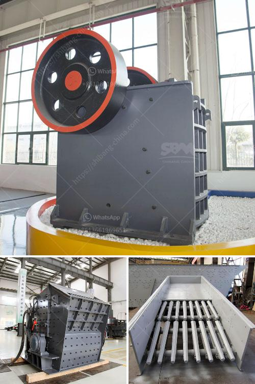

<h3>What is primary crushing equipment ?</h3>
When it comes to crushing raw materials, there are several options available, each with its own set of characteristics and advantages. One common type of crushing equipment is primary crushing equipment, which is used to break large chunks of rocks and stones into smaller pieces.

Primary crushers are typically used in the first stage of the crushing process, where they are capable of processing large rocks and stones. This type of machinery is designed to reduce the size of various materials, such as coal, gravel, sand, and limestone. Larger-sized material is fed into the jaws of the primary crushers, and then gradually, a smaller size is obtained.

There are several types of machines used in primary crushing, including jaw crushers, impact crushers, gyratory crushers, and hammermills. Each of these works on different principles and has its own advantages and applications.

Jaw crushers are commonly used in primary crushing stages and are suitable for processing hard materials such as granite, basalt, and iron ore. They are also suitable for recycling construction waste, as it can be easily managed by jaw crushers. These machines have a set of jaws that crush the rocks and stones into smaller sizes using a compression force. The crushed material then passes through a series of screens to separate it into various sizes.

Impact crushers are another popular choice for primary crushing. They work by using a high-speed rotor with blow bars that strike the feed material and create a collision force. This force breaks the rocks and stones into smaller sizes. Impact crushers are suitable for processing various materials, including soft and medium-hard rocks. They are commonly used in the construction and mining industries.

Gyratory crushers are often used in primary crushing for large-sized materials. They operate by crushing the material between a stationary concave surface and a movable mantle. Gyratory crushers have a higher capacity compared to jaw crushers and can handle larger rocks and stones. However, they are more expensive to install and maintain compared to other types of crushers.

Hammermills are also used for primary crushing in some applications. They consist of a rotating shaft with hammers attached. The hammers strike the feed material, causing it to break apart into smaller pieces. Hammermills are commonly used in the mining industry to crush coal and other hard materials.

In conclusion, primary crushing equipment plays a crucial role in the quarrying and mining industries. It is responsible for breaking large-sized rocks and stones into smaller pieces, making them easier to transport, process, and use in various applications. The choice of primary crusher depends on the desired output size, material characteristics, and the site's specifications. Whether it is a jaw crusher, impact crusher, gyratory crusher, or hammermill, the selection of the right primary crushing equipment is essential for optimal results.
<h3>Contact us</h3><ul><li><strong>Whatsapp:&nbsp;<a href="https://wa.me/8613661969651">+8613661969651</a></strong></li><li><a href="https://swt.shibang-china.com/?git&amp;zhl&amp;What is primary crushing equipment "><strong>Online Service(chat now)</strong></a></li></ul><h3>Related</h3><ul><li><a href='What is a bentonite grinding unit.md'>What is a bentonite grinding unit?</a></li><li><a href='what are the applications of small portable crusher.md'>what are the applications of small portable crusher?</a></li><li><a href='when pulverizing coal what is a crusher use for？.md'>when pulverizing coal what is a crusher use for？</a></li><li><a href='What machinery and equipment is needed for a sand and gravel processing plant.md'>What machinery and equipment is needed for a sand and gravel processing plant</a></li><li><a href='what are rock crusher cone liners made out of.md'>what are rock crusher cone liners made out of</a></li></ul>