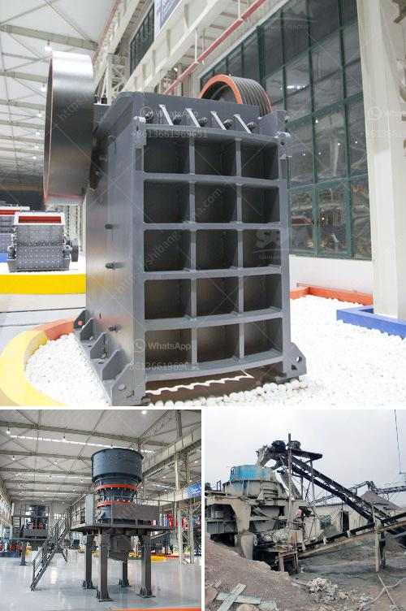

<h3>What is quarrying in relation to cement production?</h3>
Quarrying is an essential activity in the construction industry, providing raw materials for the production of cement. This process involves the extraction of valuable minerals or other geological materials from the earth's surface. It is primarily carried out in open-pit mines or quarries, where large deposits of limestone, clay, or shale are found.

One of the primary materials needed for cement production is limestone. This sedimentary rock is abundant worldwide and is known for its high calcium carbonate content. Limestone is an essential component in the manufacturing process of cement because it provides the necessary lime to react with the clay or shale to form the desired cementitious compounds. It also contributes to the overall strength and durability of the final cement product.

The quarrying of limestone for cement production involves several stages. The first step is the drilling of boreholes to determine the extent and quality of the deposit. This process is carried out using specialized drilling equipment and techniques. Once the drilling is complete and the geological information is gathered, explosives are used to break up the limestone into manageable pieces. These fragmented rocks are then loaded into trucks or conveyor belts to be transported to the cement manufacturing plant.

At the cement plant, the raw materials are further processed to produce cement. The limestone is crushed into smaller pieces and then mixed with other materials such as clay or shale in precise proportions. This mixture is then ground into a fine powder and heated in a kiln at high temperatures, typically around 1450 degrees Celsius. The heat causes chemical reactions that result in the formation of clinker, which is a granular material composed of various cementitious compounds.

After the clinker is cooled, it is mixed with gypsum and other additives to produce the final cement product. These additives might include fly ash, slag, or silica fume, which enhance the properties of the cement, such as its strength, workability, or resistance to specific conditions. This final product is then packaged and distributed to construction sites, where it is used in various applications, such as building foundations, roads, bridges, or other infrastructure projects.

Quarrying for cement production has significant environmental and social implications. The extraction of limestone and other raw materials can result in landscape alteration, soil erosion, and habitat destruction. It can also lead to the loss of biodiversity and impact the availability of water resources. However, responsible quarrying practices and land reclamation efforts can help mitigate these adverse effects and restore the affected areas to a sustainable state.

In conclusion, quarrying plays a vital role in the production of cement by providing the essential raw materials, especially limestone. It is a process involving the extraction of minerals from the earth's surface, which are then further processed to produce cement. While quarrying has its environmental and social challenges, it is crucial for meeting the global demand for cement and supporting the construction industry's growth. Promoting sustainable quarrying practices becomes essential to balance the need for raw materials with environmental conservation and social responsibility.
<h3>Contact us</h3><ul><li><strong>Whatsapp:&nbsp;<a href="https://wa.me/8613661969651">+8613661969651</a></strong></li><li><a href="https://swt.shibang-china.com/?git&amp;zhl&amp;What is quarrying in relation to cement production"><strong>Online Service(chat now)</strong></a></li></ul><h3>Related</h3><ul><li><a href='What can be used for basalt.md'>What can be used for basalt?</a></li><li><a href='what equipment needed for mining iron ore.md'>what equipment needed for mining iron ore</a></li><li><a href='What is the specification of a jaw crusher.md'>What is the specification of a jaw crusher?</a></li><li><a href='What machinery and equipment is needed for a sand and gravel processing plant.md'>What machinery and equipment is needed for a sand and gravel processing plant</a></li><li><a href='What is chrome ore grades.md'>What is chrome ore grades?</a></li></ul>