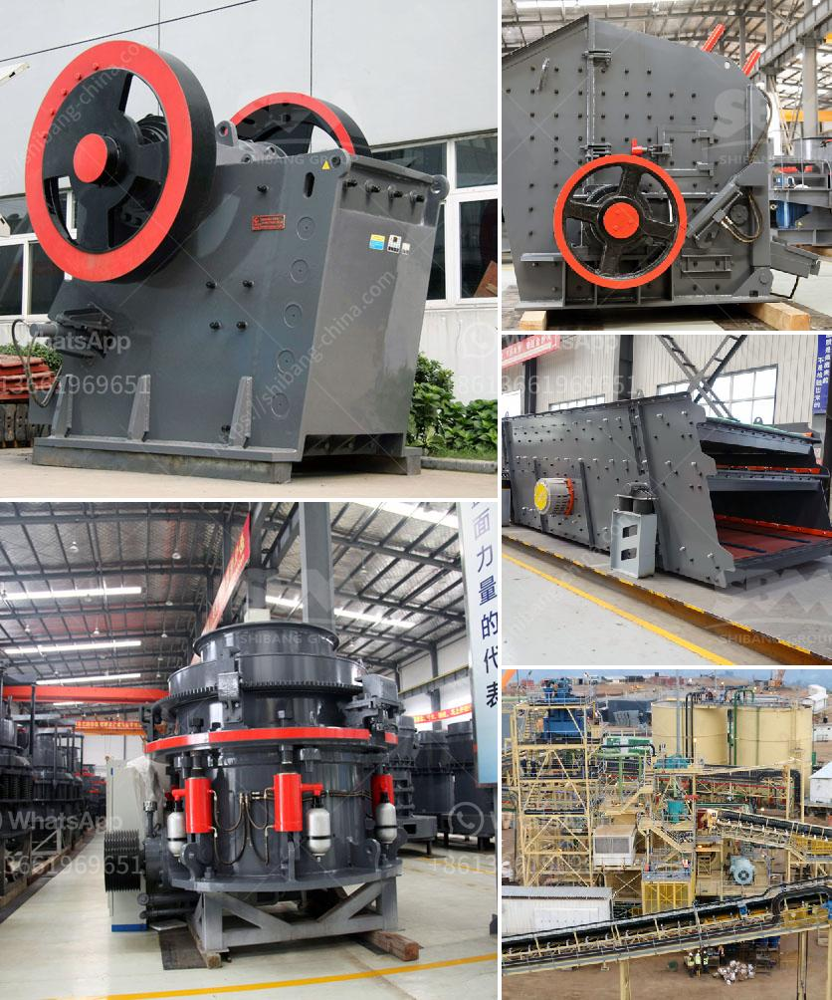

<h3>What is roller crusher?</h3>
A roller crusher is a piece of heavy-duty equipment used in mining and industrial processes. It features a pair of large wheels or cylinders mounted on horizontal axles. When rocks, ore, and other materials pass between the two cylinders, they are crushed or ground into smaller pieces. A roller crusher has multiple uses, including sizing ore for heap leaching, pre-crushing ore before further processing, and pulverizing rocks in a quarry.

The basic structure of a roller crusher consists of two parallel cylindrical rollers mounted horizontally. One of the roller shafts is movable and the other is fixed. As the materials are fed into the gap between the rollers, they are crushed or ground by the rotating motion of the rollers and the friction between the material and the roller surface.

Roller crushers are commonly used to crush hard materials such as limestone, coal, chalk, gypsum, and other minerals. They offer advantages such as a very compact design, easy maintenance, low operating costs, and the ability to produce a wide range of particle sizes with a uniform shape. The crushed material can be used directly in various applications or further processed.

Roller crushers are often used in the production of sand and gravel to crush and grind materials down to the desired size. They are also used for crushing minerals, such as iron ore, in the mining industry. They are custom designed for each specific application to optimize performance and minimize wear and tear.

In addition to crushing and grinding, roller crushers are also effective in breaking down agglomerates, such as clays, which are difficult to break apart using other types of crushers. This ability makes roller crushers particularly useful in the chemical and fertilizer industries, where agglomeration is a common problem.

Another application of roller crushers is their use in waste management, such as processing glass bottles, scrap metal, and municipal solid waste. The rollers can efficiently crush and compact materials, reducing volume and making it easier to handle and transport the waste for further processing or disposal.

Safety is a crucial aspect of roller crusher operation. The moving parts of the machine must be adequately guarded to prevent accidents. Additionally, regular maintenance and inspections are necessary to ensure proper functioning and to prevent excessive wear.

In conclusion, a roller crusher is an efficient and versatile machine that can be used for various applications. It offers numerous advantages such as compact design, easy maintenance, and the ability to produce a wide range of particle sizes. Roller crushers are commonly used in mining, quarrying, and recycling industries, and they excel at breaking down hard materials and agglomerates. Proper safety precautions and regular maintenance are important for maximizing the lifespan and performance of a roller crusher.
<h3>Contact us</h3><ul><li><strong>Whatsapp:&nbsp;<a href="https://wa.me/8613661969651">+8613661969651</a></strong></li><li><a href="https://swt.shibang-china.com/?git&amp;zhl&amp;What is roller crusher"><strong>Online Service(chat now)</strong></a></li></ul><h3>Related</h3><ul><li><a href='what are steps to wash iron sand？.md'>what are steps to wash iron sand？</a></li><li><a href='what equipment is used when mining zinc ore.md'>what equipment is used when mining zinc ore?</a></li><li><a href='What is grindind machine.md'>What is grindind machine?</a></li><li><a href='What is the specification of a jaw crusher.md'>What is the specification of a jaw crusher?</a></li><li><a href='What is the process for mining line.md'>What is the process for mining line?</a></li></ul>