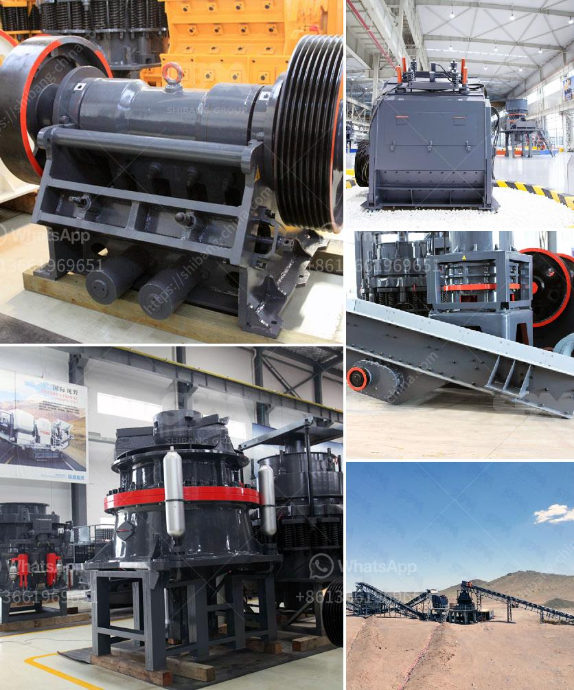

<h3>What is the aggregate crusher?</h3>
An aggregate crusher is a machine designed to grind or pulverize various types of rock into small, relatively uniform pieces. Aggregate crushers are used in mining, quarrying, and recycling operations. Several types of crushers can perform this task including hammer mills, roller crushers, jaw crushers, and gyratory crushers.

Aggregate crushers are used in many industries such as construction, mining, food and beverage, minerals, and recycling. They are typically used in the primary crushing stage to reduce large pieces of rock to a more manageable size for further processing. Different types of crushers have different capabilities and can handle varying levels of hardness and abrasiveness.

The main objective of an aggregate crusher is to break down large rocks into smaller pieces to produce materials for construction and other purposes. Depending on the desired final product, the crusher can be paired with a secondary or tertiary crusher to further process the material. For example, cone crushers are often used after jaw crushers to produce smaller-sized materials suitable for use as gravel or concrete aggregates.

Aggregate crushers are available in both stationary and mobile versions. They come in various sizes and configurations to fit different job requirements. In addition to size, crushers can also be customized based on feed capacity, material hardness, and throughput requirements. This versatility makes them suitable for a wide range of applications and operating conditions.

The crushing process in aggregate crushers involves the reduction of lumps or masses of material into small particles while producing a considerable amount of dust. This dust consists of small particles that range from 0.1 to 5mm in size. Depending on the crusher type, the produced dust may also include water-soluble pollutants, such as sulfur dioxide or nitrogen oxides.

To mitigate the risk of dust generation, several techniques can be employed. For example, water sprays and chemical agents can be used to control dust during the crushing process. Additionally, enclosing crushers in sealed cabinets or using a dust suppression system can also help reduce dust emissions.

Aggregate crushers play a crucial role in modern construction projects. They provide essential materials for roads, bridges, buildings, and various infrastructures. Without efficient and reliable aggregate crushers, construction projects would be significantly delayed or hindered.

In conclusion, an aggregate crusher is a machine used to grind or pulverize various types of rock into small, relatively uniform pieces. It is widely used in construction, mining, and recycling industries. Different types of crushers can perform this task to varying degrees of efficiency and output. The choice of crusher depends on factors such as the hardness and abrasiveness of the material, desired final product, and operating conditions. Proper dust control measures are necessary to minimize dust emissions during the crushing process. Overall, aggregate crushers are essential machines in the construction industry, enabling the production of materials necessary for infrastructure development.
<h3>Contact us</h3><ul><li><strong>Whatsapp:&nbsp;<a href="https://wa.me/8613661969651">+8613661969651</a></strong></li><li><a href="https://swt.shibang-china.com/?git&amp;zhl&amp;What is the aggregate crusher"><strong>Online Service(chat now)</strong></a></li></ul><h3>Related</h3><ul><li><a href='What is the cost of a quarry crusher for 500 tons.md'>What is the cost of a quarry crusher for 500 tons?</a></li><li><a href='What is approximate cost of a jaw crusher.md'>What is approximate cost of a jaw crusher?</a></li><li><a href='What is the cost of limestone crushing process .md'>What is the cost of limestone crushing process ?</a></li><li><a href='What are the different steps of chromite ore beneficiation .md'>What are the different steps of chromite ore beneficiation ?</a></li><li><a href='What are the most common expenses in crushing plant project.md'>What are the most common expenses in crushing plant project?</a></li></ul>