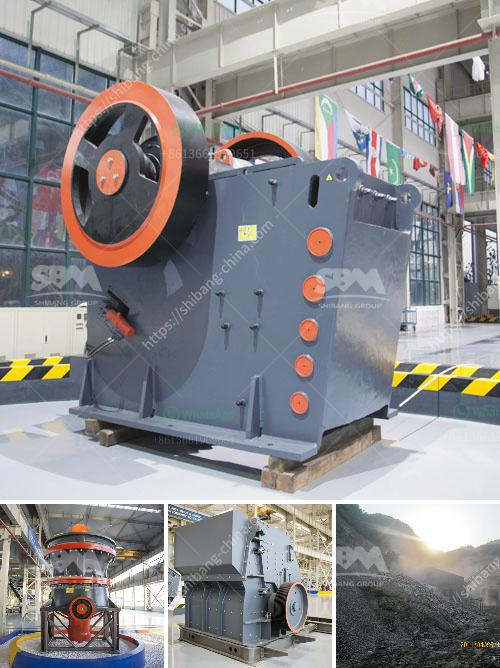

<h3>What is the beneficiation of iron ore?</h3>
Iron ore is one of the most common minerals in the earth's crust. It mainly exists in the form of hematite (Fe2O3), magnetite (Fe3O4), siderite (FeCO3), and limonite (FeO(OH)). Iron ore is an important raw material for steel production enterprises. After crushing, grinding, magnetic separation, flotation, and gravity separation, the concentrate grades of iron ore can be increased and the processing cost can be reduced, which has become an important part of iron ore processing technologies.

The beneficiation process of iron ore mainly includes magnetic separation, flotation, gravity separation, electrical separation, and chemical beneficiation. The iron ore is initially crushed by jaw crusher, followed by further crushing in a cone crusher, and then conveyed to the ball mill for grinding. After ball milling, the fine particles are sent to high-intensity magnetic separators for magnetic separation, and the concentrate is obtained. The concentrate is then transported to a flotation machine for flotation separation, and the obtained iron ore concentrate is sent to a high-gradient magnetic separator for magnetic separation to further improve the concentrate grade.

Gravity separation is also an important method of iron ore beneficiation. Jigging machine, spiral chute, shaking table, and dense medium cyclone are commonly used devices for gravity separation. Jigging machine uses the pulsating water flow to separate the heavy mineral grains from the lighter gangue. Spiral chute utilizes the gravity difference of minerals to separate them. Shaking table uses the combined action of the bed surface's reciprocating asymmetry and the differential movement of the water flow to achieve the separation of minerals. Dense medium cyclone separation uses the principle of centrifugal settling to separate minerals based on their density.

Electrical separation is mainly used for the separation of fine-grained and micro-fine iron ore particles. High gradient magnetic separators, magnetic pulleys, and magnetic rollers are commonly used equipment for electrical separation. The electrical separation process can effectively separate the weak magnetic minerals in the iron ore.

Chemical beneficiation uses chemical agents to treat iron ore minerals, mainly including amphoteric collector, collector, activator, inhibitor, dispersant, flocculant, and defoamer. Chemical beneficiation can selectively separate valuable minerals from gangue minerals according to the different surface properties of various minerals.

The beneficiation of iron ore not only improves the grade of the concentrate, but also reduces the cost of processing. By removing impurities, the quality and purity of iron ore can be greatly improved, making it more suitable for steel production. In addition, the beneficiation of iron ore can also reduce the environmental pollution caused by mining activities.

To achieve the purpose of iron ore beneficiation, it is necessary to select suitable beneficiation equipment, establish a reasonable beneficiation process, and carry out scientific management of the entire beneficiation plant. In the future, with the continuous advancement of technology, more efficient and environmentally friendly beneficiation methods will be applied, which will further improve the beneficiation level of iron ore and promote the sustainable development of iron ore resources.
<h3>Contact us</h3><ul><li><strong>Whatsapp:&nbsp;<a href="https://wa.me/8613661969651">+8613661969651</a></strong></li><li><a href="https://swt.shibang-china.com/?git&amp;zhl&amp;What is the beneficiation of iron ore"><strong>Online Service(chat now)</strong></a></li></ul><h3>Related</h3><ul><li><a href='What temperature should the Raymond roller mill operate at.md'>What temperature should the Raymond roller mill operate at?</a></li><li><a href='What is cost of bauxite processing per ton.md'>What is cost of bauxite processing per ton?</a></li><li><a href='What guidelines are needed to set up a mobile stone crusher in Orissa.md'>What guidelines are needed to set up a mobile stone crusher in Orissa?</a></li><li><a href='What are machines used for mining iron ore.md'>What are machines used for mining iron ore?</a></li><li><a href='What are grinding and crushing in small scale miners.md'>What are grinding and crushing in small scale miners?</a></li></ul>