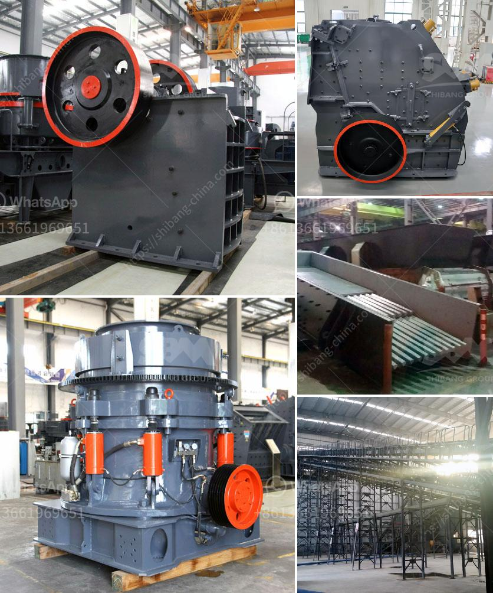

<h3>What is the best concrete crusher to make gravel?</h3>
When it comes to construction and landscaping, there are many materials available for creating gravel. But to ensure a high-quality end product, it is important to choose the right equipment. Concrete crushers are specifically designed to break down concrete into small, manageable pieces and recycle the waste material into valuable gravel.

What makes concrete crushers ideal for gravel production? First, let's look at the purpose of these machines. Typically, concrete crushers are used to reduce the size of larger concrete or construction debris into smaller pieces for further processing or recycling. These machines have two main types – jaw crushers and impact crushers.

Jaw crushers are used for the primary crushing of large chunks of concrete or construction debris. They are durable machines with a high production capacity. However, this type of crusher tends to produce less gravel than impact crushers. Therefore, when looking to produce gravel, jaw crushers are generally best suited to handle larger-sized materials.

Impact crushers, on the other hand, are more suitable for smaller-sized materials. These machines use a high-speed rotor to throw the concrete against the breaker plates, where it breaks further into small pieces. Impact crushers are known for producing cubic-shaped gravel, making them an excellent choice for projects that require a specific size and shape of the end product.

One of the best concrete crushers to make gravel on the market is the Bobcat concrete crusher attachment. For Bobcat or similar models, these crushers are ideal for breaking down concrete into sand, gravel, and other small-sized materials. The attachment allows you to easily separate these materials from the larger debris and recycle them for use in other construction projects.

The Bobcat concrete crusher attachment is compact, lightweight, and easy to maneuver, making it a practical choice for both small and large construction projects. With an adjustable jaw, it can produce gravel of different sizes, making it versatile for various applications. Additionally, its high crushing force allows the crusher to handle tough materials without any issues.

Other notable concrete crushers include the J45 and I34R crushers from McCloskey International. These machines are specifically designed for primary crushing and can handle various materials, including concrete, asphalt, and brick. Their compact size makes them easy to transport, while their efficient design ensures maximum productivity and high-quality gravel output.

When choosing the best concrete crusher for gravel production, it is essential to consider factors such as the machine's capacity, versatility, and durability. Additionally, consider the specific requirements of your project, such as the size and shape of the desired end product.

In conclusion, the best concrete crusher to make gravel depends on your project's requirements. Whether it is a small-scale landscaping project or a large construction site, there are various options available. Consider the type of materials you need to process, the machine's capacity and versatility, as well as its durability and ease of use. With the right concrete crusher, you can efficiently recycle construction waste and create high-quality gravel for your project.
<h3>Contact us</h3><ul><li><strong>Whatsapp:&nbsp;<a href="https://wa.me/8613661969651">+8613661969651</a></strong></li><li><a href="https://swt.shibang-china.com/?git&amp;zhl&amp;What is the best concrete crusher to make gravel"><strong>Online Service(chat now)</strong></a></li></ul><h3>Related</h3><ul><li><a href='What is cost of bauxite processing per ton.md'>What is cost of bauxite processing per ton?</a></li><li><a href='How to choose a cone crusher for rock crushing？.md'>How to choose a cone crusher for rock crushing？</a></li><li><a href='what are some of the equipments used in mining industry.md'>what are some of the equipments used in mining industry?</a></li><li><a href='What kind of crushing machinery is used for sandstone processing ？.md'>What kind of crushing machinery is used for sandstone processing ？</a></li><li><a href='What is roller crusher.md'>What is roller crusher?</a></li></ul>