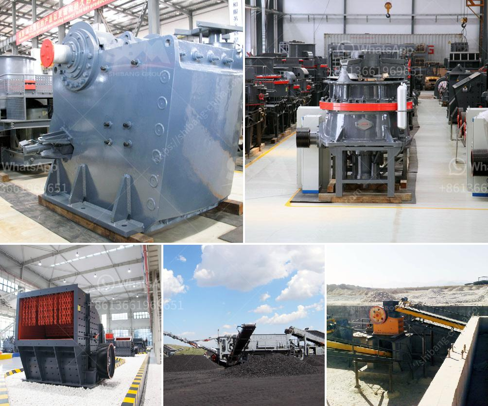

<h3>What is the best granite crusher machinery?</h3>
Granite is a prevalent and widely occurring type of intrusive, felsic, igneous rock. It is commonly used as a building material and has long been recognized for its durability and aesthetic appeal. Due to its high hardness, granites require proper crushing equipment to ensure efficient and effective processing. In this article, we will discuss the best granite crusher machinery available in the market.

When it comes to crushing granite, the selection of suitable machinery is crucial in terms of productivity, cost-effectiveness, and overall efficiency. Below are some of the best granite crusher machinery options available:

1. Jaw Crusher: Jaw crushers are an excellent primary crusher choice for granite. They are characterized by their high crushing ratio, uniform particle size distribution, simple structure, reliable performance, easy maintenance, and low operating costs. With a jaw crusher, granite can be crushed into various sizes, making it suitable for different construction projects.

2. Cone Crusher: Cone crushers are often used in medium and fine crushing stages. They are suitable for processing granite with medium hardness or above. The cone crusher provides high production capacity and excellent shape of final products. Its advanced hydraulic technology ensures reliable performance and easy adjustment of the discharge opening.

3. Impact Crusher: Impact crushers are ideal for crushing granite due to their excellent cubic shape of final products and high reduction ratios. They are suited for both primary and secondary crushing stages. Impact crushers offer good energy efficiency and low maintenance requirements, making them a popular choice for crushing granite.

4. Vertical Shaft Impact Crusher (VSI): VSI crushers are known for their ability to produce precisely shaped and graded granite aggregates. These crushers operate on the principle of rock-on-rock crushing, where rocks are fed into a central rotor that propels them against a chamber wall, resulting in the shaping of particles. VSI crushers are widely used in the production of high-quality granite sand and aggregates.

5. Mobile Crushers: Mobile crushers provide the flexibility to move the crushing operation closer to the granite source, reducing transportation costs and improving efficiency. Whether it is a jaw crusher, cone crusher, or impact crusher, mobile crushers are the best choice for crushing granite on-site.

When selecting the best granite crusher machinery, it is essential to consider factors like feed size, production capacity, required final product shapes, energy efficiency, maintenance requirements, and overall cost. Additionally, consulting experienced suppliers and analyzing customer reviews can provide valuable insights into the performance and reliability of different machinery options.

In conclusion, choosing the best granite crusher machinery is crucial for maximizing productivity, efficiency, and cost-effectiveness. From jaw crushers to impact crushers and mobile crushers, different machinery options cater to varying granite crushing needs. By carefully evaluating the requirements and consulting reputable suppliers, one can select the most suitable machinery for their specific granite crushing project.
<h3>Contact us</h3><ul><li><strong>Whatsapp:&nbsp;<a href="https://wa.me/8613661969651">+8613661969651</a></strong></li><li><a href="https://swt.shibang-china.com/?git&amp;zhl&amp;What is the best granite crusher machinery"><strong>Online Service(chat now)</strong></a></li></ul><h3>Related</h3><ul><li><a href='what type of pumps uesd in stone crusher？.md'>what type of pumps uesd in stone crusher？</a></li><li><a href='What type of mining is used for magnetite.md'>What type of mining is used for magnetite?</a></li><li><a href='What is the raw ore crushing process.md'>What is the raw ore crushing process?</a></li><li><a href='How to choose a cone crusher for rock crushing？.md'>How to choose a cone crusher for rock crushing？</a></li><li><a href='What is the best concrete crusher to make gravel.md'>What is the best concrete crusher to make gravel?</a></li></ul>