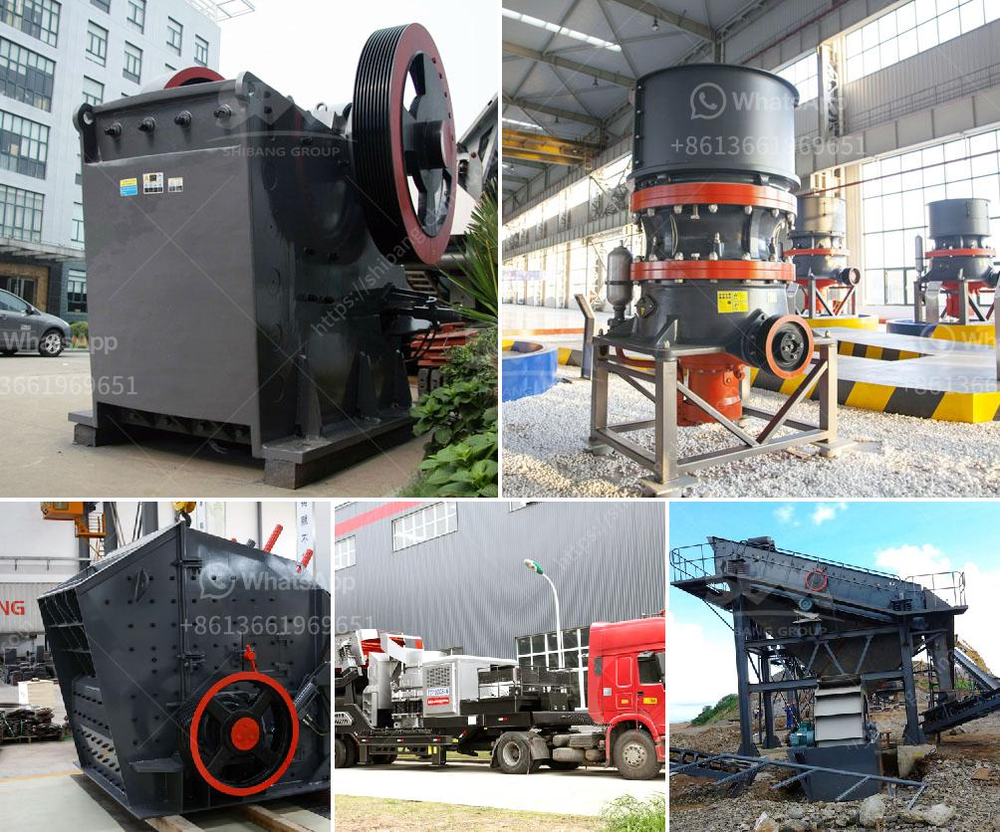

<h3>What is the cost of a quarry crusher for 500 tons?</h3>
Quarrying is a vital industry that provides resources for infrastructural development, particularly in the construction of roads, bridges, and buildings. The extraction of natural resources from a quarry requires heavy machinery and equipment that consumes a significant amount of energy, resulting in high costs. One of the essential equipment used in quarrying is the quarry crusher, which crushes the extracted rocks into smaller sizes suitable for various construction purposes. However, the cost of purchasing a quarry crusher for 500 tons can vary greatly depending on the specific model, capacity, and features, among other factors.

The first factor that determines the cost of a quarry crusher is the capacity. Crushers come in different sizes and levels of production capabilities. A crusher with a capacity of 500 tons per hour will obviously be more expensive than a smaller capacity crusher. The capacity required for a quarry will depend on various factors such as the size and hardness of the rocks being extracted, the anticipated production rate, and the specific requirements of the project.

Apart from capacity, the specific features and capabilities of the crusher will also impact its cost. Advanced crushers often offer additional features and benefits such as automated operation, high crushing efficiency, minimal maintenance requirements, and enhanced safety features. While these advanced features are advantageous, they usually come at a higher price point. Therefore, quarry operators need to carefully evaluate their requirements and prioritize which features are essential for their operations.

Another factor influencing the cost of a quarry crusher is the source and availability of spare parts. Crushers are heavy machinery, and like any mechanical equipment, they are subject to wear and tear. The availability of spare parts is crucial for minimizing downtime and ensuring smooth operations. If a particular crusher model has limited availability or high costs for spare parts, it may significantly impact the overall cost of ownership.

In addition to the initial cost of purchasing the crusher, quarry operators should also consider operational costs. These include expenses related to fuel consumption, electricity usage, manpower, and maintenance. Energy-efficient crushers can help reduce fuel and electricity costs, making them a more economical choice in the long run. Similarly, crushers with low maintenance requirements can minimize downtime and the associated costs of repairs and replacements.

Considering all these factors, the cost of a quarry crusher for 500 tons can vary anywhere from hundreds of thousands to millions of dollars. As such, careful planning and evaluation of the project's requirements are crucial to make an informed decision. It is advisable to consult with industry experts and suppliers to understand the available options and select the most cost-effective and efficient crusher for the specific quarrying operation.

In conclusion, the cost of a quarry crusher for 500 tons is influenced by various factors such as capacity, features, spare part availability, and operational costs. Quarry operators should prioritize their requirements, evaluate different options, and select a crusher that provides the best balance between cost and performance. By making a well-informed decision, quarry operators can ensure the efficient and cost-effective crushing of extracted rocks for their construction projects.
<h3>Contact us</h3><ul><li><strong>Whatsapp:&nbsp;<a href="https://wa.me/8613661969651">+8613661969651</a></strong></li><li><a href="https://swt.shibang-china.com/?git&amp;zhl&amp;What is the cost of a quarry crusher for 500 tons"><strong>Online Service(chat now)</strong></a></li></ul><h3>Related</h3><ul><li><a href='What type of Raymond Mill exhaust fan is used at gypsum plant.md'>What type of Raymond Mill exhaust fan is used at gypsum plant?</a></li><li><a href='What machinery is used in copper mining .md'>What machinery is used in copper mining ?</a></li><li><a href='What is the difference between stationary and mobile crushers.md'>What is the difference between stationary and mobile crushers?</a></li><li><a href='What is the separation process in a vertical raw mill.md'>What is the separation process in a vertical raw mill?</a></li><li><a href='What is grindind machine.md'>What is grindind machine?</a></li></ul>