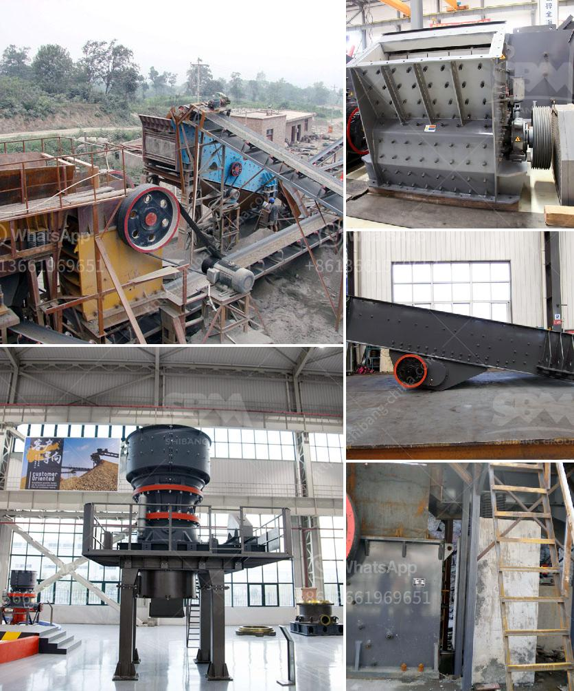

<h3>What is the cost of limestone crushing process ?</h3>
Limestone is a common sedimentary rock found all over the world. It is formed by the deposition and compression of skeletal remains of marine organisms such as coral and shells. Limestone has a wide range of uses due to its versatility and aesthetic appeal. One of the key processes involved in utilizing limestone is crushing, which is essential for various industries such as construction, agriculture, and manufacturing.

The cost of limestone crushing process primarily depends on the properties of the raw materials being crushed and the desired output. Taking measures to maximize the life of wear parts can significantly reduce the cost of wear parts and downtime, leading to savings in both production and maintenance cost.

When it comes to the cost of limestone crushing process, factors that determine the cost include the following:

1. Size and hardness of the limestone: The harder the limestone, the more energy is required to crush it. Similarly, larger limestone pieces require more energy compared to smaller ones. Therefore, the cost of crushing increases with the size and hardness of the limestone.

2. Output requirements: The desired output size of the crushed limestone affects the crushing process and cost. Higher output requirements necessitate the use of larger equipment or multiple stages of crushing, thereby increasing the cost.

3. Equipment selection: The choice of crushing equipment plays a significant role in the cost of limestone crushing process. Different equipment options, such as jaw crushers, impact crushers, or cone crushers, have varying capital and operating costs. Consideration of factors such as feed size, capacity requirements, and final product specifications is necessary to select the most appropriate crushing equipment.

4. Maintenance and wear parts: Maintenance cost and the lifespan of wear parts directly impact the cost of limestone crushing process. Regular maintenance practices, such as lubrication, inspections, and replacement of worn parts, can prevent costly breakdowns and extend the life of equipment. Additionally, optimizing the utilization of wear parts through proper design and operational strategies can further reduce the cost of replacements.

5. Operational efficiency: Optimizing the crushing process efficiency can immensely impact the overall cost. Efficient processes, such as proper screening and minimizing material loss during handling, can help reduce the cost per ton of crushed limestone. Utilizing advanced technology, such as automation systems and computer simulations, can also provide insights into process efficiency and cost reduction opportunities.

In conclusion, the cost of limestone crushing process can vary depending on factors such as limestone properties, required output, equipment selection, maintenance, and operational efficiency. By carefully considering these factors and implementing best practices, businesses can optimize their limestone crushing process to minimize costs and maximize profitability.
<h3>Contact us</h3><ul><li><strong>Whatsapp:&nbsp;<a href="https://wa.me/8613661969651">+8613661969651</a></strong></li><li><a href="https://swt.shibang-china.com/?git&amp;zhl&amp;What is the cost of limestone crushing process "><strong>Online Service(chat now)</strong></a></li></ul><h3>Related</h3><ul><li><a href='What is cost of bauxite processing per ton.md'>What is cost of bauxite processing per ton?</a></li><li><a href='What equipment is used when sand mining.md'>What equipment is used when sand mining?</a></li><li><a href='What mechanical equipment is used in limestone mining.md'>What mechanical equipment is used in limestone mining</a></li><li><a href='What is the separation process in a vertical raw mill.md'>What is the separation process in a vertical raw mill?</a></li><li><a href='What are the different steps of chromite ore beneficiation .md'>What are the different steps of chromite ore beneficiation ?</a></li></ul>