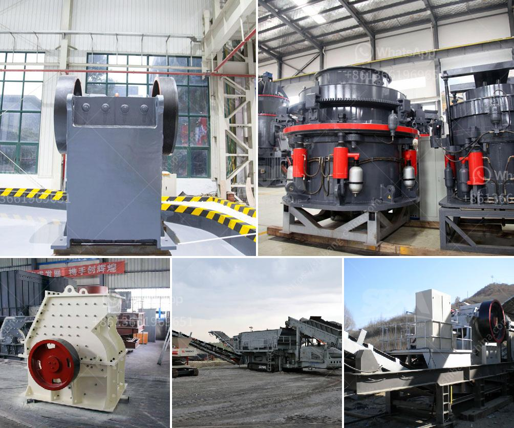

<h3>What is the cost of quarry stones in Kenya?</h3>
Quarry stones are a form of construction materials that are found in abundance in Kenya. These stones are mined from quarries, which are naturally occurring rocks where stones are extracted using a variety of techniques. Despite their omnipresence, the cost of quarry stones is critical to homeowners and builders alike. Understanding the factors that influence these costs can help in making informed decisions when purchasing quarry stones.

One of the primary factors that determine the cost of quarry stones in Kenya is their size. Larger stones tend to be more expensive compared to smaller ones. This is because extracting, transporting, and cutting larger stones requires more effort, machinery, and manpower, thereby increasing the overall cost. Additionally, the demand for larger stones is relatively lower compared to smaller stones, leading to higher pricing.

Another factor that affects the cost of quarry stones is their quality. The quality of the stones is determined by their strength, durability, and appearance. High-quality stones tend to be more expensive due to their superior performance and aesthetic appeal. On the other hand, lower-quality stones are priced lower as they may have defects, be prone to breakage, or lack desirable visual characteristics.

The location of the quarry also plays a significant role in cost determination. Transportation costs are directly influenced by the distance between the quarry and the project site. For instance, quarry stones located far away from urban centers or infrastructure may require additional expenses to transport them. These costs are usually passed on to the buyers, making stones from such remote quarries more expensive.

The availability of quarry stones in a particular area also affects their cost. In areas where quarry stones are readily available, the competition among suppliers tends to be high, resulting in competitive pricing. Conversely, in areas with limited quarry resources, the cost tends to be higher due to limited supply and increased demand.

The production process also contributes to the cost of quarry stones. Quarries that utilize advanced machinery, technology, and effective extraction techniques will have higher production costs, which are then factored into the pricing. Such technologies ensure that the stones are extracted efficiently while minimizing the wastage, thus producing high-quality stones.

Lastly, government regulations and policies can influence the cost of quarry stones in Kenya. Restrictions on quarrying activities, such as environmental regulations and licensing requirements, can increase the cost of production. Quarry owners may need to implement measures to adhere to these regulations, such as investing in waste management systems or acquiring licenses, which can be costly.

In conclusion, the cost of quarry stones in Kenya varies depending on various factors. Size, quality, location, availability, production process, and government regulations all contribute to the pricing. It is essential for homeowners and builders to consider these factors to make informed decisions when purchasing quarry stones. By understanding the cost dynamics, one can strike a balance between quality and affordability, ultimately achieving the desired outcome for their construction projects.
<h3>Contact us</h3><ul><li><strong>Whatsapp:&nbsp;<a href="https://wa.me/8613661969651">+8613661969651</a></strong></li><li><a href="https://swt.shibang-china.com/?git&amp;zhl&amp;What is the cost of quarry stones in Kenya"><strong>Online Service(chat now)</strong></a></li></ul><h3>Related</h3><ul><li><a href='What is concrete crusher.md'>What is concrete crusher?</a></li><li><a href='what equipment is used when mining zinc ore.md'>what equipment is used when mining zinc ore?</a></li><li><a href='What are the characteristics of bauxite ore and how to crush it.md'>What are the characteristics of bauxite ore and how to crush it?</a></li><li><a href='What is the difference between impact crusher and jaw crusher.md'>What is the difference between impact crusher and jaw crusher?</a></li><li><a href='What is the difference between stationary and mobile crushers.md'>What is the difference between stationary and mobile crushers?</a></li></ul>