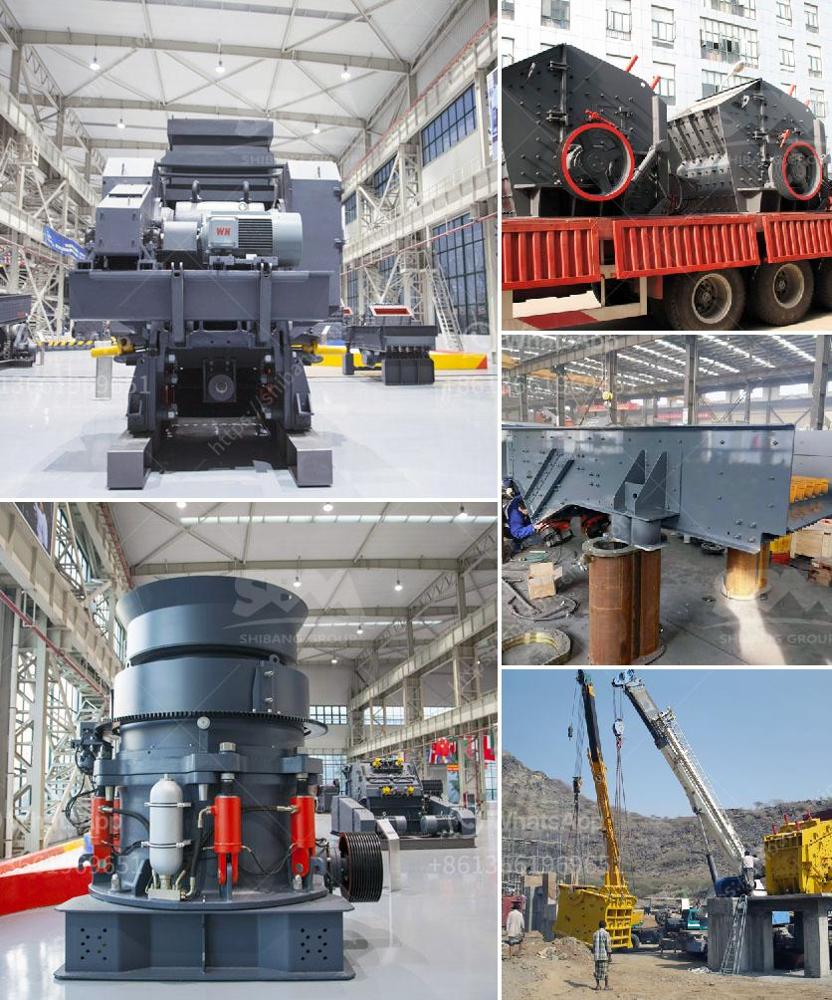

<h3>What is the cost of the cone crusher?</h3>
The cone crusher is undoubtedly one of the most commonly used crushers in aggregates production, mining operations, and recycling applications. They are engineered to process a wide range of materials including hard and abrasive ones. With a cost that is typically higher than other compression crushers, such as a jaw or impactor, the cone crusher is often selected as the ideal secondary or tertiary crushing equipment. 

Cone crushers work by compressing materials between a mantle and a concave. These surfaces typically lined with manganese steel liners and are shaped similar to a bowl. As the mantle gyrates within the concave, the material is crushed and can be discharged through the bottom of the crusher, ready for further processing. 

When considering the cost of a cone crusher, there are various factors to consider, including the initial costs of purchasing the crusher, the operational expenses to be incurred in the long run, and the maintenance costs. 

The initial cost of a cone crusher can vary significantly, depending on the size, model, and manufacturer. However, the upfront cost is generally higher than other crushers because of the added complexity and engineering involved. Additionally, cone crushers often have a higher price tag than jaw crushers and impact crushers due to their extensive operational and design features. It is important to determine your needs and budget before making a purchase decision.

In addition to the initial cost, the operational expenses of running a cone crusher should also be considered. These include the cost of energy consumption, maintenance expenses, and the costs associated with the crusher's replacement parts. In general, cone crushers require regular maintenance intervals to maintain optimal performance. This may include lubrication, changing of wear parts, and inspections to identify potential issues before they worsen. Proper maintenance can help prolong the lifespan of the machine and reduce overall operational costs.

Furthermore, it is crucial to consider the costs of the crusher's replacement parts, such as mantles, liners, and feed plates. These parts are subject to wear and tear, particularly when processing hard and abrasive materials. The frequency and cost of replacing these parts will depend on various factors, including the type and quality of the material being processed, the crusher's settings, and the operating conditions. Regular inspections and a proper maintenance program can help identify when replacement parts are needed and minimize the associated costs.

Overall, while the cone crusher may have a higher initial cost compared to other crushers, it offers numerous benefits in terms of its capabilities, efficiency, and output quality. It can effectively process a wide range of materials, ensuring high productivity and reduced downtime. However, it is essential to consider the long-term operational and maintenance costs associated with cone crushers when making a purchase decision. By assessing your specific needs, conducting thorough research, and budgeting accordingly, you can make an informed decision and choose a cone crusher that provides the best value for your investment.
<h3>Contact us</h3><ul><li><strong>Whatsapp:&nbsp;<a href="https://wa.me/8613661969651">+8613661969651</a></strong></li><li><a href="https://swt.shibang-china.com/?git&amp;zhl&amp;What is the cost of the cone crusher"><strong>Online Service(chat now)</strong></a></li></ul><h3>Related</h3><ul><li><a href='What is the cost of the equipment used in mining lead ore.md'>What is the cost of the equipment used in mining lead ore?</a></li><li><a href='What is the cost of the cone crusher.md'>What is the cost of the cone crusher?</a></li><li><a href='when pulverizing coal what is a crusher use for？.md'>when pulverizing coal what is a crusher use for？</a></li><li><a href='What are the parts of ball mill internal structure.md'>What are the parts of ball mill internal structure?</a></li><li><a href='What kind of crushing machinery is used for sandstone processing ？.md'>What kind of crushing machinery is used for sandstone processing ？</a></li></ul>