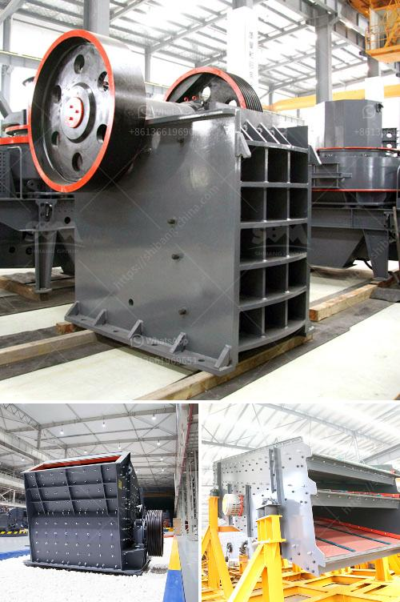

<h3>What is the cost of the equipment used in mining lead ore?</h3>
Mining is an essential industry that has been part of our civilization for centuries. From the Bronze Age to the Industrial Revolution, humans have relied on mining to extract valuable resources from the earth. One crucial metal that has played a significant role in various industries is lead. However, the process of mining lead ore comes with significant costs, particularly concerning the equipment used in the extraction process.

The cost of equipment used in mining lead ore can vary widely, depending on the nature of the deposit and the scale of extraction operation. As with any mining project, the equipment needed will be determined by factors such as the type of ore, the location, and the environmental conditions. Therefore, providing a precise cost estimate is challenging. Nonetheless, we can shed light on the major equipment required and offer a rough estimation of the associated costs.

The first piece of essential equipment used in mining lead ore is the drilling rig. This powerful machine is responsible for creating holes in the ground to extract the ore. Modern drilling rigs have advanced features, including automated systems, enabling faster and more efficient drilling. Drilling rigs can cost anywhere from tens of thousands to several million dollars, depending on their specifications, size, and technology.

After the drilling process, the next crucial equipment in lead ore mining is the loading and hauling machinery. This includes excavators, loaders, and trucks. These heavy-duty machines are responsible for removing the ore from the mines and transporting it to the processing plant. The cost of these machines varies significantly, depending on their capacity and technology. Smaller loaders and excavators can cost a few hundred thousand dollars, while larger models can reach millions of dollars.

The processing plant is where the valuable lead ore is extracted and refined. This stage requires various types of equipment, such as crushers, grinding mills, flotation cells, and filters. The cost of this equipment depends on their capacity, quality, and level of automation. A basic processing plant can cost a few million dollars, while a more advanced facility could run into the tens of millions.

Safety and environmental concerns are paramount in the mining industry. Therefore, significant investment must be made in equipment to ensure the well-being of the workers and minimize the impact on the environment. This includes ventilation systems, dust suppression equipment, safety gear, and monitoring tools. While the costs associated with safety equipment might not be as substantial as the extraction and processing machinery, they are a necessary expense to comply with regulations and ensure worker safety.

In conclusion, the cost of equipment used in mining lead ore can vary greatly depending on several factors, including the size of the operation, location, and technological advancements. Drilling rigs, loading and hauling machinery, processing plants, and safety equipment all contribute to the overall expenses. As technology advances and demand for lead ore increases, these costs are expected to rise in tandem. However, the benefits and profitability of lead extraction make this investment justifiable for many mining companies.
<h3>Contact us</h3><ul><li><strong>Whatsapp:&nbsp;<a href="https://wa.me/8613661969651">+8613661969651</a></strong></li><li><a href="https://swt.shibang-china.com/?git&amp;zhl&amp;What is the cost of the equipment used in mining lead ore"><strong>Online Service(chat now)</strong></a></li></ul><h3>Related</h3><ul><li><a href='What is the fault and how do I repair a cone crusher.md'>What is the fault and how do I repair a cone crusher?</a></li><li><a href='What  is vertical shaft impact crusher.md'>What  is vertical shaft impact crusher?</a></li><li><a href='What are the parts of ball mill internal structure.md'>What are the parts of ball mill internal structure?</a></li><li><a href='What is the difference between an open circuit and a closed circuit ball mill.md'>What is the difference between an open circuit and a closed circuit ball mill?</a></li><li><a href='What is the aggregate crusher.md'>What is the aggregate crusher?</a></li></ul>