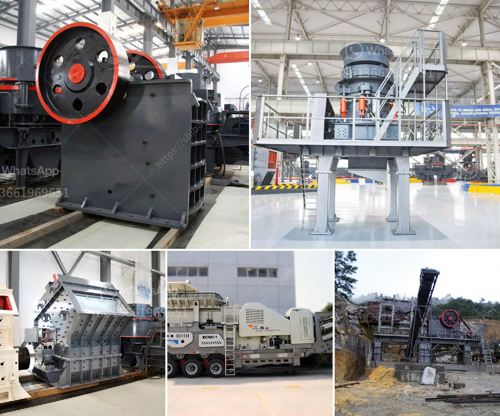

<h3>What is the difference between a quarry and a mine?</h3>
When it comes to extracting minerals, stones, or any other valuable resources from the Earth's crust, two commonly used terms are quarry and mine. While these terms may seem interchangeable to some, they actually denote significant differences in the extraction processes and the materials they yield. Let's explore the dissimilarities between quarries and mines.

A quarry is an excavation site where natural materials, such as rocks, gravel, sand, or dimension stone, are extracted for use in construction, landscaping, or other industrial purposes. Generally, quarries are shallow and open pits, although there are also underground quarries. In a quarry, the extraction process involves the removal of overburden - the top layer of soil, vegetation, and rocks that cover the resource being sought. This is typically done with heavy machinery, such as bulldozers and excavators, which allows access to the desired material. The extracted materials are often blasted or drilled to break them into manageable sizes, then loaded onto trucks to be transported for processing or use in construction.

One of the main purposes of a quarry is to extract construction aggregate, a broad term that encompasses crushed stone, sand, gravel, and recycled materials. These materials are used in the production of concrete, asphalt, road base, and various other construction products. Quarrying for dimension stone, which refers to natural stone that has been selected and cut into desired shapes and sizes, is another common objective.

On the other hand, a mine is an underground or surface excavation where minerals, ores, or precious metals are extracted. Unlike a quarry, mines may require extensive planning and infrastructure to access and extract the desired resources. Ores or minerals are often found deep within the Earth's crust and are obtained by drilling or blasting. Once extracted, they are then processed to separate the valuable minerals from the surrounding rock or ore body.

Mines are usually classified into two main types: surface mines and underground mines. Surface mines, such as open-pit or strip mines, are typically used to extract minerals near the surface. These mines involve the removal of overburden and the use of heavy equipment, including trucks, shovels, and drills, to access the minerals. Underground mines, as the name suggests, involve extracting minerals or ores from beneath the Earth's surface. This method requires extensive tunneling, shaft sinking, and structural support systems.

While quarries and mines have distinct objectives and processes, they both play a vital role in supplying society with the resources necessary for construction, infrastructure development, and various industries. The materials extracted from quarries and mines provide the foundation of our modern world.

In summary, quarries and mines differ primarily in terms of the materials they aim to extract and the extraction methods employed. Quarries excavate natural materials for construction purposes, while mines access minerals and ores for various industrial applications. Despite these discrepancies, both quarrying and mining operations are essential for meeting the demands of human civilization.

- McGarry, S. (2004). The quarrying industry on Mendip. The Somersetshire Archaeological and Natural History Society, 148, 119-174.

- Maney, J. P. (Ed.). (2017). Quarrying and mining: Issues in quarrying and mining, and associated environmental and health concerns. Nova Science Publishers.
<h3>Contact us</h3><ul><li><strong>Whatsapp:&nbsp;<a href="https://wa.me/8613661969651">+8613661969651</a></strong></li><li><a href="https://swt.shibang-china.com/?git&amp;zhl&amp;What is the difference between a quarry and a mine"><strong>Online Service(chat now)</strong></a></li></ul><h3>Related</h3><ul><li><a href='What are the characteristics of bauxite ore and how to crush it.md'>What are the characteristics of bauxite ore and how to crush it?</a></li><li><a href='What is the separation process in a vertical raw mill.md'>What is the separation process in a vertical raw mill?</a></li><li><a href='What is concrete crushing.md'>What is concrete crushing?</a></li><li><a href='What are the machines and equipment in mining.md'>What are the machines and equipment in mining?</a></li><li><a href='What are the machines used to mine bauxite.md'>What are the machines used to mine bauxite?</a></li></ul>