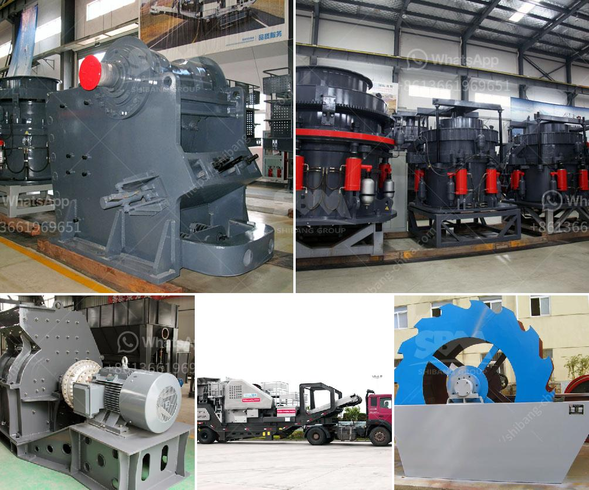

<h3>What is the difference between a roll crusher and a hammer mill?</h3>
A roll crusher is a piece of heavy-duty equipment used in mining and industrial processes. It features a pair of large wheels or cylinders mounted on horizontal axis. When rocks, ore, and other materials pass between the two cylinders, they are crushed or ground into smaller pieces. A hammer mill, on the other hand, is a machine that uses rotating hammers attached to a rotating drum to pulverize materials. It is commonly used in the construction and mining industries. 

Hammer mills come in different shapes and sizes, but all operate on the same basic principle: the hammers crush the material against a screen or grate to achieve the desired size reduction. They can be configured with different screens to produce a variety of particle sizes. In addition to crushing, hammer mills are also capable of grinding and pulverizing materials.

The main difference between a roll crusher and a hammer mill is that the former relies on compression, while the latter relies on impact, shear, or attrition. The roll crusher is capable of producing a uniform particle size distribution with less dust and fines generation. However, it requires more energy input compared to a hammer mill.

A hammer mill uses rotating hammers attached to a rotating drum to generate impact and shear forces on the material being crushed. When the material enters the mill, it is subjected to high-velocity impacts from the hammers. These impacts shatter the material and propel it against the screen or grate. As the material passes through the screen, the desired particle size is achieved, while oversized particles are further reduced.

In contrast, a roll crusher applies pressure to the material being crushed by using two opposite rotating drums. The material is fed into the gap between the drums, and as the drums rotate, they compress the material. This compression force breaks the material apart, resulting in smaller particles. The size of the final product is determined by the gap between the drums and the rotational speed.

Both roll crushers and hammer mills serve a variety of industries. They are commonly used in mining, construction, and recycling processes. Roll crushers are ideal for producing a uniform particle size distribution with minimal fines generation, while hammer mills are well-suited for producing intermediate to fine particle sizes.

In summary, the main differences between a roll crusher and a hammer mill are the method of compression, the desired particle size, and the energy input required. Roll crushers use compression to reduce material size, while hammer mills rely on impact and shear forces. Both achieve the desired size reduction, but each comes with its own set of advantages and limitations.
<h3>Contact us</h3><ul><li><strong>Whatsapp:&nbsp;<a href="https://wa.me/8613661969651">+8613661969651</a></strong></li><li><a href="https://swt.shibang-china.com/?git&amp;zhl&amp;What is the difference between a roll crusher and a hammer mill"><strong>Online Service(chat now)</strong></a></li></ul><h3>Related</h3><ul><li><a href='What is mechanism sand.md'>What is mechanism sand?</a></li><li><a href='What is the cost of the equipment used in mining lead ore.md'>What is the cost of the equipment used in mining lead ore?</a></li><li><a href='What beneficiation method is used for iron ore.md'>What beneficiation method is used for iron ore?</a></li><li><a href='What machine is used to crush copper ore.md'>What machine is used to crush copper ore?</a></li><li><a href='What equipment is needed for magnesite ore mines.md'>What equipment is needed for magnesite ore mines?</a></li></ul>