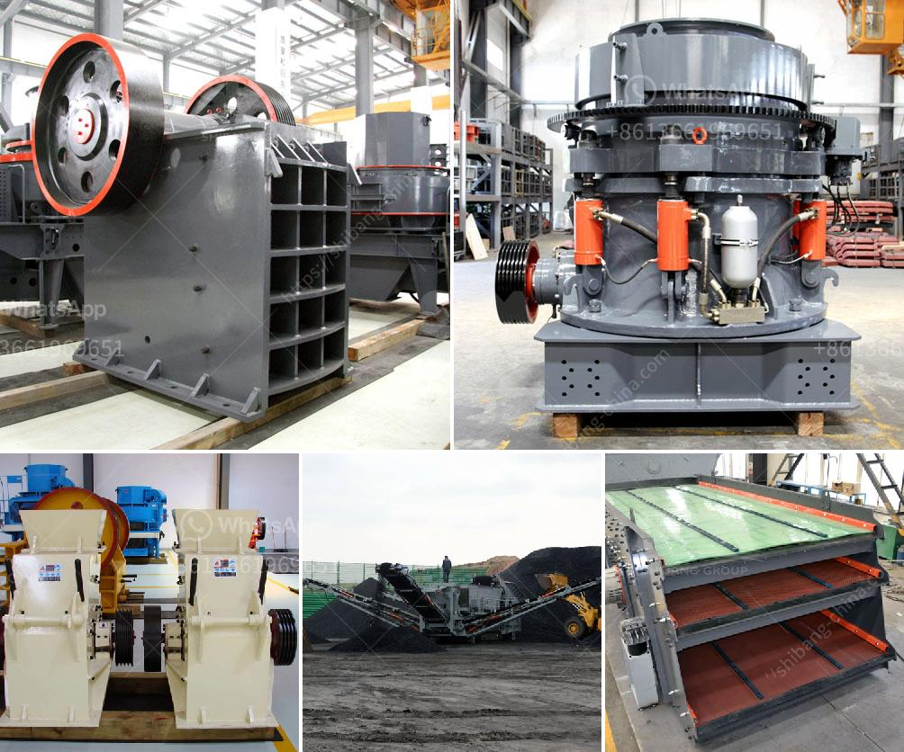

<h3>What is the difference between an open circuit and a closed circuit ball mill?</h3>
Ball milling is one of the most widely used methods in the field of mineral processing. It involves the use of a rotating cylindrical shell filled with grinding media (such as balls) to reduce the particle size of the material being processed. The mill can be operated in either open circuit or closed circuit depending on the desired end product size.

In an open circuit milling operation, the grinding media are not continuously added to the mill. Instead, they are periodically replaced by fresh media to maintain the desired grinding efficiency. This is achieved by manually opening the mill's inlet and outlet valves to allow the material and grinding media to enter and exit the mill. One advantage of the open circuit system is that it allows for greater control over the particle size distribution of the final product.

On the other hand, in a closed circuit milling operation, the grinding media are continuously added to the mill along with the material being processed. The mill operates under a closed circuit, meaning that the overflow from the mill passes through a separator and is recycled back into the mill for further grinding. This continuous process ensures that the grinding media are always present in the mill and that the particle size of the product can be closely controlled.

One of the main differences between an open circuit and a closed circuit ball mill is the size and type of grinding media used inside the mill. Open circuit ball mills typically have a diameter-to-length ratio of around two to one. Closed circuit ball mills, on the other hand, have a diameter-to-length ratio of around one to two. This difference in grinding media size and shape also contributes to the difference in power consumption and grinding efficiency between the two types of mills.

Another difference between the two types of mills is the flow of material through the mill. In an open circuit mill, the material passes through the mill once and is discharged through a combination of gravity and the rotation of the mill. In a closed circuit mill, the material is recirculated back to the mill for further grinding. This recirculation of material helps to improve the grinding efficiency of the mill by ensuring that the grinding media are always in contact with fresh material.

Overall, the choice between an open circuit and a closed circuit ball mill depends on the desired particle size of the ground material and the specific requirements of the milling process. Open circuit ball mills are typically used for coarse grinding, while closed circuit ball mills are used for fine grinding. However, the ball mill can also be used in combination with other devices such as classifiers or hydrocyclones to improve grinding efficiency and achieve the desired end product size.
<h3>Contact us</h3><ul><li><strong>Whatsapp:&nbsp;<a href="https://wa.me/8613661969651">+8613661969651</a></strong></li><li><a href="https://swt.shibang-china.com/?git&amp;zhl&amp;What is the difference between an open circuit and a closed circuit ball mill"><strong>Online Service(chat now)</strong></a></li></ul><h3>Related</h3><ul><li><a href='what is concentration of ores？.md'>what is concentration of ores？</a></li><li><a href='What is the mining process for fluorite.md'>What is the mining process for fluorite?</a></li><li><a href='What type of bearings must be used for the taper of a jaw crusher.md'>What type of bearings must be used for the taper of a jaw crusher?</a></li><li><a href='What are machines used for mining iron ore.md'>What are machines used for mining iron ore?</a></li><li><a href='What guidelines are needed to set up a mobile stone crusher in Orissa.md'>What guidelines are needed to set up a mobile stone crusher in Orissa?</a></li></ul>