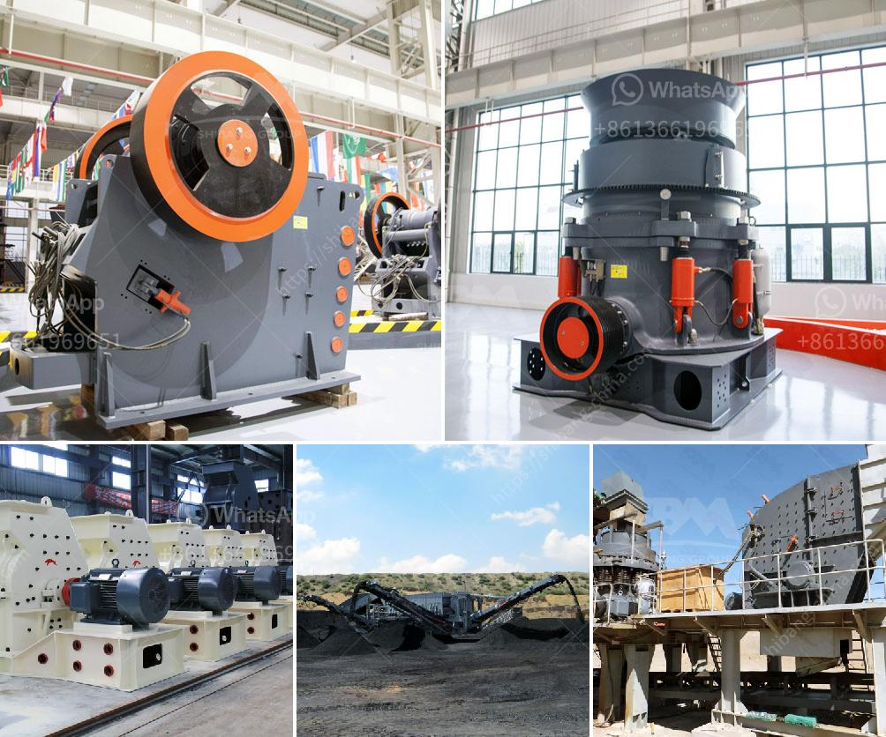

<h3>What is the difference between impact crusher and hammer mill?</h3>
The impact crusher and hammer mill are two common types of crushing equipment used for medium to hard materials such as limestone, coal, and ores. Both machines utilize a high-speed rotor with swinging hammers to impact the material and cause it to break apart.

However, there are some differences between the two machines that should be considered when choosing the right crusher for your application.

The impact crusher consists of a rotor with rotating hammers, a chamber with a feeding inlet, and an outlet. The material is fed into the chamber and crushed by the rotating hammers, which are impacted by the high-speed rotor. The crushed material is then thrown against the impact plates or breaker plates lining the chamber, where further breakage occurs.

On the other hand, the hammer mill consists of a rotating shaft with fixed hammers attached. The material is fed into the chamber and crushed by the hammers as they rotate, creating kinetic energy. The size of the final product is determined by the size of the gap between the hammers and the lining plates.

The impact crusher is known for its high crushing ratio and finished product size. It can crush materials with a compressive strength of up to 350 MPa, such as granite, limestone, and concrete. The product size is adjustable, depending on the gap between the impact plate and the rotor.

In comparison, the hammer mill has a lower crushing ratio and can produce sizes ranging from coarse to fine. It is suitable for crushing brittle materials with a compressive strength of up to 150 MPa, such as coal, limestone, gypsum, and cement clinker.

The impact crusher is commonly used for the crushing of limestone, coal, calcium carbide, quartz, dolomite, iron pyrites, gypsum, and chemical raw materials of medium hardness. It is widely used in mining, construction, chemical, cement, metallurgical industries, etc.

In contrast, the hammer mill is mainly used for the crushing of agriculture, forestry, and construction waste. It is also suitable for processing fragile materials, such as glass, ceramic, rocks, bricks, and concrete.

Both the impact crusher and hammer mill require regular maintenance and repair to prolong their lifespan. However, the impact crusher has a larger number of wear-resistant parts and higher maintenance costs compared to the hammer mill. Therefore, the impact crusher is recommended for applications with high maintenance costs.

In conclusion, the impact crusher and hammer mill have their own strengths and weaknesses. The choice between them depends on the specific needs and requirements of the application. If you have medium to hard materials and require a high crushing ratio, the impact crusher is more suitable. However, if you have brittle materials and need a wide range of product sizes, the hammer mill is a better choice.
<h3>Contact us</h3><ul><li><strong>Whatsapp:&nbsp;<a href="https://wa.me/8613661969651">+8613661969651</a></strong></li><li><a href="https://swt.shibang-china.com/?git&amp;zhl&amp;What is the difference between impact crusher and hammer mill"><strong>Online Service(chat now)</strong></a></li></ul><h3>Related</h3><ul><li><a href='What is the process of mining iron ore.md'>What is the process of mining iron ore?</a></li><li><a href='What is wet process cement.md'>What is wet process cement?</a></li><li><a href='What is the optimal rotation speed for a ball mill.md'>What is the optimal rotation speed for a ball mill?</a></li><li><a href='What is the process of mining copper ore.md'>What is the process of mining copper ore?</a></li><li><a href='What are the methods of mining mica.md'>What are the methods of mining mica?</a></li></ul>