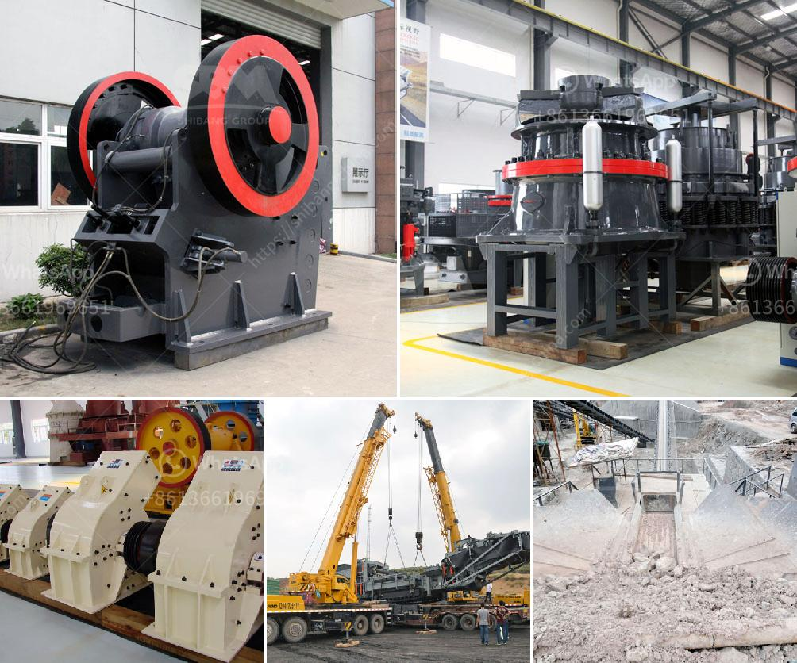

<h3>What is the difference between impact crusher and jaw crusher?</h3>
When it comes to crushing equipment, two common pieces of machinery are often utilized: impact crushers and jaw crushers. Although both crushers rely on the compression mechanism to break rocks, each type is suitable for different tasks. This article will explore the differences between impact crushers and jaw crushers and demonstrate their respective applications.

Firstly, let's begin with a brief overview of how these crushers work. An impact crusher utilizes a feed hopper, which feeds material into a rotor assembly. High-speed hammers or blow bars then strike the material, causing it to break along its natural fracture lines. On the other hand, a jaw crusher operates with one fixed jaw and one moving jaw. The material enters the jaws and is squeezed by the movement of the two jaws, resulting in fragmentation.

One major difference between impact crushers and jaw crushers is the location of the crushing force. The jaw crusher operates by applying pressure to the material between two jaws, one stationary and one movable. The material gets crushed due to the pressure exerted by the movable jaw onto the fixed jaw. The impact crusher, on the other hand, operates by striking the material and providing it with kinetic energy, causing it to break.

In terms of output, the jaw crusher can achieve a reduction ratio of 6:1 to 8:1, whereas the impact crusher can achieve a reduction ratio of 20:1 to 25:1. This means that the jaw crusher can handle a more extensive range of materials. However, the impact crusher is mostly used for crushing stones from the quarry or demolition site, whereas the jaw crusher is commonly used for primary crushing in various applications.

Another difference between the two crushers is their feed size. The jaw crusher can handle a maximum feed size of 600mm, whereas the impact crusher can accommodate a feed size of 800mm. This means that the impact crusher can handle larger rocks and crush them down to a smaller size than the jaw crusher.

Additionally, impact crushers are typically equipped with a horizontal shaft impactor, whereas jaw crushers have a vertical shaft impactor. This difference in equipment results in a difference in crushing performance. The horizontal shaft impactor delivers high-quality cubical-shaped aggregates, whereas the vertical shaft impactor produces more irregularly-shaped particles.

Finally, the operational costs between the two crushers also vary. Jaw crushers require regular lubrication, while impact crushers do not. Additionally, the maintenance costs of jaw crushers are generally higher due to their complex and heavy-duty nature. On the other hand, impact crushers are known for their easy maintenance and overall efficiency.

In conclusion, although both impact crushers and jaw crushers operate on the compression mechanism, they vary in terms of output, feed size, crushing force location, and operational costs. The impact crusher is better suited for crushing large rocks and quarried materials, whereas the jaw crusher is designed for smaller rocks and primary crushing applications. It is essential to consider these differences when choosing the appropriate equipment for your crushing needs.
<h3>Contact us</h3><ul><li><strong>Whatsapp:&nbsp;<a href="https://wa.me/8613661969651">+8613661969651</a></strong></li><li><a href="https://swt.shibang-china.com/?git&amp;zhl&amp;What is the difference between impact crusher and jaw crusher"><strong>Online Service(chat now)</strong></a></li></ul><h3>Related</h3><ul><li><a href='What  is vertical shaft impact crusher.md'>What  is vertical shaft impact crusher?</a></li><li><a href='what is throughput for a cement grinding ball mill？.md'>what is throughput for a cement grinding ball mill？</a></li><li><a href='What is the mining process of gypsum.md'>What is the mining process of gypsum?</a></li><li><a href='What are the production and uses of crushed rock aggregates.md'>What are the production and uses of crushed rock aggregates?</a></li><li><a href='What is concrete crushing.md'>What is concrete crushing?</a></li></ul>