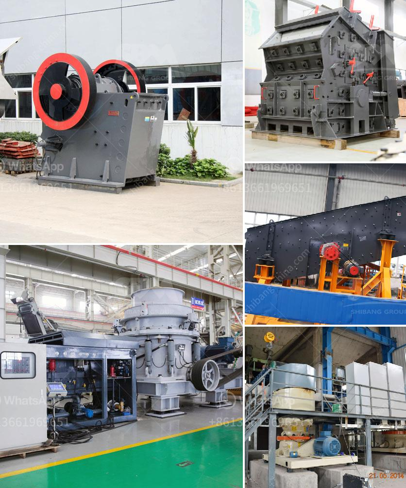

<h3>What is the difference between stationary and mobile crushers?</h3>
In the constantly evolving world of machinery, it can often be difficult to keep up with the latest trends and advances. Nowhere is this more evident than in the realm of crushing equipment. With so many different types of crushers on the market, it can be challenging to accurately distinguish between them. Two of the most popular options are stationary and mobile crushers. Keep reading to learn more about what makes these machines different, how they work, and their key advantages.

A stationary crusher is just that: it stays in one place. It might seem like an archaic concept – after all, it probably isn’t as thrilling as hopping from one job site to another, constantly on the move. Indeed, stationary crushers are a vital component of a mining operation or aggregate process plant. The State of Queensland in Australia, for example, has adopted a policy of encouraging mining operators to expand their installations and replace older machines with high-performance units, in order to improve productivity and reduce costs.

One of the primary benefits of stationary crushers is their large production capacity. With a jaw crusher or impact crusher, you can achieve higher reduction ratios, and consequently a higher productivity rate than other crushing machines such as cone crushers. This is especially important if you are targeting a specific aggregate gradation or size.

Mobility is not as big an issue with a stationary jaw crusher, as it is with a track-mounted or mobile unit. Consider the following factors that may make a stationary crusher your best choice:

- Stationary crushers can provide more customization options in terms of size and configuration, since they are fixed to a specific location.

- With the advancement of technology, mobile crushers have become more compact and can be transported easily without causing any additional costs. Mobile crushers are excellent for remote areas where hauling and setting up stationary crushers might be an issue.

- Site selection is a crucial part of the design of a stationary jaw crusher. It is important to consider the layout and the logistics of the site, the distance between the crusher and the truck or trailer carrying the crusher, availability of electricity or any other utilities, and the availability of space.

- On the other hand, mobile crushers are flexible and their portability allows operators to save time and money when it comes to loading, unloading, and transshipping materials. The mobile nature of these machines also enables them to be easily transported from one location to the next.

In summary, the main differences between stationary and mobile crushers are their processing capabilities, mobility, and flexibility. While mobile crushers can be moved relatively easily, stationary machines are better suited for handling big loads, customizing desirable size reduction ratios, and picking a perfect match for the intended job. Stationary crushers also require a considerable amount of area and infrastructure, as well as a designated crushing area.

Ultimately, both stationary and mobile crushing equipment have their own benefits and strengths. It is up to mining companies to identify which works best for their operations, and their specific needs and constraints. Regardless of the choice, high-quality crushers are crucial for all crushing situations to ensure optimal performance, reliability, and longevity of the equipment.
<h3>Contact us</h3><ul><li><strong>Whatsapp:&nbsp;<a href="https://wa.me/8613661969651">+8613661969651</a></strong></li><li><a href="https://swt.shibang-china.com/?git&amp;zhl&amp;What is the difference between stationary and mobile crushers"><strong>Online Service(chat now)</strong></a></li></ul><h3>Related</h3><ul><li><a href='What is aluminium ore benefication process.md'>What is aluminium ore benefication process?</a></li><li><a href='What are the production and uses of crushed rock aggregates.md'>What are the production and uses of crushed rock aggregates?</a></li><li><a href='What is approximate cost of a jaw crusher.md'>What is approximate cost of a jaw crusher?</a></li><li><a href='What machines are needed to crush river pebbles into small stones.md'>What machines are needed to crush river pebbles into small stones?</a></li><li><a href='What is the optimal rotation speed for a ball mill.md'>What is the optimal rotation speed for a ball mill?</a></li></ul>