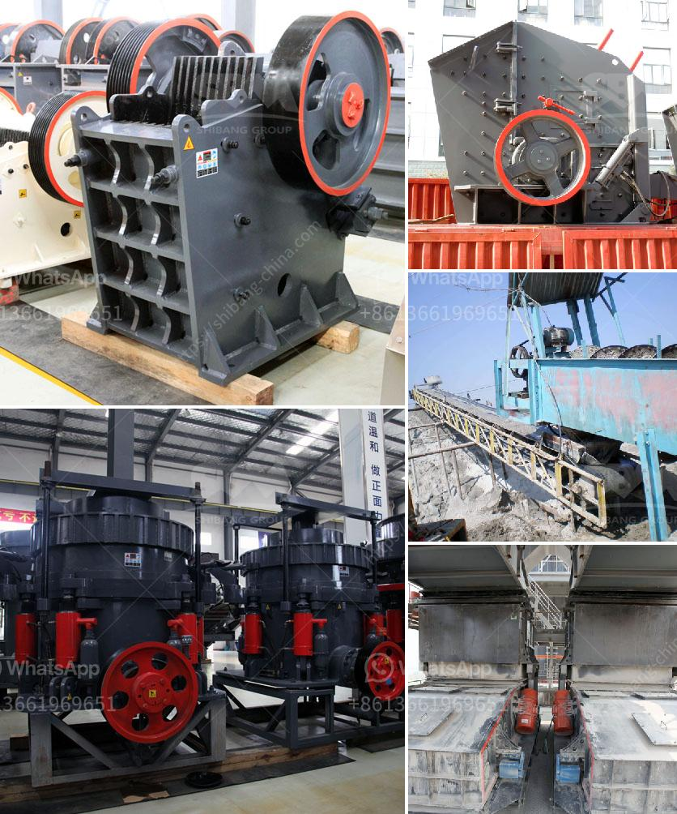

<h3>What is the fault and how do I repair a cone crusher?</h3>
As the name suggests, a cone crusher is a type of crushing equipment used specifically to crush rocks and ores in various industry sectors such as mining, metallurgy, building materials, and chemical engineering. To ensure efficient and effective operation of your cone crusher, it is essential to identify and rectify any faults or issues that may arise. In this article, we will explore common faults in cone crushers and discuss how to repair them.

One of the most common faults in a cone crusher is overheating. Overheating can be caused by various factors, such as a damaged lubricating oil seal or a faulty oil temperature sensor. When the crusher overheats, it usually results in a significant decrease in performance or even a complete breakdown. To repair this fault, you should first identify the root cause of the overheating. Check the oil levels and examine the lubrication system for any leaks or damages. Replace any faulty seals or sensors and ensure that the oil temperature is within the recommended range.

Another common fault in cone crushers is the production of excessive noise or vibrations. This can be caused by various factors, including loose components, worn out parts, or misalignment. Excessive vibrations can not only affect the performance of the crusher but also lead to additional damages. To fix this issue, start by identifying the source of the noise or vibrations. Inspect the crusher for any loose or worn out parts, such as bolts, nuts, or belts. Tighten or replace as necessary. Furthermore, check the alignment of the crusher and make adjustments if needed.

Blocked or clogged feeding and discharge chutes are another prevalent fault in cone crushers. When materials get stuck in the chutes, it can cause a decrease in production capacity and even damage the crusher. To resolve this issue, firstly, shut down the crusher and ensure all power sources are disconnected. Next, remove any obstructions or blockages from the feeding and discharge chutes using appropriate tools, such as a shovel or air blower. Inspect the chutes for damages and repair or replace them if necessary.

Furthermore, cone crushers may experience uneven or excessive wear on the crushing chamber liners and other internal components. This can impact the overall efficiency and performance of the crusher. Regular maintenance and inspections are essential to identify and repair any wear-related faults. Inspect the liners for signs of wear, such as uneven surfaces or excessive thinning. Replace any worn-out liners promptly to prevent further damage to the crusher.

In conclusion, a cone crusher is prone to various faults due to its complex structure and heavy-duty operation. To ensure optimal performance, it is crucial to identify and repair any faults promptly. Regular maintenance and inspections are key to preventing issues and maximizing the lifespan of the crusher. By addressing faults such as overheating, excessive noise or vibrations, blocked chutes, and wear-related concerns, you can keep your cone crusher running smoothly and efficiently.
<h3>Contact us</h3><ul><li><strong>Whatsapp:&nbsp;<a href="https://wa.me/8613661969651">+8613661969651</a></strong></li><li><a href="https://swt.shibang-china.com/?git&amp;zhl&amp;What is the fault and how do I repair a cone crusher"><strong>Online Service(chat now)</strong></a></li></ul><h3>Related</h3><ul><li><a href='What kind of crushing equipment is needed to produce cement.md'>What kind of crushing equipment is needed to produce cement</a></li><li><a href='What type of crushing equipment should copper mine choose.md'>What type of crushing equipment should copper mine choose?</a></li><li><a href='what is the primary use for dolomite rock.md'>what is the primary use for dolomite rock</a></li><li><a href='What equipment is needed for silicon ore mines.md'>What equipment is needed for silicon ore mines?</a></li><li><a href='What is needed to open an aggregate mine.md'>What is needed to open an aggregate mine?</a></li></ul>