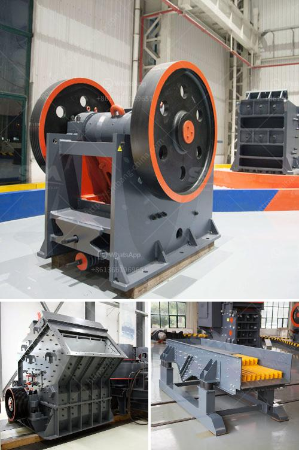

<h3>What is the machine used in hard rock gold mining?</h3>
Hard rock gold mining is the process of extracting gold from hard rock deposits. Unlike placer mining, which uses a variety of equipment such as gold pans and sluice boxes, hard rock mining involves more advanced machinery like crushers and mills. These are essential for breaking down large chunks of rock into smaller, more manageable pieces for processing and extracting the gold.

One of the key machines used in hard rock gold mining is a crusher. This machine is used to break down the large chunks of rock into smaller pieces that can be further processed. There are various types of crushers available, each designed to handle different types of rocks and ores. Jaw crushers and gyratory crushers are commonly used in primary crushing stages, while cone crushers and impact crushers are utilized in secondary and tertiary stages of crushing.

After the rock has been crushed, the next step in the process is to mill it. Milling machines are used to grind the crushed rock into a fine powder. This powder is then subjected to various chemical processes, such as leaching or flotation, to extract the gold particles. The most commonly used milling machine in hard rock gold mining is the ball mill. The ball mill grinds the rock into a fine powder, which can be mixed with water to create slurry. This slurry is then mixed with various chemicals, such as cyanide or mercury, to extract the gold particles from the rock.

In addition to crushers and mills, other equipment used in hard rock gold mining includes underground mining equipment, such as drills and loaders. These machines are used to access the hard rock deposits underground and extract the gold. Drills are used to create holes in the rock, while loaders are used to remove the excavated rock and transport it to the surface for further processing.

Another important machine used in hard rock gold mining is the water pump. Water is an essential resource in mining, as it is used for various purposes, such as dust suppression, drilling, and processing. Water pumps are used to transport water from a nearby source, such as a river or a reservoir, to the mining site. These pumps come in various sizes and capacities, depending on the specific requirements of the mining operation.

In conclusion, hard rock gold mining requires a range of equipment to extract the precious metal from the rock. Crushers and mills are used to break down the rock into smaller pieces, which are then processed to extract the gold. Underground mining equipment, such as drills and loaders, are used to access the hard rock deposits. Water pumps are essential for transporting water to the mining site. Overall, these machines play a crucial role in the process of hard rock gold mining, making it possible to extract gold from deep underground.
<h3>Contact us</h3><ul><li><strong>Whatsapp:&nbsp;<a href="https://wa.me/8613661969651">+8613661969651</a></strong></li><li><a href="https://swt.shibang-china.com/?git&amp;zhl&amp;What is the machine used in hard rock gold mining"><strong>Online Service(chat now)</strong></a></li></ul><h3>Related</h3><ul><li><a href='What is the mining process for fluorite.md'>What is the mining process for fluorite?</a></li><li><a href='What type of crushing equipment should copper mine choose.md'>What type of crushing equipment should copper mine choose?</a></li><li><a href='What is a bentonite grinding unit.md'>What is a bentonite grinding unit?</a></li><li><a href='what type of pumps uesd in stone crusher？.md'>what type of pumps uesd in stone crusher？</a></li><li><a href='What is the cost of the equipment used in mining lead ore.md'>What is the cost of the equipment used in mining lead ore?</a></li></ul>