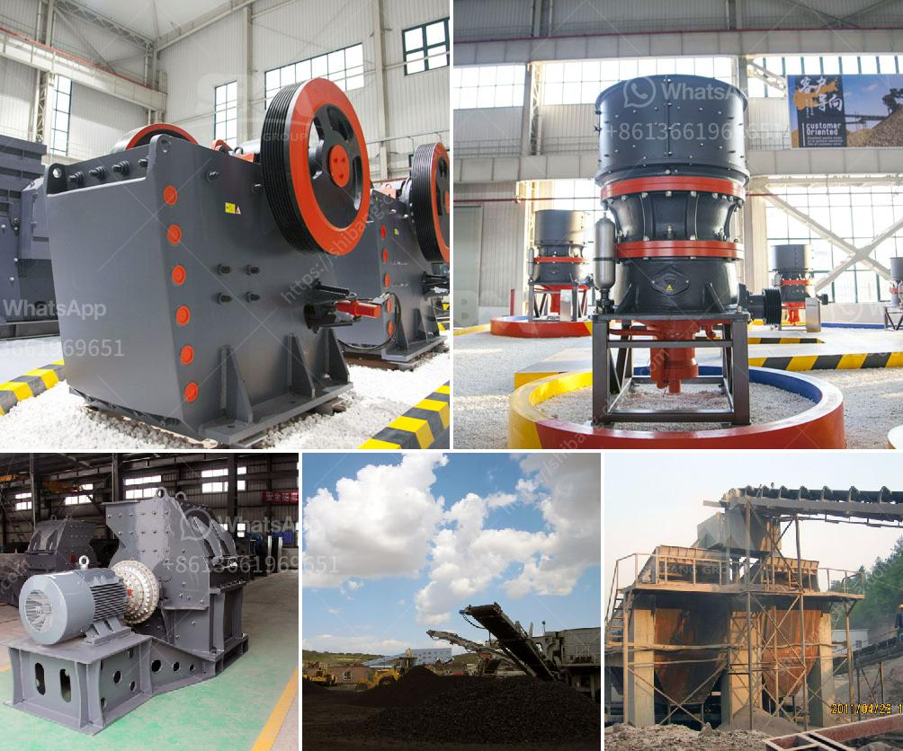

<h3>What is the mining process for fluorite?</h3>
Fluorite, also known as fluorspar, is a mineral composed primarily of calcium and fluorine. It is widely used in various industries due to its vibrant colors and unique optical properties. But have you ever wondered how this beautiful mineral is extracted from the Earth? Let's dive into the mining process for fluorite.

The mining process for fluorite starts with the exploration phase. Geologists analyze geological formations to identify potential fluorite deposits. This involves examining rock samples, using satellite imagery, and conducting surveys to determine the extent and quality of the mineral deposits.

Once a viable deposit is discovered, the next step is the actual mining of fluorite. There are two primary methods used for extracting this mineral: underground mining and open-pit mining.

Underground mining is typically employed when the fluorite deposit is located deep below the Earth's surface. This method involves creating tunnels and shafts through which miners can access the deposit. Tunneling can be challenging due to rock hardness and potential instability. To ensure safety, reinforcement and support structures are used.

Once the tunnels are in place, specialized mining equipment is used to extract the fluorite ore. Machinery such as drill rigs, loaders, and haul trucks are utilized to remove the overlying material and expose the mineralized zones. Explosives may also be used to break up large rocks, making them easier to handle and transport.

As the fluorite ore is extracted, it is loaded onto underground trucks for transportation to the surface. These trucks transport the ore to the processing plant, where it undergoes further treatment.

In open-pit mining, the fluorite deposit is closer to the surface and can be accessed by removing the overburden, or layers of soil and rock that cover the deposit. Large equipment such as excavators, bulldozers, and drills are used to remove and transport the overburden.

Once the overburden is removed, the exposed fluorite ore is loaded onto trucks and transported to the processing plant, similar to the underground mining process. The ore is then crushed, ground into fine particles, and subjected to a flotation process to separate the fluorite from other minerals and impurities.

The flotation process utilizes chemicals and reagents to selectively separate the fluorite from the gangue minerals. Froth flotation, a common method in mineral processing, takes advantage of differences in surface properties of the minerals. Once separated, the fluorite concentrate is then dried, bagged, and transported for further processing or sale.

It is worth noting that each mining operation is unique, and the specific techniques used may vary depending on the characteristics of the mineral deposit, local regulations, and environmental considerations.

In conclusion, the mining process for fluorite involves exploration, extraction, and processing to obtain the valuable mineral. Whether through underground mining or open-pit mining, specialized equipment is utilized to remove the overburden and extract the fluorite ore. These processes ensure that the fluorite can be utilized in various industries, such as glass, ceramics, and metallurgy, bringing its unique properties to the world.
<h3>Contact us</h3><ul><li><strong>Whatsapp:&nbsp;<a href="https://wa.me/8613661969651">+8613661969651</a></strong></li><li><a href="https://swt.shibang-china.com/?git&amp;zhl&amp;What is the mining process for fluorite"><strong>Online Service(chat now)</strong></a></li></ul><h3>Related</h3><ul><li><a href='when pulverizing coal what is a crusher use for？.md'>when pulverizing coal what is a crusher use for？</a></li><li><a href='What is the process of mining hematite ore.md'>What is the process of mining hematite ore?</a></li><li><a href='What is concrete crushing.md'>What is concrete crushing?</a></li><li><a href='What is the best granite crusher machinery.md'>What is the best granite crusher machinery?</a></li><li><a href='What size equpment is used in big rock crushing crews.md'>What size equpment is used in big rock crushing crews?</a></li></ul>