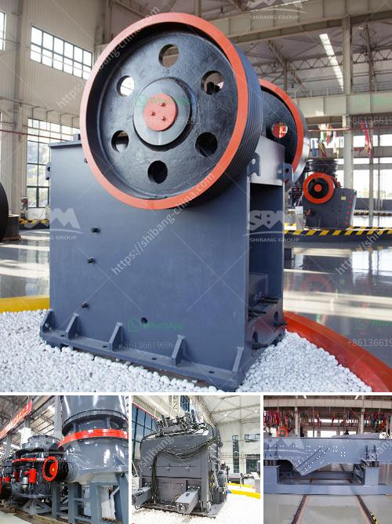

<h3>What is the mining process of gypsum?</h3>
Gypsum is a mineral commonly found in sedimentary rocks, and it is used in many industries for various purposes. One of the primary uses of gypsum is to create drywall and plaster products in construction. To obtain gypsum, mining is essential as the mineral is not usually available in pure form at the surface. This article will provide an overview of the mining process of gypsum.

The mining process of gypsum involves starting with the exploration and analysis of the deposit. The geologists thoroughly analyze the rock strata and mineral composition of the site to determine its potential for mining. They may also examine the surrounding geology, including the soil and water conditions. Once the site has been deemed suitable, the mining company proceeds to lease or purchase the land.

The next step in the mining process is the development of the mining plan. This includes determining the methods and techniques to extract the gypsum from the deposit. The mining plan takes into account several factors such as the deposit’s depth, thickness, and quality, as well as the estimated quantity of gypsum reserves. It also considers the topography and accessibility of the site, which influences the choice of mining method.

The three main mining methods used to extract gypsum are open-pit mining, underground mining, and in-situ mining. Open-pit mining is the most commonly used method and involves excavating the deposit using heavy machinery. The topsoil and overburden materials are removed first to expose the gypsum layer. Then, large drilling rigs and explosives are used to break the gypsum into smaller fragments, which are then loaded onto trucks for transportation to the processing plant.

In underground mining, shafts or tunnels are excavated to access the gypsum deposit. This method is employed when the gypsum deposit is deep underground or when the surface terrain is unsuitable for open-pit mining. Underground mining is more expensive and complex than open-pit mining as it requires extensive infrastructure, ventilation systems, and safety measures.

In-situ mining, also known as solution mining, is a technique employed when the gypsum deposit is relatively close to the surface and of high quality. This method involves creating a borehole into the gypsum deposit and injecting water or a solution to dissolve the gypsum. The dissolved gypsum is then pumped to the surface for further processing.

Once the gypsum has been extracted from the mine, it undergoes several processing steps before it can be used for its intended applications. The mining company will crush the gypsum into smaller particles and then use various techniques, such as grinding and drying, to reduce moisture content. The final product is typically a fine powder known as gypsum powder or stucco.

In conclusion, the mining process for gypsum involves several stages, including exploration, mining plan development, extraction, and processing. It requires careful analysis of the deposit's quality, quantity, and accessibility to determine the most suitable mining method. Moreover, environmental factors and safety measures must be considered throughout the entire process to ensure responsible mining practices.
<h3>Contact us</h3><ul><li><strong>Whatsapp:&nbsp;<a href="https://wa.me/8613661969651">+8613661969651</a></strong></li><li><a href="https://swt.shibang-china.com/?git&amp;zhl&amp;What is the mining process of gypsum"><strong>Online Service(chat now)</strong></a></li></ul><h3>Related</h3><ul><li><a href='What equipment is used in the bauxite mining process in Jamaica.md'>What equipment is used in the bauxite mining process in Jamaica?</a></li><li><a href='Whats better for a granite mobile crusher or fixed crusher.md'>Whats better for a granite mobile crusher or fixed crusher?</a></li><li><a href='What is aluminium ore benefication process.md'>What is aluminium ore benefication process?</a></li><li><a href='What is mechanism sand.md'>What is mechanism sand?</a></li><li><a href='What are the machines and equipment in mining.md'>What are the machines and equipment in mining?</a></li></ul>