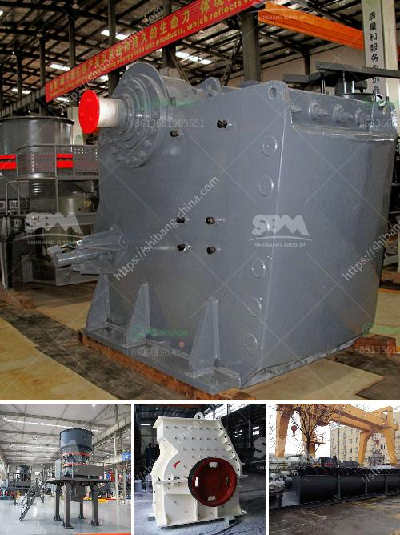

<h3>What is the most popular rock crusher on market?</h3>
When it comes to crushing rocks, there are several options available in the market. However, one rock crusher stands above all the others in terms of popularity and demand. The jaw crusher is the most popular rock crusher on the market, taking up a significant portion of the market share.

Jaw crushers are incredibly powerful machines that are often used for primary crushing. They are renowned for their ability to break down hard and abrasive materials, making them suitable for rock crushing. The jaw crusher consists of two vertical jaws that move back and forth to crush rocks into smaller pieces. This mechanism allows for efficient and effective crushing, making it highly sought after in the mining and construction industries.

One of the main reasons why the jaw crusher is the most popular rock crusher on the market is its excellent performance. The jaw crusher can handle a wide variety of materials, including limestone, concrete, gravel, basalt, and more. Its impressive crushing capacity ensures that it can handle even the toughest of rocks with ease. Whether it is a large boulder or a smaller gravel piece, the jaw crusher can effortlessly reduce it down to the desired size.

Another factor contributing to the popularity of the jaw crusher is its versatility. These crushers come in different sizes and configurations, allowing users to choose the one that suits their specific needs. Whether you are operating a small quarry or a large mining operation, there is a jaw crusher available to meet your requirements. The wide range of options ensures that the jaw crusher can be adapted to various applications, making it a versatile and adaptable machine.

Additionally, the jaw crusher is known for its durability and reliability. These robust machines are built to withstand the rigors of rock crushing. They are designed to handle heavy loads and continuous operation, ensuring that they can effectively crush rocks for an extended period without any significant wear or breakdowns. This reliability is crucial for businesses that rely on continuous crushing operations, as they can trust the jaw crusher to deliver consistent results.

In conclusion, the jaw crusher is the most popular rock crusher on the market, and for good reason. Its powerful performance, versatility, and reliability make it the preferred choice for crushing rocks in various industries. Whether you are in mining, construction, or even recycling, the jaw crusher can handle the job with ease. With its wide range of applications and robust design, it is no wonder why the jaw crusher dominates the market and remains the go-to option for rock crushing.
<h3>Contact us</h3><ul><li><strong>Whatsapp:&nbsp;<a href="https://wa.me/8613661969651">+8613661969651</a></strong></li><li><a href="https://swt.shibang-china.com/?git&amp;zhl&amp;What is the most popular rock crusher on market"><strong>Online Service(chat now)</strong></a></li></ul><h3>Related</h3><ul><li><a href='What is roller crusher.md'>What is roller crusher?</a></li><li><a href='What is needed to open an aggregate mine.md'>What is needed to open an aggregate mine?</a></li><li><a href='What is the mining process of gypsum.md'>What is the mining process of gypsum?</a></li><li><a href='What is the machine used in hard rock gold mining.md'>What is the machine used in hard rock gold mining?</a></li><li><a href='what are steps to wash iron sand？.md'>what are steps to wash iron sand？</a></li></ul>